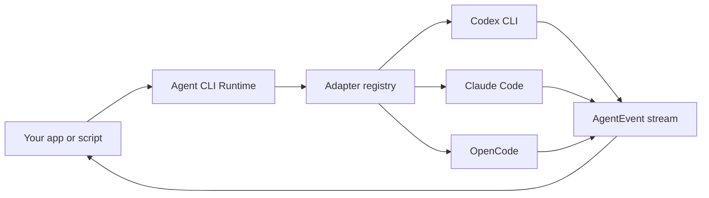

# Agent CLI Runtime

> A tiny local-first runtime for driving Codex CLI, Claude Code, OpenCode, and other coding-agent CLIs through one typed API.

[](./LICENSE)
[](#status)

[English](./README.md) | [简体中文](./README.zh-CN.md)

Agent CLI Runtime is the adapter layer you reach for when you do **not** want to build another coding agent.

Modern local coding agents already know how to plan, edit files, run tools, ask for permission, manage sessions, and talk to models. This project keeps those loops inside the user's installed CLI and gives product builders a small, dependable runtime around them:

- detect installed local coding agents;
- launch them in a chosen `cwd`;
- pass prompts through safe transports such as stdin;
- normalize streaming output into one event protocol;
- cancel, time out, diagnose, and classify runs;
- keep permissions and extra readable directories explicit.

## Status

This repository is in **pre-alpha / developer preview**.

Release boundary:
- `agent-cli-runtime@0.1.0-alpha.1` is published on npm and has GitHub pre-release `v0.1.0-alpha.1`.
- `agent-cli-runtime@0.1.0-alpha.2` is published on npm and has GitHub pre-release `v0.1.0-alpha.2`, but its immutable npm tarball contains stale pre-publish package docs.
- `agent-cli-runtime@0.1.0-alpha.3` is the corrective pre-alpha release for package consumers.
- `agent-cli-runtime@0.1.0-alpha.0` is deprecated because its immutable package docs shipped stale pre-publish state.
- npm registry metadata and GitHub Releases are the source of truth for available versions and dist-tags.
- Release-candidate and post-alpha evidence keeps target SHA, evidence target SHA, workflow head SHA, and downloaded artifact details outside the npm package under `.release-evidence/` or GitHub Release assets.
- `createAgentRuntime` is the only runtime value export.
- No background daemon, no API server, no WAL, no database, and no remote runtime mode are included in this pre-alpha track.
- The package is intended as a local-first execution kernel for embedding in a daemon or product shell, not as a hosted control plane.

The API and CLI schema contract is [docs/api-schema-contract.md](./docs/api-schema-contract.md), the daemon-ready embedding contract is [docs/daemon-ready-contract.md](./docs/daemon-ready-contract.md), the SSOT is [docs/ssot.md](./docs/ssot.md), the post-alpha evidence entrypoint is [docs/release-report.md](./docs/release-report.md), and the publish/runbook boundary is [docs/release-publish-runbook.md](./docs/release-publish-runbook.md). The current implementation is a contract-hardening library-first Node.js/TypeScript implementation with memory-only default run and goal scheduling, optional durable local replay storage with crash/recovery health reporting, fault-injected consistency coverage, package-root API contract tests, tarball TypeScript consumer smoke, installed-package daemon embedding verification, compatibility profiles for the built-in CLIs, hardened planner/task-graph validation, versioned event/diagnostics/conformance/real-smoke/store/release-artifact contracts, redacted diagnostics, parser fixtures, local/remote release artifact verification, post-alpha registry/GitHub Release evidence normalization, published npm install smoke, remote CI/artifact audit checks, alpha publish readiness docs, and thin local smoke/query CLI commands.

## Why

Every serious coding-agent product eventually needs the same boring, sharp-edged runtime work:

| Problem | Runtime responsibility |
| --- | --- |
| Users have different CLIs installed | Detect Codex CLI, Claude Code, OpenCode, and future adapters |
| Each CLI has different flags | Hide argv construction behind adapter definitions |
| Long prompts break argv limits | Prefer stdin or prompt files by default |
| Streams have different schemas | Parse per-agent output into one `AgentEvent` stream |
| Headless runs can hang | Provide cancellation, timeout, inactivity, and exit classification |
| Permissions are easy to overgrant | Make `cwd`, `extraAllowedDirs`, and `permissionPolicy` explicit |

The goal is to make this layer boring enough that excellent tools can build on it.

## What This Is Not

Agent CLI Runtime is not:

- an LLM provider router;
- a hosted cloud agent;
- a replacement for Codex CLI, Claude Code, or OpenCode;
- a web UI;
- a plugin marketplace;
- a custom `Read` / `Write` / `Edit` tool loop;
- a permission bypass wrapper.

The runtime delegates the agent loop. It normalizes execution, not intelligence.

## API

```ts
import { createAgentRuntime } from "agent-cli-runtime";

const runtime = createAgentRuntime();

const agents = await runtime.detect({
  includeUnavailable: true,
});

const run = await runtime.run({
  agentId: "codex",
  cwd: "/path/to/project",
  prompt: "Add a focused regression test for the failing parser case.",
  permissionPolicy: "workspace-write",
});

for await (const event of run.events) {
  if (event.type === "text_delta") process.stdout.write(event.text);
  if (event.type === "tool_call") console.log("tool", event.name);
  if (event.type === "error") console.error(event.code, event.message);
}
```

Goals add a planner run before task execution:

```ts
const goal = await runtime.createGoal({
  cwd: "/path/to/project",
  objective: "Implement a focused parser regression fix.",
  defaultAgentId: "codex",
  permissionPolicy: "workspace-write",
  maxConcurrentTasks: 2,
  retryPolicy: {
    maxAttempts: 2,
    retryableErrorCodes: ["AGENT_TIMEOUT", "AGENT_EXECUTION_FAILED"],
    backoffMs: 500,
  },
});

for await (const event of goal.events) {
  if (event.type === "task_attempt_started") console.log(event.taskId, event.attemptId, event.runId);
  if (event.type === "goal_finished") console.log(event.result);
}
```

Goal scheduling uses a dependency-aware ready queue. A task can start only after all dependencies have succeeded. The conservative default is `maxConcurrentTasks: 1`, preserving serial dependency-order execution; set `maxConcurrentTasks` on `createGoal()` or `createAgentRuntime()` to allow independent ready tasks to run in parallel. `retryPolicy` defaults to `{ maxAttempts: 1 }`; only failures whose terminal error code is listed in `retryableErrorCodes` are retried. Cancellation and validation failures are not retried unless the caller explicitly includes their error code.

Planner output is validated before any task starts. The preferred planner response is strict JSON, but the runtime can extract one JSON object from a Markdown fenced block or short surrounding prose. Multiple JSON objects, malformed JSON, missing `tasks`, or invalid field types fail planning with `AGENT_TASK_GRAPH_INVALID` as a `scheduler_error` and the goal finishes as `failed`; they are not reported as task failures or adapter unavailability. Diagnostics are concise and do not echo oversized planner output.

Task graph schema:

```json
{
  "tasks": [
    {
      "id": "T001",
      "title": "Short title",
      "objective": "Self-contained task objective",
      "dependencies": [],
      "allowedFiles": ["src/example.ts"],
      "validationCommands": ["npm test"],
      "agentId": "codex",
      "retryPolicy": {
        "maxAttempts": 2,
        "retryableErrorCodes": ["AGENT_TIMEOUT"],
        "backoffMs": 250
      }
    }
  ]
}
```

`id`, `title`, `objective`, and every `dependencies` item must be strings. `dependencies`, `allowedFiles`, `validationCommands`, and `retryPolicy.retryableErrorCodes` must be string arrays when present. `agentId` must be a string when present. A task-level `retryPolicy` must include a positive integer `maxAttempts`, a string-array `retryableErrorCodes`, and a non-negative numeric `backoffMs`.

Task evidence records every attempt:

```json
{
  "runId": "run_latest",
  "result": "success",
  "attempts": [
    {
      "attemptId": "T001:attempt:1",
      "runId": "run_1",
      "startedAt": 1760000000000,
      "finishedAt": 1760000001200,
      "result": "failed",
      "diagnostics": [{ "code": "AGENT_EXECUTION_FAILED", "message": "..." }]
    },
    {
      "attemptId": "T001:attempt:2",
      "runId": "run_2",
      "startedAt": 1760000001800,
      "finishedAt": 1760000002600,
      "result": "success",
      "diagnostics": []
    }
  ],
  "validationCommands": [],
  "summary": "Task T001 finished with success after 2 attempts."
}
```

Persistence is opt-in. Without `storageDir`, runs and goals stay memory-only. With `storageDir`, manifests and replay events are written as auditable JSON files:

```ts
const runtime = createAgentRuntime({
  storageDir: ".agent-runtime",
  storage: { durability: "fsync" }, // optional; default is "relaxed"
});

const runs = await runtime.listRuns({ status: "active" });
const runEvents = await runtime.replayRunEvents("run_123", { afterEventId: 10 });
const goals = await runtime.listGoals();
const goalEvents = await runtime.replayGoalEvents("goal_123");
```

The public facade exposes:

- `createAgentRuntime(options?)`
- `runtime.detect(options?)`
- `runtime.detectStream(options?)`
- `runtime.run(request)`
- `runtime.createGoal(request)`
- `runtime.cancelRun(runId)`
- `runtime.cancelGoal(goalId)`
- `runtime.shutdown(reason?)`
- `runtime.getRun(runId)`
- `runtime.replayRunEvents(runId, { afterEventId? })`
- `runtime.listRuns({ status? })`
- `runtime.getGoal(goalId)`
- `runtime.replayGoalEvents(goalId, { afterEventId? })`
- `runtime.listGoals({ status? })`
- `runtime.inspectStore({ storageDir? })`
- `runtime.exportDiagnostics({ kind: "run", runId, storageDir? })`
- `runtime.exportDiagnostics({ kind: "goal", goalId, storageDir? })`
- `runtime.getAdapter(id)`

### API Contract Boundary

For the pre-alpha release, the package root is intentionally small. It exports the `createAgentRuntime()` value plus the public TypeScript types needed to call it and consume its records:

- stable MVP surface: `AgentRuntime`, `RuntimeOptions`, `DetectOptions`, `DetectedAgent`, `RunRequest`, `RunHandle`, `RunRecord`, `RunStatus`, `CreateGoalRequest`, `GoalHandle`, `GoalRecord`, `GoalStatus`, `AgentEvent`, `SchedulerEvent`, `ReplayEvent`, `VersionedEventEnvelope`, `EventScope`, `EventTerminalContract`, `EventTerminalReason`, `RuntimeDiagnostic`, and `RuntimeErrorCode`;
- experimental extension surface: adapter-authoring types such as `AgentAdapterDef`, `BuildArgsInput`, `PromptTransport`, `StreamParser`, and `AdapterCompatibilityProfile`;
- not exported from the package root: built-in adapter values, parser helpers, executable-resolution helpers, stores, schedulers, and task-graph helpers.

The published tarball may contain internal `dist/` files because TypeScript declarations and the CLI need them, but only the package root import (`import { createAgentRuntime } from "agent-cli-runtime"`) is a documented API boundary.

`getAdapter(id)` and `RuntimeOptions.adapters` exist for adapter experimentation in pre-alpha. Treat them as extension points whose shape may still change before a stable release.

## API Stability (pre-alpha / developer preview)

This release candidate is explicitly scoped:

- No stable API contract is guaranteed yet.
- Internal adapters/parsers/helpers are intentionally not exported from package root.
- No production promises around daemon APIs, WAL-backed storage, remote runtime mode, or distributed storage.
- CLI JSON schemas and failure taxonomy follow the pre-alpha versioning policy in [docs/api-schema-contract.md](./docs/api-schema-contract.md).

## Installation

Install from npm:

```bash
npm install agent-cli-runtime
```

Use the CLI through `npx` without adding it to a project:

```bash
npx --package agent-cli-runtime agent-runtime agents --json
npx --package agent-cli-runtime agent-runtime conformance --mode fixtures --json
```

Use a local checkout:

```bash
npm ci
npm run build
node ./dist/cli/main.js --help
npm run daemon:verify
npm run dogfood
```

Quick library smoke after installation:

```bash
node -e "import('agent-cli-runtime').then((m) => console.log(typeof m.createAgentRuntime))"
```

Minimal TypeScript consumer:

```ts
import {
  createAgentRuntime,
  type CreateGoalRequest,
  type RunRequest,
} from "agent-cli-runtime";

const runtime = createAgentRuntime({ storageDir: "./.agent-runtime" });

const runRequest: RunRequest = {
  agentId: "codex",
  cwd: process.cwd(),
  prompt: "Reply with a one-line status.",
};

const goalRequest: CreateGoalRequest = {
  defaultAgentId: "codex",
  cwd: process.cwd(),
  objective: "Summarize this repository.",
};

void runRequest;
void goalRequest;
void runtime.shutdown();
```

The daemon embedding gate installs the packed tarball into a temporary consumer, then executes fake-CLI detect/conformance, run, goal, replay, diagnostics, store inspection, shutdown, and reopen checks. The runtime safety gate uses the same installed-package boundary for repeated run/goal execution, slow event consumption, cancel/timeout churn, repeated shutdown, lease close, and reopen checks. The published daemon consumer gate installs `agent-cli-runtime@0.1.0-alpha.1` from the npm registry into a temporary daemon-style consumer and exercises the published package lifecycle with fake Codex/Claude/OpenCode binaries. The published adapter gate installs the published package from the npm registry and verifies built-in Codex, Claude, and OpenCode adapter detection, argv shape, stdin prompt transport, parser behavior, redaction, and failure isolation with fake CLIs. The published verification gate aggregates those post-publish checks plus registry metadata into a redacted artifact:

```bash
npm run daemon:verify
npm run runtime:safety
npm run published:daemon:verify
npm run published:adapters:verify
npm run published:verify -- --out-dir published-verification
npm run published:verify:evidence -- --dir published-verification
```

`published:verify` generates `published-verification/published-verification.json`. `published:verify:evidence` is a verifier only; it does not generate evidence. Running the verifier without an existing evidence file is an expected guard failure, not a publish failure. For a local check, run `npm run published:verify -- --out-dir published-verification` before `npm run published:verify:evidence -- --dir published-verification`. For a GitHub Actions review, download the `agent-cli-runtime-published-verification` artifact and pass its directory with `npm run published:verify:evidence -- --dir <downloaded-artifact-dir>`.

`published:usability:audit` is a repository-only post-publish audit script. It is intentionally excluded from npm package contents and verifies the already published package from the npm registry.

The broader release gate installs the packed tarball into a temporary TypeScript project, runs `tsc --noEmit`, and then executes fake-CLI library run/goal/replay/diagnostics smoke. See `npm run daemon:verify`, `npm run runtime:safety`, `npm run published:daemon:verify`, `npm run published:adapters:verify`, `npm run published:verify`, `npm run dogfood`, and [docs/release-checklist.md](./docs/release-checklist.md).

Required local agent CLIs are optional by scenario:

- `codex` for Codex CLI coverage.
- `claude` for Claude Code coverage.
- `opencode` / `opencode-cli` for OpenCode coverage.

Executable overrides:

```bash
export CODEX_BIN=/absolute/path/to/codex
export CLAUDE_BIN=/absolute/path/to/claude
export OPENCODE_BIN=/absolute/path/to/opencode
```

Codex configuration is inherited from the installed Codex CLI and process environment. The runtime does not log in, edit Codex config files, or add hidden permissions.

Claude Code can use its normal first-party setup or an Anthropic-compatible provider. Configure the provider through environment variables only; never write real token values into prompts, examples, fixtures, manifests, or committed docs:

```bash
export ANTHROPIC_BASE_URL=<anthropic-compatible-base-url>
export ANTHROPIC_MODEL=<model-name>
export ANTHROPIC_DEFAULT_OPUS_MODEL=<model-name>
export ANTHROPIC_DEFAULT_SONNET_MODEL=<model-name>
export ANTHROPIC_DEFAULT_HAIKU_MODEL=<model-name>
export CLAUDE_CODE_SUBAGENT_MODEL=<model-name>
export CLAUDE_CODE_EFFORT_LEVEL=<effort>
# Set the auth token in the variable required by your provider or Claude Code setup,
# commonly ANTHROPIC_AUTH_TOKEN or ANTHROPIC_API_KEY. Do not commit its value.
```

OpenCode configuration is inherited from the installed OpenCode CLI. The runtime currently uses `opencode run --format json --dir <cwd>` and leaves explicit read-only/workspace-write flags in `needsVerification` until they are verified against real CLI evidence.

Proxy settings are inherited from the process environment:

```bash
export HTTPS_PROXY=http://127.0.0.1:7897
export HTTP_PROXY=http://127.0.0.1:7897
```

Use one of the quick verification command sets before release:

```bash
npm run ci
npm run daemon:verify
npm run runtime:safety
npm run compat:real:evidence:verify
npm run published:daemon:verify
npm run published:adapters:verify
npm run published:verify -- --out-dir published-verification
npm run published:verify:evidence -- --dir published-verification
npm run dogfood
npm run prepublish:check
node ./dist/cli/main.js conformance --mode fixtures --json
node ./dist/cli/main.js conformance --mode fake --json
node ./dist/cli/main.js conformance --mode real --agent all --json
node ./dist/cli/main.js smoke --mode real --agent codex --json
```

`conformance --mode real` and `smoke --mode real` without `--allow-real-run` perform real local detection/profile certification only. They do not launch an authenticated agent run. A real run requires `--allow-real-run`; without `--cwd`, the runtime uses an isolated temporary cwd and requests read-only behavior. Treat `--allow-real-run` as an explicit local-account/network boundary.

`npm run compat:real:evidence` creates the repo-only P8-2 real CLI compatibility matrix at `.release-evidence/p8-2-real-cli-compatibility-matrix.json` and is an explicit evidence refresh action, not a default release gate. By default it runs only safe real preflight. Authenticated smoke evidence requires explicit pairs such as `--allow-real-run --agent codex --expect-text "agent-runtime codex smoke ok"`; skipped states like `real_run_skipped`, `auth_missing`, `unavailable_executable`, and `needs_verification` remain evidence states and are not converted into success. `npm run compat:real:evidence:verify` is the offline drift gate for that matrix. It does not launch real CLI runs; it rejects unsafe content, missing dirty-state evidence, skipped/auth-missing/unavailable states claimed as success, incomplete authenticated success evidence, missing adapter fields, missing `needsVerification` audit items, and invalid package-boundary claims. The matrix separates uncommitted input changes from the evidence output file write: `gitDirty` / `gitInputDirty` cover non-evidence inputs, while `gitOutputDirty` covers the matrix file itself. The default verifier run accepts valid dirty repo-only evidence and reports `dirtyPolicy.status`; release review uses explicit freshness binding: `npm run compat:real:evidence:verify -- --target-sha <target-sha> --max-age-hours 24 --release-strict`. Release-strict accepts `self_dirty_only` evidence-output changes, rejects dirty input evidence unless `--allow-dirty` is intentionally supplied, and records the resulting dirty policy summary. `prepublish:check` runs the default offline verifier. Local `release:candidate` defaults to `--real-compatibility-mode local-strict` and verifies existing repo-only evidence against the matrix `gitSha` release target without refreshing real CLI evidence; `--target-sha <sha>` can override that target for explicit checks. Remote clean-checkout release-candidate workflows use `--real-compatibility-mode repo-only-skipped`, which records that repo-only real compatibility evidence was not refreshed in CI.

CI uses a Node.js 20/22/24 matrix for typecheck, lint, tests, build, production dependency audit, package boundary checks, and `npm pack --dry-run`. A separate single-Node release-gates job runs `npm run daemon:verify`, `npm run runtime:safety`, and `npm run dogfood` so the full matrix does not launch redundant installed-package gates. CI intentionally does not run the repo-only compatibility evidence verifier. Local `prepublish:check` and local strict `release:candidate` are the release/evidence paths that can bind existing `.release-evidence/` matrix evidence to a target SHA; remote workflow artifacts record the explicit repo-only skipped state. The dogfood, CI, and prepublish paths share the same safety boundary: fixtures, fake CLIs, and real local detection/profile certification are allowed by default; authenticated real agent runs are not launched unless `--allow-real-run` is explicit.

For local release-candidate confidence, run `npm run prepublish:check` and `npm run release:candidate -- --out-dir release-candidate` from a worktree whose checked-in matrix `gitSha` is the intended release target. The GitHub Actions `Release Candidate` workflow is manually triggered with `workflow_dispatch`, runs `npm ci`, `npm run ci`, `npm run dogfood`, and `npm run release:candidate -- --out-dir release-candidate --real-compatibility-mode repo-only-skipped`; the generated artifact set includes `agent-cli-runtime-tarball`, `agent-cli-runtime-pack-metadata`, `agent-cli-runtime-package-files`, `agent-cli-runtime-gate-evidence`, and `agent-cli-runtime-release-verification`. The compatibility gate summary records the verifier schema, verified matrix schema, target SHA status, freshness status, dirty policy status, diagnostic count/codes, and, for remote repo-only skipped artifacts, the fixed `not_refreshed_in_ci` reason.

`npm run release:strict-compatibility:evidence -- --target-sha <target-sha> --local-release-dir <tmp-local-strict>` writes the repo-only P8-4 summary at `.release-evidence/p8-4-release-strict-compatibility.json`. The summary records the P8-2 matrix schema, strict verifier schema, local strict `release:candidate` / `release:verify` result, remote workflow trigger state, downloaded-artifact verification state, `noAuthenticatedRealRun`, `noNpmPublish`, `noNpmToken`, and an explicit branch/main evidence decision. `targetSha` is the release target proven by the matrix; `currentHeadSha` is only the summary generation context and can differ after an evidence-only commit. If the target SHA is not in `origin/main`, the summary is branch/local evidence with `mainEvidence: false`; it is not current `main` release evidence.

Version `0.1.0-alpha.1` is published to npm and has GitHub pre-release `v0.1.0-alpha.1`. Version `0.1.0-alpha.2` is published to npm with the `alpha` dist-tag and has GitHub pre-release `v0.1.0-alpha.2`, but its immutable tarball contains stale pre-publish package docs. Version `0.1.0-alpha.3` is the corrective pre-alpha release for package consumers. Version `0.1.0-alpha.0` is deprecated because its immutable tarball contains stale pre-publish status text. npm registry metadata and GitHub Releases are the source of truth for available versions and dist-tags. Because release docs are included in the npm package, volatile target-SHA evidence must stay outside packaged docs under `.release-evidence/` or GitHub Release assets.

Post-alpha verification:

```bash
npm run release:post-alpha:verify
npm run smoke:published
npm run published:daemon:verify
npm run published:adapters:verify
npm run published:verify -- --out-dir published-verification
npm run published:verify:evidence -- --dir published-verification
```

`release:post-alpha:verify` compares the npm registry tarball with the `v0.1.0-alpha.1` GitHub Release tarball. Raw gzip SHA1/SHA256 values may differ because the registry tarball and Release asset are separate packaging artifacts; the package content boundary is npm registry `shasum`/`integrity`, matching unpacked package file list and content, and `npm run release:verify -- --dir <downloaded-github-release-assets-dir>`.

`published:daemon:verify` installs the already published npm package from the registry, not the local checkout or local `dist/`, and emits `schemaVersion: "agent-runtime.publishedDaemonConsumer.v1"` with `packageSource: "npm-registry"`. It uses fake CLIs only and covers detect, run, goal, cancel, timeout, replay, read-only inspection while a writer is active, second-writer refusal, shutdown/reopen, and stale owner recovery without launching authenticated real agent runs.

`published:adapters:verify` also installs from the npm registry and emits `schemaVersion: "agent-runtime.publishedAdapters.v1"` with `packageSource: "npm-registry"`. It uses fake Codex/Claude/OpenCode binaries to verify the published package's built-in adapter invocation shape, stdin prompt transport, parser noise tolerance, redaction, and per-adapter failure isolation. This is fake-CLI adapter contract evidence, not authenticated real CLI compatibility success evidence.

`published:verify` emits `schemaVersion: "agent-cli-runtime.publishedVerification.v1"` and writes `published-verification/published-verification.json` by default. It aggregates `smoke:published`, `published:daemon:verify`, `published:adapters:verify`, `release:post-alpha:verify`, and npm registry metadata without storing raw stdout/stderr or requiring publish credentials. The manual GitHub Actions `Published Package Verification` workflow runs the same post-publish verification on Node.js 22 and uploads `agent-cli-runtime-published-verification`.

`published:verify:evidence` reads an existing `published-verification.json` from `--dir` or `--summary` and verifies the four published gates plus registry packaged-docs inspection. It never runs the gates or creates evidence. If the default `published-verification/published-verification.json` is missing, it exits `1` with redacted parseable JSON that points to the local generation command and the GitHub artifact `--dir` path.

To create a local release-candidate artifact set without publishing, run:

```bash
npm run release:candidate -- --out-dir release-candidate
npm run release:verify -- --dir release-candidate
```

`release:candidate` writes `npm-pack.json`, `package-files.txt`, `gate-evidence.json`, the tarball, and `release-verification.json` to the output directory. After `gh run download` unpacks the five GitHub Actions artifacts into per-artifact subdirectories, normalize them before verification:

```bash
npm run release:artifacts:normalize -- --download-dir <gh-download-dir> --out-dir <normalized-artifact-dir>
npm run release:verify -- --dir <normalized-artifact-dir>
```

`release:artifacts:normalize` emits `schemaVersion: "agent-cli-runtime.releaseArtifactNormalization.v1"`, copies only the expected five release-candidate files from their matching GitHub artifact directories, and rejects missing, duplicate, unknown, or misplaced files without printing absolute local paths. `release:verify` validates the normalized files, including proof that `daemon:verify`, `runtime:safety`, and either a local strict compatibility verifier summary or a remote repo-only skipped compatibility summary were recorded for the candidate.

Main-scoped release-candidate evidence is generated with:

```bash
npm run release:main-candidate:evidence -- --stage <stage> --release-target-sha <origin-main-sha> --local-release-dir <local-strict-dir> --remote-run-json <run.json> --artifacts-json <artifacts.json> --downloaded-dir <normalized-artifact-dir> --out .release-evidence/<stage-lower>-main-release-candidate.json
```

The generator emits `schemaVersion: "agent-cli-runtime.mainReleaseCandidateEvidence.v1"`. Stage labels such as `P9-2` are accepted; P8 main evidence files remain historical exact-SHA evidence and are not current fresh main evidence for later package-visible changes.

Package-content equivalence between a recorded release target SHA and a later ref is checked with:

```bash
npm run release:package-content:verify -- --base-ref <release-target-sha> --head-ref <sha-or-ref>
```

The verifier emits `schemaVersion: "agent-cli-runtime.packageContentEquivalence.v1"` and compares npm package-visible file lists plus per-file content hashes from temporary git worktrees. It does not rely on gzip/tarball bytes as the only signal. Package-external `.release-evidence/`, tests, and repo-only script changes can be recorded as `evidenceOnlyDrift: true` with `freshReleaseCandidateRequired: false`; README, packaged docs, package.json, dist, types, bin, examples, and other package-visible changes require fresh release-candidate evidence before the later ref is treated as a release target.

The release evidence summary is [docs/release-report.md](./docs/release-report.md), with volatile P8-4 target-SHA evidence under `.release-evidence/p8-4-release-strict-compatibility.json` and historical P8 main remote evidence under `.release-evidence/p8-5-main-release-candidate.json`, `.release-evidence/p8-7-main-release-candidate.json`, and `.release-evidence/p8-9-main-release-candidate.json`. The alpha publish decision runbook is [docs/release-publish-runbook.md](./docs/release-publish-runbook.md). `npm publish --dry-run --ignore-scripts --tag alpha` is documented there as a local manual dry-run check; it must not publish and is not required as a remote CI gate. Published package verification is a separate manual post-publish workflow, not a publish workflow.

Main-scoped evidence proves only its recorded `releaseTargetSha`; an evidence-recording commit or later PR merge commit needs its own fresh main evidence before it can be used as a release target.

Runnable examples are in [examples/library-run.js](./examples/library-run.js), [examples/library-goal.js](./examples/library-goal.js), and [examples/cli-dogfood.md](./examples/cli-dogfood.md). The JavaScript examples create local fake CLIs and do not require real provider secrets.

## CLI

```bash
agent-runtime agents
agent-runtime conformance --mode fixtures --json
agent-runtime conformance --mode fake --json
agent-runtime conformance --mode real --agent all --json
agent-runtime smoke --mode real --agent codex --allow-real-run --expect-text <safe_text> --json
agent-runtime smoke --mode real --agent claude --allow-real-run --expect-text <safe_text> --json
agent-runtime smoke --mode real --agent opencode --allow-real-run --expect-text <safe_text> --json
agent-runtime smoke --mode detection --json
agent-runtime smoke --mode fixtures --json
agent-runtime run --agent codex --cwd . --prompt "fix the failing test"
agent-runtime goal --agent codex --cwd . --prompt "split this objective into tasks and execute them"
agent-runtime goal --agent codex --cwd . --prompt "run independent fixes" --max-concurrent-tasks 2 --max-attempts 2 --retryable-error-codes AGENT_TIMEOUT,AGENT_EXECUTION_FAILED
agent-runtime run --agent claude --cwd . --permission workspace-write --prompt-file task.md
agent-runtime run --agent codex --cwd . --prompt "fix the failing test" --json
agent-runtime run --agent codex --cwd . --prompt "fix the failing test" --stream jsonl --diagnostics
agent-runtime doctor
agent-runtime runs --storage-dir .agent-runtime --json
agent-runtime run-status run_123 --storage-dir .agent-runtime --json
agent-runtime replay-run run_123 --storage-dir .agent-runtime --after 10 --jsonl
agent-runtime goals --storage-dir .agent-runtime --json
agent-runtime goal-status goal_123 --storage-dir .agent-runtime --json
agent-runtime replay-goal goal_123 --storage-dir .agent-runtime --after 10 --jsonl
agent-runtime store-health --storage-dir .agent-runtime --json
agent-runtime store-lock --storage-dir .agent-runtime --json
agent-runtime store-repair --storage-dir .agent-runtime --dry-run --json
agent-runtime store-repair --storage-dir .agent-runtime --apply --json
agent-runtime diagnostics run run_123 --storage-dir .agent-runtime --json
agent-runtime diagnostics goal goal_123 --storage-dir .agent-runtime --json --out diagnostics-goal_123.json
agent-runtime smoke --mode real --agent codex --allow-real-run --prompt-file task.md --expect-text "expected reply" --timeout-ms 30000 --json --diagnostics
```

The library API is primary. The CLI is a thin wrapper over the same runtime and supports `--json` plus `--stream jsonl` for run/goal event streams. For run/goal commands, `--json` prints the final run or goal record. `--stream jsonl --diagnostics` keeps the event stream and appends a redacted `run_summary` or `goal_summary` line after the terminal event.

`agent-runtime conformance` is the production gate wrapper. Its JSON output is versioned with `schemaVersion: "agent-runtime.conformance.v1"` and emits a stable per-adapter summary with `adapter`, `version`, `resolvedExecutable`, `auth`, `modelsSource`, `capabilities`, `argvProfile`, `promptTransport`, `parserMode`, `runClassification`, `expectedTextMatched`, `observedTextTail`, `cwdMutationChecked`, `cwdMutated`, `diagnosticsCount`, `diagnostics`, `skippedReason`, and `failureReason`.

- `--mode fixtures` checks parser contracts offline.
- `--mode fake` creates local fake CLIs and runs the real adapter argv/stdin/parser path offline.
- `--mode real` defaults to real local detection/profile certification without launching agent runs. A real run is launched only when `--allow-real-run` is explicit; otherwise runnable adapters report `runClassification: "real_run_skipped"` and `skippedReason: "real_run_not_allowed"`. `--agent all` keeps one adapter fail/skip isolated in the summary.

Real conformance diagnostics are designed for drift detection: unsupported tracked flags, unfamiliar help/version output, parser/stream failures, and unverified capabilities are reported as actionable diagnostics instead of guessed into the argv path. Unknown flags remain in `argvProfile.needsVerification`. Outputs are redacted for tokens, Bearer values, auth env assignments, prompts, observed text tails, and private absolute paths.

`agent-runtime smoke` has three modes:

- `--mode detection` runs local executable/model/auth detection only.
- `--mode fixtures` dry-runs built-in parser conformance fixtures for Codex, Claude, and OpenCode without launching real CLIs.
- `--mode real` defaults to detection/profile certification and returns `runClassification: "real_run_skipped"` unless `--allow-real-run` is explicit. With `--allow-real-run`, it launches one real non-mutating run for `--agent <id>` with runtime-requested read-only behavior. Without `--cwd`, it uses an isolated temp directory. The default prompt asks the agent to reply exactly with `agent-runtime <agent> smoke ok` without editing files, and `--expect-text <text>` can provide a different safe verifier. Expected text is required for success: if `--prompt` or `--prompt-file` is supplied without `--expect-text`, exit `0` and text output still classify as `unexpected_output`.

Recommended opt-in smoke evidence commands:

```bash
node ./dist/cli/main.js smoke --mode real --agent codex --allow-real-run --expect-text <safe_text> --json
node ./dist/cli/main.js smoke --mode real --agent claude --allow-real-run --expect-text <safe_text> --json
node ./dist/cli/main.js smoke --mode real --agent opencode --allow-real-run --expect-text <safe_text> --json
```

Real smoke JSON uses `schemaVersion: "agent-runtime.realSmoke.v1"` and a redacted `real_smoke_summary` with `adapter`, `version`, `auth`, `modelsSource`, `runClassification`, `expectedTextMatched`, truncated/redacted `observedTextTail`, `cwdMutationChecked`, `cwdMutated`, `diagnosticsCount`, `skippedReason`, and `failureReason`. It does not include prompt text, token values, private cwd, raw stdout/stderr, or the final run record. Failure and skip classifications include `auth_missing`, `unavailable_executable`, `unsupported_flag`, `unexpected_output`, `cwd_mutated`, `needs_verification`, and `real_run_skipped`.

The complete schema inventory and version bump policy for event envelopes, diagnostics, conformance, real smoke, store health/repair, CLI errors, release verification, and release gate evidence is maintained in [docs/api-schema-contract.md](./docs/api-schema-contract.md).

Disk storage layout is intentionally simple and tail-friendly:

```text
.agent-runtime/
  runtime.lock.json
  runs/<runId>/manifest.json
  runs/<runId>/events.jsonl
  goals/<goalId>/manifest.json
  goals/<goalId>/events.jsonl
```

Public replay APIs remain source-compatible and return `ReplayEvent<T>` records: `{ "id": 1, "sequence": 1, "runId": "run_123", "timestamp": 123, "event": {...} }`, or the same shape with `goalId`. CLI JSONL output for `run --stream jsonl`, `goal --stream jsonl`, `replay-run --jsonl`, and `replay-goal --jsonl` uses the stable envelope `schemaVersion: "agent-runtime.event.v1"`:

```json
{
  "schemaVersion": "agent-runtime.event.v1",
  "id": 1,
  "sequence": 1,
  "timestamp": 1760000000000,
  "scope": { "kind": "run", "id": "run_123" },
  "event": { "type": "run_finished", "result": "success", "timestamp": 1760000000000 },
  "terminal": { "result": "success", "reason": "success" }
}
```

`id` and `sequence` are monotonic per run or goal. Terminal reasons use one vocabulary: `success`, `failed`, `timeout`, `canceled`, `interrupted`, `validation_failed`, `execution_failed`, `unavailable`, `auth_missing`, and `task_graph_invalid`. `--stream jsonl --diagnostics` may append a redacted summary line after the event envelopes. The default durability is `relaxed`; `createAgentRuntime({ storageDir, storage: { durability: "fsync" } })` asks the store to `fdatasync`/`fsync` manifest temp files and event appends with graceful platform fallback diagnostics.

When `storageDir` is supplied, the runtime opens it in writer mode with a local single-writer lease stored in `runtime.lock.json`. The lock owner includes a generated `runtimeInstanceId`, `pid`, `startedAt`, and `heartbeatAt`; active run/goal manifests also record the current owner. A second writer runtime for the same `storageDir` is refused while the owner is live. If the existing owner is stale or closed, a new runtime may take over and records a redacted lease diagnostic. `runtime.shutdown(reason?)` cancels active runs/goals, waits briefly for terminal events, and marks the lease closed. This is a best-effort same-machine guard for embedded local runtimes; it is not a daemon coordination protocol, distributed lock, WAL, database transaction layer, or live process resume mechanism.

When a new writer runtime opens a `storageDir`, terminal runs/goals are readable immediately. Active records are recovered only when their recorded owner is missing, stale, or closed; those runs/goals are marked failed with an `AGENT_RUNTIME_INTERRUPTED` diagnostic/event so they never pretend to still be active after a process restart. Active records owned by another live runtime are left untouched and are visible through read-only inspection. A corrupt manifest or JSONL line is isolated to that record and reported through `AGENT_STORE_RECORD_CORRUPT` or `AGENT_EVENT_LOG_CORRUPT` diagnostics instead of failing runtime initialization. Corrupt manifests are not silently rewritten during load, so later health scans can still see the original damaged record.

`runs`, `goals`, `run-status`, `goal-status`, `replay-run`, `replay-goal`, `store-health`, `store-lock`, and `diagnostics` are read-only inspection paths for a supplied `storageDir`; they do not acquire the writer lease or interrupt active work. `store-lock` prints the current lock owner/status. `store-health` uses `schemaVersion: "agent-runtime.storeHealth.v1"` and scans the on-disk store without launching an agent. It reports lock status, active records with owner live/stale/closed state, run/goal totals, corrupt manifests, corrupt event logs, corrupt line counts, partial JSONL tail detection, retained event counts, last good event id/sequence, repair recommendations, interrupted historical records, storage-level sync/lease diagnostics, and consistency warnings. Middle corrupt JSONL lines are skipped so later valid records can still replay; partial tail records stop at the last known-good boundary. Terminal manifests without terminal events and non-terminal manifests with terminal events are reported as warnings; the runtime does not silently reconcile them.

`store-repair --json` defaults to the same non-destructive plan as `--dry-run`. Its output uses `schemaVersion: "agent-runtime.storeRepair.v1"`. Partial tails are reported as `truncate_partial_tail`; middle corrupt lines are reported as `isolate_corrupt_line`; terminal manifest/event mismatches are `manual_review` and are not auto-fixed. `--apply` is explicit, requires `--storage-dir`, refuses a live writer owner, holds the local store lease while writing, backs up each original event log under `repair-backups/<timestamp>/...`, and rewrites through temp-file-and-rename with best-effort fsync. If backup creation fails, the original event log is not rewritten. If rewrite fails after backup creation, the backup path is reported and the original log remains readable rather than becoming a partial rewrite. Successful apply records `AGENT_STORE_REPAIR_APPLIED`; failed apply records `AGENT_STORE_REPAIR_FAILED`, both redacted, so later health and diagnostics bundles can show repair evidence. Apply is conservative and idempotent; it is not a WAL, database transaction layer, daemon resume, or compaction service.

Diagnostics bundles are redacted JSON evidence packets for one run or goal. A bundle uses `schemaVersion: "agent-runtime.diagnostics.v1"` and includes the sanitized manifest, an event summary rather than full event payloads, `RuntimeDiagnostic[]` items, storage-level diagnostics, goal task attempt evidence when present, a supervisor summary with terminal reason and owner/lease status, and an environment-safe adapter summary. CLI usage failures emitted with `--json` use `schemaVersion: "agent-runtime.cliError.v1"`. `--out <file>` writes the bundle with a temp-file-and-rename atomic write. Bundles, health output, and JSON errors do not include raw corrupt JSONL lines, tokens, Bearer values, auth-token environment assignments, full environment dumps, prompts, or absolute private paths.

Production readiness scope is tracked in [docs/production-readiness.md](./docs/production-readiness.md). The local-first production target is single-machine, local CLI execution with explicit `storageDir`, a local single-writer lease, auditable redacted diagnostics, and no silent privilege escalation; daemon/API server, WAL, live resume/session attachment, distributed execution, UI/artifacts, telemetry, and database layers remain outside this package.

## Configuration

Configuration is intentionally environment-first for the pre-alpha package. Use `CODEX_BIN`, `CLAUDE_BIN`, and `OPENCODE_BIN` to point at specific executables; pass proxy and provider variables through the parent process; keep tokens out of prompts and committed files.

See [docs/compatibility.md](./docs/compatibility.md) for the current real CLI smoke matrix.

## Runtime Model



Each adapter owns only the details that truly vary by CLI:

- binary names and env overrides;
- version, auth, capability, and model probes;
- compatibility profile notes for verified and unverified invocation flags;
- argv construction;
- prompt transport;
- stream parser;
- permission-policy mapping.

The core runner owns process lifecycle, process-tree best-effort termination, diagnostics, cancellation, timeout, shutdown, redaction, and event delivery.

## MVP Adapters

| Adapter | Target binary | Prompt transport | Stream strategy | MVP status |
| --- | --- | --- | --- | --- |
| Codex CLI | `codex` | stdin | `codex exec --json` | P1-6 real smoke requires expected text evidence and cwd mutation checks; timeout diagnostics classify local network/plugin startup stalls; transient reconnect events are parsed as status |
| Claude Code | `claude` | stdin JSONL | `stream-json` | P0-4 detection baseline recorded; local auth still missing |
| OpenCode | `opencode-cli`, `opencode` | stdin | JSON stream | P1-6 non-mutating isolated smoke is checked for expected text and cwd mutation; stdin prompt support is verified on local `opencode` 1.15.6, explicit read-only flags remain unverified |

Future adapters should be possible without changing the core runtime.

## Event Protocol

The runtime exposes a small append-only event stream:

```ts
type AgentEvent =
  | { type: "run_started"; runId: string; agentId: string; cwd: string; model?: string; timestamp: number }
  | { type: "status"; label: string; detail?: string; timestamp: number }
  | { type: "text_delta"; text: string; timestamp: number }
  | { type: "thinking_delta"; text: string; timestamp: number }
  | { type: "tool_call"; id: string; name: string; input?: unknown; timestamp: number }
  | { type: "tool_result"; id: string; output?: unknown; isError?: boolean; timestamp: number }
  | { type: "file_event"; path: string; action: "created" | "updated" | "deleted" | "unknown"; timestamp: number }
  | { type: "usage"; usage: RuntimeUsage; costUsd?: number; timestamp: number }
  | { type: "error"; code: RuntimeErrorCode; message: string; retryable?: boolean; detail?: unknown; timestamp: number }
  | { type: "run_finished"; result: "success" | "failed" | "cancelled"; exitCode?: number | null; signal?: string | null; timestamp: number };
```

Goal scheduling wraps run events with `goal_started`, `task_created`, `task_started`, `task_attempt_started`, `run_event`, `task_attempt_finished`, `task_finished`, `goal_finished`, and `scheduler_error`.

Adapter-specific raw events can be logged for debugging, but the public API should stay stable and small.

## Security Model

This project starts local processes on behalf of the caller. That is powerful and deserves explicit defaults.

- The runtime does not log in to agent CLIs.
- The runtime does not edit user CLI config files in MVP.
- Metadata probes run in a neutral temp directory, not in the user's project.
- Prompts should use stdin or prompt files before argv.
- `cwd` must be explicit.
- `extraAllowedDirs` must be explicit.
- Permission escalation must be explicit.
- Logs and diagnostics must redact secret-looking env values and tokens.
- Disk backed storage does not write secret-bearing environment maps. Diagnostics and validation stdout/stderr are redacted before they are written to manifests or events.
- A failed adapter must not collapse detection for other adapters.
- Detection probe diagnostics are classified as `not_installed`, `not_executable`, `auth_missing`, `network_error`, `unsupported_flag`, or `probe_failed`.
- JSON stream parsers ignore empty, warning, log, and non-JSON noise lines; user-visible text is emitted only from structured CLI text fields.
- Timeout diagnostics include sanitized argv/profile labels, parsed event counts, stdout/stderr tails, and actionable hints; prompts are still kept out of argv.
- Goal task `validationCommands` run in the task `cwd` after a successful agent run; failed validation marks the task and goal as failed.

The runtime should never grant more authority than the caller requested.

## Relationship To Other Projects

Agent CLI Runtime is inspired by the adapter/runtime boundary in [OpenDesign](https://github.com/nexu-io/open-design) and the clarity of [OpenCode](https://github.com/anomalyco/opencode)'s open-source project presentation.

It is not affiliated with OpenDesign, OpenCode, Anthropic, OpenAI, or any supported CLI vendor.

## Roadmap

- M0: SSOT, README, license, project skeleton. Done.
- M1: core process runner with fake CLI tests. Done.
- M2: Codex adapter MVP. Done.
- M3: Claude Code adapter MVP. Done.
- M4: OpenCode adapter MVP. Done.
- M5: CLI wrapper and `doctor` command. Done.
- M6: public package boundary, compatibility matrix, API/CLI contract freeze, contribution guide, and security policy. Completed for pre-alpha release candidate hardening.

## Contributing

See [CONTRIBUTING.md](./CONTRIBUTING.md).

## License

Apache License 2.0. See [LICENSE](./LICENSE).
