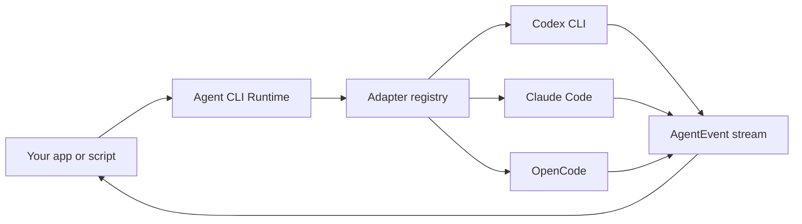

# Agent CLI Runtime

> A tiny local-first runtime for driving Codex CLI, Claude Code, OpenCode, and other coding-agent CLIs through one typed API.

[](./LICENSE)
[](#status)

[English](./README.md) | [简体中文](./README.zh-CN.md)

Agent CLI Runtime is the adapter layer you reach for when you do **not** want to build another coding agent.

Modern local coding agents already know how to plan, edit files, run tools, ask for permission, manage sessions, and talk to models. This project keeps those loops inside the user's installed CLI and gives product builders a small, dependable runtime around them:

- detect installed local coding agents;
- launch them in a chosen `cwd`;
- pass prompts through safe transports such as stdin;
- normalize streaming output into one event protocol;
- cancel, time out, diagnose, and classify runs;
- keep permissions and extra readable directories explicit.

## Status

This repository is in **pre-alpha MVP stage**.

The SSOT is available in [docs/ssot.md](./docs/ssot.md). The current implementation is a library-first Node.js/TypeScript MVP with in-memory run and goal scheduling, fake CLI integration tests, and thin local smoke CLI commands.

## Why

Every serious coding-agent product eventually needs the same boring, sharp-edged runtime work:

| Problem | Runtime responsibility |
| --- | --- |
| Users have different CLIs installed | Detect Codex CLI, Claude Code, OpenCode, and future adapters |
| Each CLI has different flags | Hide argv construction behind adapter definitions |
| Long prompts break argv limits | Prefer stdin or prompt files by default |
| Streams have different schemas | Parse per-agent output into one `AgentEvent` stream |
| Headless runs can hang | Provide cancellation, timeout, inactivity, and exit classification |
| Permissions are easy to overgrant | Make `cwd`, `extraAllowedDirs`, and `permissionPolicy` explicit |

The goal is to make this layer boring enough that excellent tools can build on it.

## What This Is Not

Agent CLI Runtime is not:

- an LLM provider router;
- a hosted cloud agent;
- a replacement for Codex CLI, Claude Code, or OpenCode;
- a web UI;
- a plugin marketplace;
- a custom `Read` / `Write` / `Edit` tool loop;
- a permission bypass wrapper.

The runtime delegates the agent loop. It normalizes execution, not intelligence.

## API

```ts
import { createAgentRuntime } from "agent-cli-runtime";

const runtime = createAgentRuntime();

const agents = await runtime.detect({
  includeUnavailable: true,
});

const run = await runtime.run({
  agentId: "codex",
  cwd: "/path/to/project",
  prompt: "Add a focused regression test for the failing parser case.",
  permissionPolicy: "workspace-write",
});

for await (const event of run.events) {
  if (event.type === "text_delta") process.stdout.write(event.text);
  if (event.type === "tool_call") console.log("tool", event.name);
  if (event.type === "error") console.error(event.code, event.message);
}
```

Goals add a planner run before task execution:

```ts
const goal = await runtime.createGoal({
  cwd: "/path/to/project",
  objective: "Implement a focused parser regression fix.",
  defaultAgentId: "codex",
  permissionPolicy: "workspace-write",
});

for await (const event of goal.events) {
  if (event.type === "task_started") console.log(event.taskId, event.runId);
  if (event.type === "goal_finished") console.log(event.result);
}
```

The public facade exposes:

- `createAgentRuntime(options?)`
- `runtime.detect(options?)`
- `runtime.detectStream(options?)`
- `runtime.run(request)`
- `runtime.createGoal(request)`
- `runtime.cancelRun(runId)`
- `runtime.cancelGoal(goalId)`

## Installation

```bash
npm install agent-cli-runtime
```

For local development from this repository:

```bash
npm ci
npm run build
node ./dist/cli/main.js agents --json
```

## CLI

```bash
agent-runtime agents
agent-runtime run --agent codex --cwd . --prompt "fix the failing test"
agent-runtime goal --agent codex --cwd . --prompt "split this objective into tasks and execute them"
agent-runtime run --agent claude --cwd . --permission workspace-write --prompt-file task.md
agent-runtime doctor
```

The library API is primary. The CLI is a thin wrapper over the same runtime and supports `--json` plus `--stream jsonl` for run/goal event streams.

## Configuration

Executable overrides:

```bash
export CODEX_BIN=/absolute/path/to/codex
export CLAUDE_BIN=/absolute/path/to/claude
export OPENCODE_BIN=/absolute/path/to/opencode
```

Proxy settings are inherited from the process environment:

```bash
export HTTPS_PROXY=http://127.0.0.1:7897
export HTTP_PROXY=http://127.0.0.1:7897
```

Claude Code can also target Anthropic-compatible providers such as DeepSeek:

```bash
export ANTHROPIC_BASE_URL=https://api.deepseek.com/anthropic
export ANTHROPIC_AUTH_TOKEN=<your-token>
export ANTHROPIC_MODEL='deepseek-v4-pro[1m]'
export ANTHROPIC_DEFAULT_OPUS_MODEL='deepseek-v4-pro[1m]'
export ANTHROPIC_DEFAULT_SONNET_MODEL='deepseek-v4-pro[1m]'
export ANTHROPIC_DEFAULT_HAIKU_MODEL=deepseek-v4-flash
export CLAUDE_CODE_SUBAGENT_MODEL=deepseek-v4-flash
export CLAUDE_CODE_EFFORT_LEVEL=max
```

See [docs/compatibility.md](./docs/compatibility.md) for the current real CLI smoke matrix.

## Runtime Model



Each adapter owns only the details that truly vary by CLI:

- binary names and env overrides;
- version, auth, capability, and model probes;
- argv construction;
- prompt transport;
- stream parser;
- permission-policy mapping.

The core runner owns process lifecycle, diagnostics, cancellation, timeout, redaction, and event delivery.

## MVP Adapters

| Adapter | Target binary | Prompt transport | Stream strategy | MVP status |
| --- | --- | --- | --- | --- |
| Codex CLI | `codex` | stdin | `codex exec --json` | Implemented MVP, real flags need ongoing compatibility smoke |
| Claude Code | `claude` | stdin JSONL | `stream-json` | Implemented MVP, real flags need ongoing compatibility smoke |
| OpenCode | `opencode-cli`, `opencode` | stdin | JSON stream | Implemented MVP, real flags need ongoing compatibility smoke |

Future adapters should be possible without changing the core runtime.

## Event Protocol

The runtime exposes a small append-only event stream:

```ts
type AgentEvent =
  | { type: "run_started"; runId: string; agentId: string; cwd: string }
  | { type: "status"; label: string; detail?: string }
  | { type: "text_delta"; text: string }
  | { type: "thinking_delta"; text: string }
  | { type: "tool_call"; id: string; name: string; input?: unknown }
  | { type: "tool_result"; id: string; output?: unknown; isError?: boolean }
  | { type: "usage"; usage: RuntimeUsage; costUsd?: number }
  | { type: "error"; code: RuntimeErrorCode; message: string; retryable?: boolean }
  | { type: "run_finished"; result: "success" | "failed" | "cancelled" };
```

Goal scheduling wraps run events with `goal_started`, `task_created`, `task_started`, `run_event`, `task_finished`, `goal_finished`, and `scheduler_error`.

Adapter-specific raw events can be logged for debugging, but the public API should stay stable and small.

## Security Model

This project starts local processes on behalf of the caller. That is powerful and deserves explicit defaults.

- The runtime does not log in to agent CLIs.
- The runtime does not edit user CLI config files in MVP.
- Metadata probes run in a neutral temp directory, not in the user's project.
- Prompts should use stdin or prompt files before argv.
- `cwd` must be explicit.
- `extraAllowedDirs` must be explicit.
- Permission escalation must be explicit.
- Logs and diagnostics must redact secret-looking env values and tokens.
- A failed adapter must not collapse detection for other adapters.
- Goal task `validationCommands` run in the task `cwd` after a successful agent run; failed validation marks the task and goal as failed.

The runtime should never grant more authority than the caller requested.

## Relationship To Other Projects

Agent CLI Runtime is inspired by the adapter/runtime boundary in [OpenDesign](https://github.com/nexu-io/open-design) and the clarity of [OpenCode](https://github.com/anomalyco/opencode)'s open-source project presentation.

It is not affiliated with OpenDesign, OpenCode, Anthropic, OpenAI, or any supported CLI vendor.

## Roadmap

- M0: SSOT, README, license, project skeleton. Done.
- M1: core process runner with fake CLI tests. Done.
- M2: Codex adapter MVP. Done.
- M3: Claude Code adapter MVP. Done.
- M4: OpenCode adapter MVP. Done.
- M5: CLI wrapper and `doctor` command. Done.
- M6: public package, compatibility matrix, contribution guide, and security policy.

## Contributing

The project is not ready for external contributions yet. The first contribution guide will land with the implementation skeleton.

Good first contribution areas will likely include:

- fake CLI fixtures;
- parser fixtures from real CLI streams;
- adapter compatibility tests;
- docs for local CLI setup;
- security and diagnostics review.

## License

Apache License 2.0. See [LICENSE](./LICENSE).
