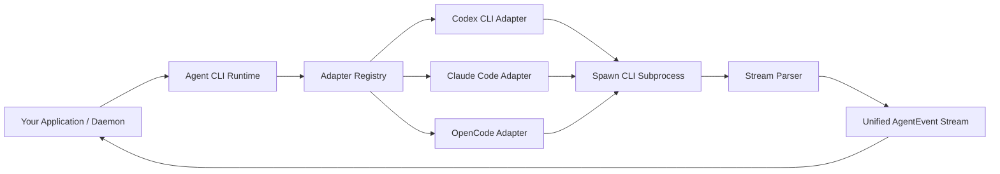

# Agent CLI Runtime

<div align="center">
  <p align="center">
    <b>The Universal Adapter & Execution Engine for Local Coding Agents</b>
  </p>
  <p align="center">
    <a href="./LICENSE"></a>
    <a href="https://www.npmjs.com/package/agent-cli-runtime"></a>
    <a href="#status"></a>
  </p>
  <p align="center">
    <b><a href="./README.md">English</a></b> | <b><a href="./README.zh-CN.md">简体中文</a></b>
  </p>
</div>

---

> **Agent CLI Runtime** is the dependable adapter layer you reach for when you do **not** want to build yet another coding agent.
>
> Modern local coding agents (like Codex CLI, Claude Code, and OpenCode) already excel at planning, editing files, running tools, asking for permissions, and managing LLM loops. This runtime keeps those complex loops *inside* the user's installed CLI while giving product builders and developers a unified, typed Node.js/TypeScript API to programmatically orchestrate them.

---

## 💡 Why Agent CLI Runtime?

Building developer tools with local coding agents usually means wrestling with non-standardized CLI flags, parsing chaotic terminal streams, managing subprocess timeouts, and dealing with permission leaks.

Agent CLI Runtime normalizes this chaotic landscape into a clean, predictable, and local-first execution layer:

| Subprocess Problem | Runtime Responsibility |
| :--- | :--- |
| **CLI Fragmentation** <br><sub>Users have different CLIs installed (`codex`, `claude`, `opencode`)</sub> | **Auto-Detection** <br><sub>Probes and detects available coding agent CLIs in the system.</sub> |
| **Argument Limits** <br><sub>Oversized prompts break command-line length limits (argv)</sub> | **Safe Prompt Transport** <br><sub>Gracefully leverages stdin and temporary prompt files instead of argv.</sub> |
| **Stream Inconsistency** <br><sub>Every CLI outputs a different text/JSON format</sub> | **Event Stream Normalization** <br><sub>Parses raw stdout/stderr into a single unified `AgentEvent` protocol.</sub> |
| **Zombies & Hangs** <br><sub>Headless runs can hang indefinitely on network stalls</sub> | **Lifecycle Management** <br><sub>Enforces timeouts, inactivity limits, cancellation, and exit classification.</sub> |
| **Privilege Escalation** <br><sub>Agents can run arbitrary shell commands outside workspaces</sub> | **Explicit Sandboxing** <br><sub>Enforces strict `cwd`, `extraAllowedDirs`, and `permissionPolicy`.</sub> |

---

## ✨ Key Features

*   🔍 **Automated CLI Detection:** Programmatically probes local executables, CLI versions, auth states, model availability, and capabilities without mutating user configs.
*   ⚡ **Unified Event Streaming:** Stream text deltas, thinking logs, tool invocations, file operations, usage/costs, and errors through an async-iterable `AgentEvent` stream.
*   💾 **Opt-In Durable Storage & Replay:** Log run manifests and events to disk. Includes crash-recovery checks, single-writer lease protection (`runtime.lock.json`), and store health/repair utilities.
*   🎯 **Task Graphs & Goal Scheduling:** Built-in planner integration that validates task dependency graphs and executes tasks in serial or parallel with custom retry and backoff policies.
*   🛡️ **Hardened Security & Redaction:** Out-of-the-box credential sanitization that automatically redacts secrets, bearer tokens, home folders, and absolute paths from diagnostics and outputs.
*   🩺 **Production-Grade Diagnostics:** Comprehensive, isolated diagnostics bundle exports with standardized error codes to make debugging failed agent runs trivial.

---

## 📦 Installation

Install the library via npm:

```bash
npm install agent-cli-runtime
```

Or execute CLI commands on the fly using `npx`:

```bash
npx --package agent-cli-runtime agent-runtime agents --json
npx --package agent-cli-runtime agent-runtime conformance --mode fixtures --json
```

---

## ⚡ Quick Start (API)

Initialize the runtime and detect what coding agents are installed on the local machine:

```ts
import { createAgentRuntime } from "agent-cli-runtime";

const runtime = createAgentRuntime();

// Detect installed coding agents on the machine
const agents = await runtime.detect({
  includeUnavailable: true,
});

console.log("Detected agents:", agents);
```

### 1. Running an Agent Task (Single-Execution)

Run a direct prompt and consume the normalized event stream in real-time:

```ts
const run = await runtime.run({
  agentId: "codex",
  cwd: process.cwd(),
  prompt: "Add a focused regression test for the failing parser case.",
  permissionPolicy: "workspace-write",
});

for await (const event of run.events) {
  switch (event.type) {
    case "text_delta":
      process.stdout.write(event.text);
      break;
    case "tool_call":
      console.log(`\n[Tool Invoked] ${event.name}`, event.input);
      break;
    case "thinking_delta":
      process.stdout.write(`💭 ${event.text}`);
      break;
    case "error":
      console.error(`\n[Error ${event.code}] ${event.message}`);
      break;
    case "run_finished":
      console.log(`\n[Execution Finished] Result: ${event.result}`);
      break;
  }
}
```

### 2. Dependency-Aware Multi-Task Goals

Execute complex objectives that are automatically broken down into dependency-aware task graphs by the planner:

```ts
const goal = await runtime.createGoal({
  cwd: "/path/to/project",
  objective: "Implement a focused parser regression fix and run tests.",
  defaultAgentId: "codex",
  permissionPolicy: "workspace-write",
  maxConcurrentTasks: 2, // Allows independent tasks to run in parallel
  retryPolicy: {
    maxAttempts: 2,
    retryableErrorCodes: ["AGENT_TIMEOUT", "AGENT_EXECUTION_FAILED"],
    backoffMs: 500,
  },
});

for await (const event of goal.events) {
  if (event.type === "task_attempt_started") {
    console.log(`Task ${event.taskId} Attempt ${event.attemptId} started.`);
  }
  if (event.type === "goal_finished") {
    console.log(`Goal Finished. Status: ${event.result}`);
  }
}
```

---

## 🏗️ Architectural Model

The core runtime acts as a process orchestrator and event normalizer. Individual adapters encapsulate CLI-specific nuances, allowing the client application to interact with a single interface.



Each adapter manages CLI-specific responsibilities:
- Version, auth, model, and capabilities probing.
- Subprocess argument (argv) and environment variables (env) mapping.
- Prompt transport selection (stdin, prompt files).
- Output stream parsing & noise isolation.

---

## 📋 Task Graph Schema

When calling `createGoal`, the planner output is parsed and validated against a strict JSON schema:

```json
{
  "tasks": [
    {
      "id": "T001",
      "title": "Fix Parser Core",
      "objective": "Identify and correct the off-by-one error in stream-parser.",
      "dependencies": [],
      "allowedFiles": ["src/parsers/stream-parser.ts"],
      "validationCommands": ["npm test"],
      "agentId": "codex",
      "retryPolicy": {
        "maxAttempts": 2,
        "retryableErrorCodes": ["AGENT_TIMEOUT"],
        "backoffMs": 250
      }
    }
  ]
}
```

*   `id`, `title`, and `objective` are mandatory strings.
*   `dependencies`, `allowedFiles`, and `validationCommands` are optional string arrays.
*   Task-level `retryPolicy` can override global schedules.

---

## 💾 Durable Local Storage (Persistence)

By default, runs and goals are kept entirely in-memory. By passing a `storageDir`, the runtime enables durable local persistence:

```ts
const runtime = createAgentRuntime({
  storageDir: "./.agent-runtime",
  storage: { durability: "fsync" }, // Optional. Default is "relaxed"
});
```

### Storage Layout
On-disk serialization uses a robust, append-friendly layout:
```text
.agent-runtime/
  runtime.lock.json           # Single-writer concurrency lease
  runs/
    <runId>/
      manifest.json           # Run configuration metadata
      events.jsonl            # Append-only stream event log
  goals/
    <goalId>/
      manifest.json           # Goal objective & tasks configuration
      events.jsonl            # Append-only goal execution event log
```

### Key Concurrency Guards
1.  **Single-Writer Lease:** The `runtime.lock.json` file contains information about the active runtime (PID, host, heartbeat). A second runtime trying to gain write access to the same directory will be safely refused.
2.  **Crash Recovery:** During start-up, active runs or goals owned by crashed, stale, or dead processes are safely marked as failed with an `AGENT_RUNTIME_INTERRUPTED` diagnostic, ensuring your data history never lies about active state.
3.  **Corruption Isolation:** Corrupted JSONL lines are safely skipped during replays and reported via diagnostics instead of failing the entire runtime initialization.

---

## ⚙️ Configuration & Environment Variables

The package is intentionally environment-first to avoid mutating user files.

### 1. Executable Overrides
Specify custom binary locations using environment variables:
```bash
export CODEX_BIN=/absolute/path/to/codex
export CLAUDE_BIN=/absolute/path/to/claude
export OPENCODE_BIN=/absolute/path/to/opencode
```

### 2. Claude Code Provider Options
Configure Claude Code's Anthropic-compatible provider through environment variables:
```bash
export ANTHROPIC_BASE_URL=<anthropic-compatible-base-url>
export ANTHROPIC_MODEL=<model-name>
export ANTHROPIC_DEFAULT_OPUS_MODEL=<model-name>
export ANTHROPIC_DEFAULT_SONNET_MODEL=<model-name>
export ANTHROPIC_DEFAULT_HAIKU_MODEL=<model-name>
export CLAUDE_CODE_SUBAGENT_MODEL=<model-name>
export CLAUDE_CODE_EFFORT_LEVEL=<effort>
export ANTHROPIC_API_KEY=<your-secret-api-key>
```
> ⚠️ **Security Warning:** Never write real token values or API keys directly into prompts, manifests, examples, or committed code files.

### 3. Proxy Settings
Subprocesses automatically inherit system network proxies:
```bash
export HTTPS_PROXY=http://127.0.0.1:7897
export HTTP_PROXY=http://127.0.0.1:7897
```

---

## 🛠️ CLI Reference

The package ships with an `agent-runtime` CLI tool for administrative, testing, and debugging purposes.

```bash
# 1. Detection and Verification
agent-runtime agents                                          # List detected coding agents
agent-runtime doctor                                          # Diagnose current environment health
agent-runtime conformance --mode fake --json                  # Run conformance test suite using offline fakes
agent-runtime conformance --mode real --agent all --json      # Certificate real CLI integration profiles

# 2. Subprocess Runs & Goals
agent-runtime run --agent codex --cwd . --prompt "Fix test"   # Run interactive task
agent-runtime goal --agent codex --cwd . --prompt "Refactor"  # Create a task graph goal

# 3. Persistent Storage Auditing
agent-runtime runs --storage-dir .agent-runtime --json                    # List saved runs
agent-runtime replay-run run_123 --storage-dir .agent-runtime --jsonl     # Replay stream events
agent-runtime store-health --storage-dir .agent-runtime --json            # Run database integrity scan
agent-runtime store-repair --storage-dir .agent-runtime --apply --json     # Perform atomic repairs on event logs
```

---

## 🔌 Supported MVP Adapters

| Adapter | Binary | Transport | Stream Strategy | Status / Capabilities |
| :--- | :--- | :--- | :--- | :--- |
| **Codex CLI** | `codex` | stdin | `codex exec --json` | Fully supported. Timeout diagnostics categorize startup lags, and reconnect streams are parsed as statuses. |
| **Claude Code**| `claude` | stdin JSONL | `stream-json` | Basic detection supported. Advanced capabilities and authentication probe support is ongoing. |
| **OpenCode** | `opencode` | stdin | JSON Stream | Supported. Stdin prompts verified on `opencode 1.15.6`. Read-only isolation profile is active. |

---

## 🛡️ Security & Privacy Architecture

This runtime spawns and manages powerful coding agents on your local machine. We take safety extremely seriously:

*   **No Auto-Authentication:** The runtime does NOT store credentials or log you into third-party services. It inherits authentication from your already authenticated local CLI tools.
*   **Sandbox Isolation:** Probes run in clean, isolated temp directories to avoid polluting or reading your project workspace.
*   **Strict Redaction Engine:** Automatically filters and redacts environment dumps, token variables, absolute home folder paths, and `Bearer` keywords before writing data to manifests or diagnostic exports.
*   **Failed Adapter Isolation:** A failure in one agent adapter (e.g., missing authentication for Claude Code) is caught gracefully and never crashes detection or execution of other adapters.

---

## 🚦 Release Status & Roadmap

This project is in **pre-alpha / developer preview**.

### 🏷️ Package Release History
*   `agent-cli-runtime@0.1.0-alpha.6` - **Published corrective alpha release**. Published on npm; npm `alpha` and `latest` dist-tags both point at `0.1.0-alpha.6`. GitHub Release `v0.1.0-alpha.6` exists as a prerelease with the npm registry tarball asset, and `release:post-alpha:verify` tarball parity passes.
*   `agent-cli-runtime@0.1.0-alpha.5` - Published on npm. npm `alpha` and `latest` dist-tags both point at `0.1.0-alpha.6`. GitHub Release `v0.1.0-alpha.5` exists as a prerelease with the npm registry tarball asset, and `release:post-alpha:verify` tarball parity passes. Its immutable npm tarball contains stale package docs, so aggregate published verification (`published:verify` / `published:verify:evidence`) fails with `registry_packaged_docs_failed`; alpha.5 is not final corrective release acceptance.
*   `agent-cli-runtime@0.1.0-alpha.4` - Historical version published on npm. The immutable npm tarball contains stale release-prep package docs. GitHub Release `v0.1.0-alpha.4` exists with the npm registry tarball asset, and GitHub Release tarball parity passes.
*   `agent-cli-runtime@0.1.0-alpha.3` - Historical corrective pre-alpha release.
*   `agent-cli-runtime@0.1.0-alpha.2` - Published historical version whose immutable npm tarball contains stale pre-publish package docs.
*   `agent-cli-runtime@0.1.0-alpha.1` - Earlier published alpha with GitHub pre-release `v0.1.0-alpha.1`.
*   `agent-cli-runtime@0.1.0-alpha.0` - Deprecated because its immutable package docs shipped stale pre-publish status text.

npm registry metadata and GitHub Releases are the source of truth for available versions and dist-tags. Volatile run, target-SHA, registry, and artifact evidence stays outside the npm package under `.release-evidence/`. Future beta promotion or stable promotion requires fresh release evidence for that target, including package docs, registry state, GitHub Release parity, and published verification.

`published:usability:audit` is a repository-only post-publish audit script. It is intentionally excluded from npm package contents and verifies an already published package from the npm registry.

### 🗺️ Milestone Progress
- [x] **M0:** Design specification, documentation architecture, and core skeleton setup.
- [x] **M1:** Subprocess runner implementation and fake-CLI test harness.
- [x] **M2:** Codex CLI Adapter MVP.
- [x] **M3:** Claude Code Adapter MVP.
- [x] **M4:** OpenCode Adapter MVP.
- [x] **M5:** Command Line Interface (`agent-runtime` wrapper) and `doctor` command.
- [x] **M6:** Public package boundaries, API/CLI schema contract lock, and release candidate validation checks.

---

## 📄 Documentation Matrix

For advanced integrations, refer to the following comprehensive specifications:
*   [SSOT (Single Source of Truth)](./docs/ssot.md) — Product intent and historical evidence records.
*   [API & CLI Contract Schema](./docs/api-schema-contract.md) — Stable failure taxonomies, event envelopes, and validation contracts.
*   [Daemon Embedding Guide](./docs/daemon-ready-contract.md) — Embedding the runtime in background processes.
*   [Real CLI Compatibility Matrix](./docs/compatibility.md) — Supported flags and real smoke matrices.
*   [Publish Runbook & Checklist](./docs/release-publish-runbook.md) — Step-by-step guidance for releasing new versions.

---

## 🤝 Contributing

We welcome contributions! Please review [CONTRIBUTING.md](./CONTRIBUTING.md) and [SECURITY.md](./SECURITY.md) before submitting pull requests.

## ⚖️ License

Licensed under the Apache License, Version 2.0 (Apache-2.0). See the [LICENSE](./LICENSE) file for details.
