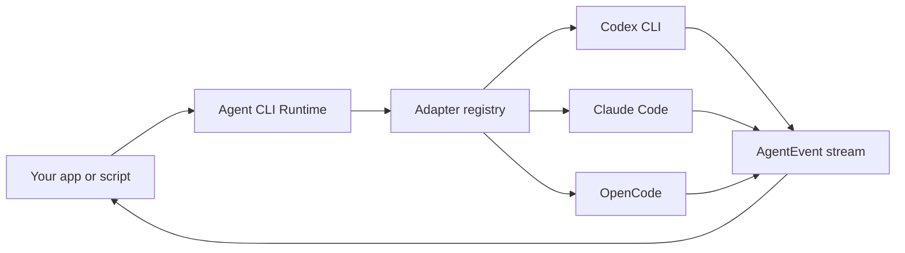

# Agent CLI Runtime

> 一个轻量、本地优先的 runtime，用同一套 typed API 驱动 Codex CLI、Claude Code、OpenCode 以及其他 coding-agent CLI。

[](./LICENSE)
[](#项目状态)

[English](./README.md) | [简体中文](./README.zh-CN.md)

Agent CLI Runtime 是一个 adapter layer。它适合你在不想重新造一个 coding agent 的时候，把多个本地 agent CLI 接到自己的产品、脚本或桌面应用里。

现代本地 coding agent 已经知道如何规划、编辑文件、运行工具、请求权限、管理 session、调用模型。这个项目把这些 agent loop 留在用户已安装的 CLI 内部，只在外面提供一层小而可靠的 runtime：

- 检测本机已安装的 coding agents；
- 在指定 `cwd` 启动 agent；
- 通过 stdin 等安全 transport 传递 prompt；
- 把不同 CLI 的 streaming output 归一成同一种 event protocol；
- 支持 cancel、timeout、diagnose 和 run result classification；
- 让 permissions 和 extra readable directories 保持显式。

## 项目状态

本仓库目前处于 **pre-alpha / developer preview**。

发布边界说明：
- `agent-cli-runtime@0.1.0-alpha.1` 已发布到 npm，并创建了 GitHub pre-release `v0.1.0-alpha.1`。
- `agent-cli-runtime@0.1.0-alpha.2` 已发布到 npm，并创建了 GitHub pre-release `v0.1.0-alpha.2`，但其不可变 npm tarball 内含过期的发布前 package docs。
- `agent-cli-runtime@0.1.0-alpha.3` 是面向 package consumer 的 corrective pre-alpha release。
- `agent-cli-runtime@0.1.0-alpha.0` 已 deprecate，原因是不可变 package docs 内含过期的发布前状态。
- 可用版本和 dist-tags 以 npm registry metadata 与 GitHub Releases 为准。
- release-candidate 与 post-alpha evidence 将 target SHA、evidence target SHA、workflow head SHA 和下载 artifact 细节保存在 npm 包外的 `.release-evidence/` 或 GitHub Release assets 中。
- `createAgentRuntime` 是当前公开的主要 value 入口，其他 adapter/parser/store 内部实现不对外承诺。
- 这版不包含后台 daemon、API server、WAL、database 或 remote runtime 模式承诺。
- 运行时定位是可嵌入 daemon/product shell 的 local-first execution kernel，不替代托管平台服务。

API 与 CLI schema 契约在 [docs/api-schema-contract.md](./docs/api-schema-contract.md)，daemon-ready 嵌入契约在 [docs/daemon-ready-contract.md](./docs/daemon-ready-contract.md)，SSOT 在 [docs/ssot.md](./docs/ssot.md)，post-alpha evidence 入口在 [docs/release-report.md](./docs/release-report.md)，publish/runbook 边界在 [docs/release-publish-runbook.md](./docs/release-publish-runbook.md)。当前实现是 contract-hardening 的 library-first Node.js/TypeScript 版本，默认 memory-only run / goal 调度，可选 durable local replay storage 及 crash/recovery health reporting，并补充 fault-injected consistency coverage、package-root API contract tests、tarball TypeScript consumer smoke 和 installed-package daemon embedding verification；包含内置 CLI compatibility profiles、强化后的 planner/task-graph validation、版本化 event/diagnostics/conformance/real-smoke/store/release-artifact 契约、parser fixtures、本地/远端 release artifact verification、post-alpha registry/GitHub Release evidence normalization、published npm install smoke、remote CI/artifact audit checks、alpha publish readiness docs，以及本地 smoke/query 薄 CLI。

## 为什么需要它

每个严肃的 coding-agent 产品，最后都会遇到同一组朴素但锋利的 runtime 问题：

| 问题 | Runtime 负责什么 |
| --- | --- |
| 用户安装的 CLI 各不相同 | 检测 Codex CLI、Claude Code、OpenCode 和未来 adapter |
| 每个 CLI 的 flags 不同 | 把 argv construction 收进 adapter definition |
| 长 prompt 会撞上 argv 长度限制 | 默认优先使用 stdin 或 prompt file |
| stream schema 各不相同 | 把各 agent output 解析成统一 `AgentEvent` stream |
| headless run 可能卡住 | 提供 cancellation、timeout、inactivity 和 exit classification |
| permission 很容易给过头 | 让 `cwd`、`extraAllowedDirs`、`permissionPolicy` 明确可见 |

目标是把这一层做得足够可靠、足够无聊，让更优秀的工具可以放心构建在它上面。

## 它不是什么

Agent CLI Runtime 不是：

- LLM provider router；
- hosted cloud agent；
- Codex CLI、Claude Code 或 OpenCode 的替代品；
- web UI；
- plugin marketplace；
- 自研 `Read` / `Write` / `Edit` tool loop；
- permission bypass wrapper。

Runtime delegate agent loop。它归一的是执行过程，不是智能本身。

## API

```ts
import { createAgentRuntime } from "agent-cli-runtime";

const runtime = createAgentRuntime();

const agents = await runtime.detect({
  includeUnavailable: true,
});

const run = await runtime.run({
  agentId: "codex",
  cwd: "/path/to/project",
  prompt: "Add a focused regression test for the failing parser case.",
  permissionPolicy: "workspace-write",
});

for await (const event of run.events) {
  if (event.type === "text_delta") process.stdout.write(event.text);
  if (event.type === "tool_call") console.log("tool", event.name);
  if (event.type === "error") console.error(event.code, event.message);
}
```

Goal 会先启动一次 planner run，再用 dependency-aware ready queue 执行 task graph：

```ts
const goal = await runtime.createGoal({
  cwd: "/path/to/project",
  objective: "实现一个聚焦的 parser regression fix。",
  defaultAgentId: "codex",
  permissionPolicy: "workspace-write",
  maxConcurrentTasks: 2,
  retryPolicy: {
    maxAttempts: 2,
    retryableErrorCodes: ["AGENT_TIMEOUT", "AGENT_EXECUTION_FAILED"],
    backoffMs: 500,
  },
});

for await (const event of goal.events) {
  if (event.type === "task_attempt_started") console.log(event.taskId, event.attemptId, event.runId);
  if (event.type === "goal_finished") console.log(event.result);
}
```

task 只有在所有 dependencies 都 `succeeded` 后才会进入 ready。默认 `maxConcurrentTasks: 1`，保持保守串行语义；在 `createGoal()` 或 `createAgentRuntime()` 上配置后，互不冲突的 ready tasks 才会并发执行。`retryPolicy` 默认 `{ maxAttempts: 1 }`；只有 terminal error code 命中 `retryableErrorCodes` 的失败才会重试。cancel 和 validation failure 默认不重试，除非 caller 显式把对应 error code 加进 retry policy。

Planner output 会在任何 task 启动前先被校验。主路径仍是 strict JSON，但 runtime 可以从 Markdown fenced code 或短的 surrounding prose 中提取唯一一个 JSON object。多个 JSON objects、malformed JSON、缺少 `tasks` 或字段类型非法时，planning 会以 `AGENT_TASK_GRAPH_INVALID` 写入 `scheduler_error`，goal 最终为 `failed`；这些错误不会被误报成 task failure 或 adapter unavailable。Diagnostics 保持简短，不会把超长 planner 原文完整写入输出。

Task graph schema：

```json
{
  "tasks": [
    {
      "id": "T001",
      "title": "短标题",
      "objective": "自包含任务目标",
      "dependencies": [],
      "allowedFiles": ["src/example.ts"],
      "validationCommands": ["npm test"],
      "agentId": "codex",
      "retryPolicy": {
        "maxAttempts": 2,
        "retryableErrorCodes": ["AGENT_TIMEOUT"],
        "backoffMs": 250
      }
    }
  ]
}
```

`id`、`title`、`objective` 和每个 `dependencies` item 都必须是 string。`dependencies`、`allowedFiles`、`validationCommands` 和 `retryPolicy.retryableErrorCodes` 必须是 string array。`agentId` 如存在必须是 string。task-level `retryPolicy` 如存在，必须包含正整数 `maxAttempts`、string array `retryableErrorCodes` 和非负 number `backoffMs`。

每个 task evidence 会记录 attempts：

```json
{
  "runId": "run_latest",
  "result": "success",
  "attempts": [
    {
      "attemptId": "T001:attempt:1",
      "runId": "run_1",
      "startedAt": 1760000000000,
      "finishedAt": 1760000001200,
      "result": "failed",
      "diagnostics": [{ "code": "AGENT_EXECUTION_FAILED", "message": "..." }]
    },
    {
      "attemptId": "T001:attempt:2",
      "runId": "run_2",
      "startedAt": 1760000001800,
      "finishedAt": 1760000002600,
      "result": "success",
      "diagnostics": []
    }
  ],
  "validationCommands": [],
  "summary": "Task T001 finished with success after 2 attempts."
}
```

持久化是显式开启的：不传 `storageDir` 时，run 和 goal 仍然只保存在内存里；传入 `storageDir` 后，runtime 会写入可审计的 JSON manifest 和 JSONL replay events：

```ts
const runtime = createAgentRuntime({
  storageDir: ".agent-runtime",
  storage: { durability: "fsync" }, // 可选；默认是 "relaxed"
});

const runs = await runtime.listRuns({ status: "active" });
const runEvents = await runtime.replayRunEvents("run_123", { afterEventId: 10 });
const goals = await runtime.listGoals();
const goalEvents = await runtime.replayGoalEvents("goal_123");
```

Public facade 暴露：

- `createAgentRuntime(options?)`
- `runtime.detect(options?)`
- `runtime.detectStream(options?)`
- `runtime.run(request)`
- `runtime.createGoal(request)`
- `runtime.cancelRun(runId)`
- `runtime.cancelGoal(goalId)`
- `runtime.shutdown(reason?)`
- `runtime.getRun(runId)`
- `runtime.replayRunEvents(runId, { afterEventId? })`
- `runtime.listRuns({ status? })`
- `runtime.getGoal(goalId)`
- `runtime.replayGoalEvents(goalId, { afterEventId? })`
- `runtime.listGoals({ status? })`
- `runtime.inspectStore({ storageDir? })`
- `runtime.exportDiagnostics({ kind: "run", runId, storageDir? })`
- `runtime.exportDiagnostics({ kind: "goal", goalId, storageDir? })`
- `runtime.getAdapter(id)`

### API 契约边界

Pre-alpha release 的 package root 会刻意保持小。它只导出 `createAgentRuntime()` 这个运行时 value，以及调用 runtime、消费 records 所需的 public TypeScript types：

- stable MVP surface：`AgentRuntime`、`RuntimeOptions`、`DetectOptions`、`DetectedAgent`、`RunRequest`、`RunHandle`、`RunRecord`、`RunStatus`、`CreateGoalRequest`、`GoalHandle`、`GoalRecord`、`GoalStatus`、`AgentEvent`、`SchedulerEvent`、`ReplayEvent`、`VersionedEventEnvelope`、`EventScope`、`EventTerminalContract`、`EventTerminalReason`、`RuntimeDiagnostic` 和 `RuntimeErrorCode`；
- experimental extension surface：adapter authoring 相关类型，例如 `AgentAdapterDef`、`BuildArgsInput`、`PromptTransport`、`StreamParser` 和 `AdapterCompatibilityProfile`；
- 不从 package root 导出：内置 adapter values、parser helpers、executable-resolution helpers、stores、schedulers 和 task-graph helpers。

发布 tarball 里可能包含内部 `dist/` 文件，因为 TypeScript declarations 和 CLI 需要它们；但文档承诺的 API 边界只有 package root import：`import { createAgentRuntime } from "agent-cli-runtime"`。

`getAdapter(id)` 和 `RuntimeOptions.adapters` 是 pre-alpha 阶段为 adapter 实验保留的 extension points；在 stable release 之前，它们的形状仍可能调整。

## Pre-alpha API 发布边界

- 本阶段不承诺稳定 API 契约。
- 包根仅承诺运行时 facade 的稳定入口，内部 adapter / parser / store 实现不对外承诺。
- 本阶段不提供 daemon、WAL、remote runtime 等稳定化能力。
- CLI JSON schemas 与 failure taxonomy 遵循 [docs/api-schema-contract.md](./docs/api-schema-contract.md) 中的 pre-alpha versioning policy。

## 安装

从 npm 安装：

```bash
npm install agent-cli-runtime
```

不安装到项目、直接用 `npx` 调 CLI：

```bash
npx --package agent-cli-runtime agent-runtime agents --json
npx --package agent-cli-runtime agent-runtime conformance --mode fixtures --json
```

从本仓库本地 checkout 使用：

```bash
npm ci
npm run build
npm run stable:surface:check
node ./dist/cli/main.js --help
npm run daemon:verify
npm run dogfood
```

安装后的最小 library smoke：

```bash
node -e "import('agent-cli-runtime').then((m) => console.log(typeof m.createAgentRuntime))"
```

最小 TypeScript consumer：

```ts
import {
  createAgentRuntime,
  type CreateGoalRequest,
  type RunRequest,
} from "agent-cli-runtime";

const runtime = createAgentRuntime({ storageDir: "./.agent-runtime" });

const runRequest: RunRequest = {
  agentId: "codex",
  cwd: process.cwd(),
  prompt: "Reply with a one-line status.",
};

const goalRequest: CreateGoalRequest = {
  defaultAgentId: "codex",
  cwd: process.cwd(),
  objective: "Summarize this repository.",
};

void runRequest;
void goalRequest;
void runtime.shutdown();
```

Daemon embedding gate 会把 packed tarball 安装到临时 consumer，再用 fake CLI 跑 detect/conformance、run、goal、replay、diagnostics、store inspection、shutdown 和 reopen。Runtime safety gate 使用同样的 installed-package 边界，覆盖 repeated run/goal、慢 event consumer、cancel/timeout churn、repeated shutdown、lease close 和 reopen。Published daemon consumer gate 会从 npm registry 安装 `agent-cli-runtime@0.1.0-alpha.1` 到临时 daemon-style consumer，并用 fake Codex/Claude/OpenCode binaries 验证已发布包的嵌入生命周期。Published adapter gate 会从 npm registry 安装已发布包，并用 fake CLI 验证内置 Codex、Claude、OpenCode adapter detection、argv shape、stdin prompt transport、parser behavior、redaction 和 failure isolation。Published verification gate 会把这些 post-publish checks 和 registry metadata 聚合为 redacted artifact：

```bash
npm run daemon:verify
npm run runtime:safety
npm run published:daemon:verify
npm run published:adapters:verify
npm run published:verify -- --out-dir published-verification
npm run published:verify:evidence -- --dir published-verification
```

`published:verify` 负责生成 `published-verification/published-verification.json`。`published:verify:evidence` 只是 verifier，不会生成 evidence。没有 evidence 文件时裸跑 verifier 会按预期失败，这是一道 guard，不表示发布失败。本地验证先执行 `npm run published:verify -- --out-dir published-verification`，再执行 `npm run published:verify:evidence -- --dir published-verification`。远端复验先下载 `agent-cli-runtime-published-verification` artifact，再用 `npm run published:verify:evidence -- --dir <downloaded-artifact-dir>` 指向下载目录。

`published:usability:audit` 是 repo-only 的 post-publish 审计脚本。它有意不进入 npm package 内容，用于从 npm registry 验证已经发布的包。

更完整的 release gate 会把 packed tarball 安装到临时 TypeScript 项目，执行 `tsc --noEmit`，再用 fake CLI 跑 library run / goal / replay / diagnostics smoke。见 `npm run daemon:verify`、`npm run runtime:safety`、`npm run published:daemon:verify`、`npm run published:adapters:verify`、`npm run published:verify`、`npm run dogfood` 和 [docs/release-checklist.md](./docs/release-checklist.md)。

本机 agent CLI 按场景安装即可：

- `codex`（Codex CLI）
- `claude`（Claude Code）
- `opencode` / `opencode-cli`（OpenCode）

Executable override：

```bash
export CODEX_BIN=/absolute/path/to/codex
export CLAUDE_BIN=/absolute/path/to/claude
export OPENCODE_BIN=/absolute/path/to/opencode
```

Codex 配置继承已安装 Codex CLI 和当前进程环境。runtime 不替用户登录、不编辑 Codex config，也不会偷偷提升权限。

Claude Code 可以使用它的默认 first-party 配置，也可以接 Anthropic-compatible provider。provider 配置只通过环境变量名说明，不在文档、示例、fixture、manifest 中写真实 token：

```bash
export ANTHROPIC_BASE_URL=<anthropic-compatible-base-url>
export ANTHROPIC_MODEL=<model-name>
export ANTHROPIC_DEFAULT_OPUS_MODEL=<model-name>
export ANTHROPIC_DEFAULT_SONNET_MODEL=<model-name>
export ANTHROPIC_DEFAULT_HAIKU_MODEL=<model-name>
export CLAUDE_CODE_SUBAGENT_MODEL=<model-name>
export CLAUDE_CODE_EFFORT_LEVEL=<effort>
# 按 provider 或 Claude Code 配置要求设置 token 变量，
# 常见名称包括 ANTHROPIC_AUTH_TOKEN 或 ANTHROPIC_API_KEY；不要提交变量值。
```

OpenCode 配置继承已安装 OpenCode CLI。当前 runtime 使用 `opencode run --format json --dir <cwd>`；显式 read-only/workspace-write flag、extra dirs 和 session 仍留在 `needsVerification`，直到有真实 CLI 证据。

代理和网络相关环境变量按需设置：

```bash
export HTTPS_PROXY=http://127.0.0.1:7897
export HTTP_PROXY=http://127.0.0.1:7897
```

发布前本地验证命令：

```bash
npm run ci
npm run daemon:verify
npm run runtime:safety
npm run compat:real:evidence:verify
npm run published:daemon:verify
npm run published:adapters:verify
npm run published:verify -- --out-dir published-verification
npm run published:verify:evidence -- --dir published-verification
npm run dogfood
npm run prepublish:check
node ./dist/cli/main.js conformance --mode fixtures --json
node ./dist/cli/main.js conformance --mode fake --json
node ./dist/cli/main.js conformance --mode real --agent all --json
node ./dist/cli/main.js smoke --mode real --agent codex --json
```

`conformance --mode real` 和 `smoke --mode real` 不带 `--allow-real-run` 时只做真实本地 detection/profile certification，不启动 authenticated real agent run。只有显式传入 `--allow-real-run` 才会执行真实 run；未传 `--cwd` 时 runtime 使用隔离临时目录，并请求 read-only 行为。请把 `--allow-real-run` 当成本机账号/网络 run 的明确安全边界。

`npm run compat:real:evidence` 会生成 repo-only 的 P8-2 真实 CLI compatibility matrix：`.release-evidence/p8-2-real-cli-compatibility-matrix.json`。它是显式 evidence refresh 动作，不是默认发布门禁。默认只跑 safe real preflight；authenticated smoke evidence 必须显式传入成对参数，例如 `--allow-real-run --agent codex --expect-text "agent-runtime codex smoke ok"`。`real_run_skipped`、`auth_missing`、`unavailable_executable`、`needs_verification` 等 skipped/blocked 状态会保留为 evidence state，不会写成 success。`npm run compat:real:evidence:verify` 是该 matrix 的离线 drift gate，只复验 evidence 文件，不启动真实 CLI run；它会拒绝泄露内容、缺失 dirty-state evidence、把 skipped/auth-missing/unavailable 伪装成 success、authenticated success 证据不完整、缺少 adapter 必填字段、缺少 `needsVerification` audit 项，以及 package boundary 声明无效。Matrix 会区分未提交输入变化和 evidence 输出文件自身写入：`gitDirty` / `gitInputDirty` 表示非 evidence 输入 dirty，`gitOutputDirty` 表示 matrix 文件本身 dirty。默认 verifier 会接受结构有效的 dirty repo-only evidence，并在输出中给出 `dirtyPolicy.status`；release review 使用显式 freshness 绑定：`npm run compat:real:evidence:verify -- --target-sha <target-sha> --max-age-hours 24 --release-strict`。release-strict 允许 `self_dirty_only` 的 evidence 输出文件变化；其它 dirty input evidence 会失败，除非显式传入 `--allow-dirty` 并审查输出中的 dirty policy summary。`prepublish:check` 运行默认离线 verifier。本地 `release:candidate` 默认使用 `--real-compatibility-mode local-strict`，针对 matrix `gitSha` 对应的 release target 校验既有 repo-only evidence / freshness / dirty policy，但不会刷新真实 CLI evidence；`--target-sha <sha>` 可用于显式覆盖目标。远端 clean-checkout release-candidate workflow 使用 `--real-compatibility-mode repo-only-skipped`，明确记录 repo-only real compatibility evidence 未在 CI 刷新。

CI 使用 Node.js 20/22/24 matrix 跑 typecheck、lint、tests、build、production dependency audit、package boundary check 和 `npm pack --dry-run`。`npm run daemon:verify`、`npm run runtime:safety` 和 `npm run dogfood` 放在单 Node 版本 release-gates job 中执行，避免 matrix 重复跑 installed-package gates。CI 刻意不运行 repo-only compatibility evidence verifier；本地 `prepublish:check` 和本地 strict `release:candidate` 是能把既有 `.release-evidence/` matrix 绑定到 target SHA 的 release/evidence 路径，远端 workflow artifact 记录显式 repo-only skipped 状态。dogfood、CI 和 prepublish 的默认边界一致：允许 fixtures、fake CLIs、真实本地 detection/profile certification；不带 `--allow-real-run` 时不启动 authenticated real agent run。

本地 release-candidate 置信门禁使用 `npm run prepublish:check`，并从已提交 matrix `gitSha` 指向目标提交的 worktree 运行 `npm run release:candidate -- --out-dir release-candidate`。GitHub Actions 的 `Release Candidate` workflow 通过 `workflow_dispatch` 手动触发，执行 `npm ci`、`npm run ci`、`npm run dogfood` 和 `npm run release:candidate -- --out-dir release-candidate --real-compatibility-mode repo-only-skipped`；生成并上传 `agent-cli-runtime-tarball`、`agent-cli-runtime-pack-metadata`、`agent-cli-runtime-package-files`、`agent-cli-runtime-gate-evidence` 和 `agent-cli-runtime-release-verification`。Compatibility gate summary 只记录 verifier schema、已验证 matrix schema、target SHA status、freshness status、dirty policy status、diagnostic count/codes，以及远端 repo-only skipped artifact 中固定的 `not_refreshed_in_ci` 原因。

`npm run release:strict-compatibility:evidence -- --target-sha <target-sha> --local-release-dir <tmp-local-strict>` 会把 P8-4 repo-only summary 写入 `.release-evidence/p8-4-release-strict-compatibility.json`。Summary 记录 P8-2 matrix schema、strict verifier schema、本地 strict `release:candidate` / `release:verify` 结果、远端 workflow 触发状态、下载 artifact 复验状态、`noAuthenticatedRealRun`、`noNpmPublish`、`noNpmToken`，以及明确的 branch/main evidence 判定。`targetSha` 是 matrix 证明的 release target；`currentHeadSha` 只是 summary 生成时的 HEAD，上层 evidence-only commit 可能让它不同于最终分支 HEAD。如果 target SHA 不在 `origin/main`，summary 只能是 branch/local evidence，`mainEvidence: false`；它不是当前 `main` release evidence。

`0.1.0-alpha.1` 已发布到 npm，并有 GitHub pre-release `v0.1.0-alpha.1`。`0.1.0-alpha.2` 已发布到 npm，使用 `alpha` dist-tag，并创建了 GitHub pre-release `v0.1.0-alpha.2`，但其不可变 tarball 内含过期的发布前 package docs。`0.1.0-alpha.3` 是面向 package consumer 的 corrective pre-alpha release。`0.1.0-alpha.0` 已 deprecate，原因是该不可变 tarball 内含过期的发布前状态说明。可用版本和 dist-tags 以 npm registry metadata 与 GitHub Releases 为准。由于 release docs 会进入 npm package，易漂移的 target-SHA evidence 必须留在包外的 `.release-evidence/` 或 GitHub Release assets 中。

post-alpha 验证：

```bash
npm run release:post-alpha:verify
npm run smoke:published
npm run published:daemon:verify
npm run published:adapters:verify
npm run published:verify -- --out-dir published-verification
npm run published:verify:evidence -- --dir published-verification
```

`release:post-alpha:verify` 会比较 npm registry tarball 与 `v0.1.0-alpha.1` GitHub Release tarball。两者 raw gzip SHA1/SHA256 可以不同，因为 registry tarball 和 Release asset 是不同 packaging artifact；package 内容边界以 npm registry `shasum`/`integrity`、解包后的 package 文件列表和内容一致性，以及 `npm run release:verify -- --dir <downloaded-github-release-assets-dir>` 为准。

`published:daemon:verify` 安装的是已经发布到 npm registry 的包，不依赖本地 checkout 或本地 `dist/`，输出 `schemaVersion: "agent-runtime.publishedDaemonConsumer.v1"` 且 `packageSource: "npm-registry"`。它只使用 fake CLI，覆盖 detect、run、goal、cancel、timeout、replay、writer active 时的 read-only inspection、second-writer refusal、shutdown/reopen 和 stale owner recovery，不启动 authenticated real agent run。

`published:adapters:verify` 同样从 npm registry 安装，输出 `schemaVersion: "agent-runtime.publishedAdapters.v1"` 且 `packageSource: "npm-registry"`。它用 fake Codex/Claude/OpenCode binaries 验证已发布包的内置 adapter invocation shape、stdin prompt transport、parser noise tolerance、redaction 和 per-adapter failure isolation。这是 fake-CLI adapter contract evidence，不是 authenticated real CLI compatibility success evidence。

`published:verify` 输出 `schemaVersion: "agent-cli-runtime.publishedVerification.v1"`，默认写入 `published-verification/published-verification.json`。它聚合 `smoke:published`、`published:daemon:verify`、`published:adapters:verify`、`release:post-alpha:verify` 和 npm registry metadata，不保存 raw stdout/stderr，也不需要发布凭证。GitHub Actions 的手动 `Published Package Verification` workflow 会在 Node.js 22 上执行同一套 post-publish verification，并上传 `agent-cli-runtime-published-verification`。

`published:verify:evidence` 只读取 `--dir` 或 `--summary` 指向的既有 `published-verification.json`，并复验四个 published gates 与 registry packaged-docs inspection。它不会运行 gates，也不会创建 evidence。默认的 `published-verification/published-verification.json` 缺失时，它会以 exit `1` 输出脱敏、可解析 JSON，并提示本地生成命令和 GitHub artifact 的 `--dir` 复验方式。

如需在本地生成可审查的 release-candidate artifact set：

```bash
npm run release:candidate -- --out-dir release-candidate
npm run release:verify -- --dir release-candidate
```

`release:candidate` 会在输出目录写入 `npm-pack.json`、`package-files.txt`、`gate-evidence.json`、tarball 和 `release-verification.json`。`gh run download` 会把五个 GitHub Actions artifacts 解包到按 artifact name 分开的子目录；复验前先归一化为单层目录：

```bash
npm run release:artifacts:normalize -- --download-dir <gh-download-dir> --out-dir <normalized-artifact-dir>
npm run release:verify -- --dir <normalized-artifact-dir>
```

`release:artifacts:normalize` 输出 `schemaVersion: "agent-cli-runtime.releaseArtifactNormalization.v1"`，只从匹配的 GitHub artifact 子目录复制五个预期 release-candidate 文件，缺失、重复、未知或目录不匹配的文件都会失败，并且不会在 JSON 输出里打印本机绝对路径。`release:verify` 复核归一化后的文件，并确认候选包记录了 `daemon:verify`、`runtime:safety`，以及本地 strict 的 target SHA / freshness verifier 证据或远端 repo-only skipped 的明确状态。

Main-scoped release-candidate evidence 通过以下命令生成：

```bash
npm run release:main-candidate:evidence -- --stage <stage> --release-target-sha <origin-main-sha> --local-release-dir <local-strict-dir> --remote-run-json <run.json> --artifacts-json <artifacts.json> --downloaded-dir <normalized-artifact-dir> --out .release-evidence/<stage-lower>-main-release-candidate.json
```

该 generator 输出 `schemaVersion: "agent-cli-runtime.mainReleaseCandidateEvidence.v1"`。`P9-2` 这类阶段名是有效标签；P8 main evidence 文件只保留为 exact-SHA historical evidence，不作为后续 package-visible 变化的当前 fresh main evidence。

记录过的 release target SHA 与后续 ref 的 package-content equivalence 通过以下命令判断：

```bash
npm run release:package-content:verify -- --base-ref <release-target-sha> --head-ref <sha-or-ref>
```

该 verifier 输出 `schemaVersion: "agent-cli-runtime.packageContentEquivalence.v1"`，通过临时 git worktree 收集两个 refs 的 npm package 可见文件列表和逐文件内容 hash，不把 gzip/tarball bytes 当作唯一判定依据。`.release-evidence/`、tests 和 repo-only scripts 这类包外变化可以记录为 `evidenceOnlyDrift: true` 且 `freshReleaseCandidateRequired: false`；README、packaged docs、package.json、dist、types、bin、examples 和其它 package-visible 内容变化会要求在把后续 ref 当作 release target 前生成 fresh release-candidate evidence。

Release evidence summary 见 [docs/release-report.md](./docs/release-report.md)，易漂移的 P8-4 target-SHA evidence 保存在 `.release-evidence/p8-4-release-strict-compatibility.json`，历史 P8 main remote evidence 保存在 `.release-evidence/p8-5-main-release-candidate.json`、`.release-evidence/p8-7-main-release-candidate.json` 和 `.release-evidence/p8-9-main-release-candidate.json`，alpha publish decision runbook 见 [docs/release-publish-runbook.md](./docs/release-publish-runbook.md)。`npm publish --dry-run --ignore-scripts --tag alpha` 只作为本地手动 dry-run check 记录在这些文档中；它不得真的 publish，也不作为远端 CI 必选 gate。Published package verification 是单独的手动 post-publish workflow，不是 publish workflow。

Main-scoped evidence 只证明其记录的 `releaseTargetSha`；记录 evidence 的提交或后续 PR merge commit 要作为 release target 时，需要重新生成 fresh main evidence。

可运行示例见 [examples/library-run.js](./examples/library-run.js)、[examples/library-goal.js](./examples/library-goal.js) 和 [examples/cli-dogfood.md](./examples/cli-dogfood.md)。两个 JavaScript 示例会创建本地 fake CLI，不需要真实 provider secret。

## CLI

```bash
agent-runtime agents
agent-runtime conformance --mode fixtures --json
agent-runtime conformance --mode fake --json
agent-runtime conformance --mode real --agent all --json
agent-runtime smoke --mode real --agent codex --allow-real-run --expect-text <safe_text> --json
agent-runtime smoke --mode real --agent claude --allow-real-run --expect-text <safe_text> --json
agent-runtime smoke --mode real --agent opencode --allow-real-run --expect-text <safe_text> --json
agent-runtime smoke --mode detection --json
agent-runtime smoke --mode fixtures --json
agent-runtime run --agent codex --cwd . --prompt "fix the failing test"
agent-runtime goal --agent codex --cwd . --prompt "split this objective into tasks and execute them"
agent-runtime goal --agent codex --cwd . --prompt "run independent fixes" --max-concurrent-tasks 2 --max-attempts 2 --retryable-error-codes AGENT_TIMEOUT,AGENT_EXECUTION_FAILED
agent-runtime run --agent claude --cwd . --permission workspace-write --prompt-file task.md
agent-runtime run --agent codex --cwd . --prompt "fix the failing test" --json
agent-runtime run --agent codex --cwd . --prompt "fix the failing test" --stream jsonl --diagnostics
agent-runtime doctor
agent-runtime runs --storage-dir .agent-runtime --json
agent-runtime run-status run_123 --storage-dir .agent-runtime --json
agent-runtime replay-run run_123 --storage-dir .agent-runtime --after 10 --jsonl
agent-runtime goals --storage-dir .agent-runtime --json
agent-runtime goal-status goal_123 --storage-dir .agent-runtime --json
agent-runtime replay-goal goal_123 --storage-dir .agent-runtime --after 10 --jsonl
agent-runtime store-health --storage-dir .agent-runtime --json
agent-runtime store-lock --storage-dir .agent-runtime --json
agent-runtime store-repair --storage-dir .agent-runtime --dry-run --json
agent-runtime store-repair --storage-dir .agent-runtime --apply --json
agent-runtime diagnostics run run_123 --storage-dir .agent-runtime --json
agent-runtime diagnostics goal goal_123 --storage-dir .agent-runtime --json --out diagnostics-goal_123.json
agent-runtime smoke --mode real --agent codex --allow-real-run --prompt-file task.md --expect-text "expected reply" --timeout-ms 30000 --json --diagnostics
```

Library API 是主入口。CLI 是同一套 runtime 之上的薄包装，并支持 `--json` 以及 run/goal 的 `--stream jsonl` event stream。对 run/goal 命令，`--json` 输出最终 run 或 goal record；`--stream jsonl --diagnostics` 保留事件流，并在 terminal event 后追加一行 redacted `run_summary` 或 `goal_summary`。

`agent-runtime conformance` 是正式 production gate 包装。它的 JSON 输出带 `schemaVersion: "agent-runtime.conformance.v1"`，并输出稳定的 per-adapter summary，字段包括 `adapter`、`version`、`resolvedExecutable`、`auth`、`modelsSource`、`capabilities`、`argvProfile`、`promptTransport`、`parserMode`、`runClassification`、`expectedTextMatched`、`observedTextTail`、`cwdMutationChecked`、`cwdMutated`、`diagnosticsCount`、`diagnostics`、`skippedReason` 和 `failureReason`。

- `--mode fixtures` 离线检查 parser contract。
- `--mode fake` 临时创建 fake CLIs，并通过真实 adapter argv/stdin/parser 路径离线执行。
- `--mode real` 默认只执行真实本地 detection/profile certification，不启动 agent run。只有显式传入 `--allow-real-run` 时才启动真实运行；否则可运行 adapter 会返回 `runClassification: "real_run_skipped"` 和 `skippedReason: "real_run_not_allowed"`。`--agent all` 会把单个 adapter 的 fail/skip 隔离在 summary 中，不吞掉其他 adapter 结果。

Real conformance 也负责 drift detection：tracked flag 不再出现在 help 中、version/help 输出形状异常、parser/stream 失败、未验证能力都会变成 actionable diagnostics，而不是猜一个新 flag 塞进 argv。未知能力保留在 `argvProfile.needsVerification`。输出会对 token、Bearer、auth env assignment、prompt、observed text tail 和真实私有绝对路径做脱敏。

`agent-runtime smoke` 有三个模式：

- `--mode detection` 只执行本地 executable/model/auth detection。
- `--mode fixtures` 离线 dry-run Codex、Claude、OpenCode 的内置 parser conformance fixtures，不启动真实 CLI。
- `--mode real` 默认只做 detection/profile certification，并返回 `runClassification: "real_run_skipped"`；只有显式传入 `--allow-real-run` 才会启动真实 run。带 `--allow-real-run` 时，它会为 `--agent <id>` 执行一次真实非写入 run，并由 runtime 请求 read-only 行为。未传 `--cwd` 时使用隔离临时目录。默认 prompt 要求 agent 精确回复 `agent-runtime <agent> smoke ok` 且不编辑文件；`--expect-text <text>` 可指定另一段安全验收文本。expected text 是成功的必要条件：如果传入 `--prompt` 或 `--prompt-file` 但未传 `--expect-text`，即使 exit `0` 且有 text 输出，也会分类为 `unexpected_output`。

推荐的 opt-in smoke evidence 命令：

```bash
node ./dist/cli/main.js smoke --mode real --agent codex --allow-real-run --expect-text <safe_text> --json
node ./dist/cli/main.js smoke --mode real --agent claude --allow-real-run --expect-text <safe_text> --json
node ./dist/cli/main.js smoke --mode real --agent opencode --allow-real-run --expect-text <safe_text> --json
```

Real smoke JSON 使用 `schemaVersion: "agent-runtime.realSmoke.v1"`，输出 redacted `real_smoke_summary`，字段包括 `adapter`、`version`、`auth`、`modelsSource`、`runClassification`、`expectedTextMatched`、截断脱敏的 `observedTextTail`、`cwdMutationChecked`、`cwdMutated`、`diagnosticsCount`、`skippedReason` 和 `failureReason`。它不包含 prompt text、token value、私有 cwd、raw stdout/stderr 或最终 run record。失败和跳过分类包括 `auth_missing`、`unavailable_executable`、`unsupported_flag`、`unexpected_output`、`cwd_mutated`、`needs_verification` 和 `real_run_skipped`。

完整 schema inventory 和 version bump policy，包括 event envelopes、diagnostics、conformance、real smoke、store health/repair、CLI errors、release verification 与 release gate evidence，统一维护在 [docs/api-schema-contract.md](./docs/api-schema-contract.md)。

磁盘布局保持简单、方便人工检查和 `tail`：

```text
.agent-runtime/
  runtime.lock.json
  runs/<runId>/manifest.json
  runs/<runId>/events.jsonl
  goals/<goalId>/manifest.json
  goals/<goalId>/events.jsonl
```

Public replay API 保持 source-compatible，仍返回 `ReplayEvent<T>`：`{ "id": 1, "sequence": 1, "runId": "run_123", "timestamp": 123, "event": {...} }`，goal event 使用同样形状但带 `goalId`。CLI JSONL 输出，包括 `run --stream jsonl`、`goal --stream jsonl`、`replay-run --jsonl` 和 `replay-goal --jsonl`，统一使用稳定 envelope `schemaVersion: "agent-runtime.event.v1"`：

```json
{
  "schemaVersion": "agent-runtime.event.v1",
  "id": 1,
  "sequence": 1,
  "timestamp": 1760000000000,
  "scope": { "kind": "run", "id": "run_123" },
  "event": { "type": "run_finished", "result": "success", "timestamp": 1760000000000 },
  "terminal": { "result": "success", "reason": "success" }
}
```

`id` 和 `sequence` 在单个 run 或 goal 内单调递增。Terminal reason 使用同一组词：`success`、`failed`、`timeout`、`canceled`、`interrupted`、`validation_failed`、`execution_failed`、`unavailable`、`auth_missing`、`task_graph_invalid`。`--stream jsonl --diagnostics` 可能在 event envelopes 后追加一行脱敏 summary。默认 durability 是 `relaxed`；`createAgentRuntime({ storageDir, storage: { durability: "fsync" } })` 会要求 store 对 manifest temp file 和 event append 尽量执行 `fdatasync` / `fsync`，并在平台不支持时 graceful fallback、记录 diagnostics。

传入 `storageDir` 时，runtime 会以 writer mode 打开本地 single-writer lease，写在 `runtime.lock.json`。lock owner 包含生成的 `runtimeInstanceId`、`pid`、`startedAt` 和 `heartbeatAt`；active run/goal manifest 也会记录当前 owner。同一个 `storageDir` 若已有 live owner，第二个 writer runtime 会被拒绝。如果已有 owner stale 或 closed，新 runtime 可以接管，并记录脱敏 lease diagnostic。`runtime.shutdown(reason?)` 会取消 active runs/goals，短暂等待 terminal events，并把 lease 标记为 closed。这只是同一台机器上的 best-effort 嵌入式 runtime 防护；不是 daemon coordination、distributed lock、WAL、数据库事务层，也不是 live process resume。

新的 writer runtime 指向同一个 `storageDir` 后可以直接读取 terminal run/goal。只有 owner missing、stale 或 closed 的 active record 会进入 interrupted recovery；这些 run/goal 会被标记为 failed，并写入 `AGENT_RUNTIME_INTERRUPTED` diagnostic/event，避免重启后假装仍在执行。属于另一个 live runtime owner 的 active record 不会被改写，只通过只读 inspection 暴露。损坏的 manifest 或 JSONL 行只影响对应 record，并通过 `AGENT_STORE_RECORD_CORRUPT` 或 `AGENT_EVENT_LOG_CORRUPT` diagnostic 暴露，不会拖垮 runtime 初始化。加载 corrupt manifest 时不会静默覆盖原始坏文件，因此后续 health scan 仍能看到损坏证据。

`runs`、`goals`、`run-status`、`goal-status`、`replay-run`、`replay-goal`、`store-health`、`store-lock` 和 `diagnostics` 都是针对指定 `storageDir` 的只读 inspection path；它们不会获取 writer lease，也不会中断 active work。`store-lock` 输出当前 lock owner/status。`store-health` 使用 `schemaVersion: "agent-runtime.storeHealth.v1"`，会扫描磁盘 store，不启动 agent。输出包含 lock status、带 owner live/stale/closed 状态的 active records、run/goal 总数、corrupt manifests、corrupt event logs、corrupt line count、partial JSONL tail detection、retained event count、last good event id/sequence、repair recommendation、历史 active/interrupted records、storage-level sync/lease diagnostics，以及一致性 warnings。中间坏 JSONL 行会被跳过，后续合法 records 仍可 replay；partial tail 会停在最后一个确认完整的 record boundary。terminal manifest 缺 terminal event、event log 有 terminal event 但 manifest 非 terminal，都会报告 warning；runtime 不会静默替用户改写。

`store-repair --json` 默认等同于非破坏性的 `--dry-run`，输出 `schemaVersion: "agent-runtime.storeRepair.v1"`。partial tail 报告为 `truncate_partial_tail`；中间坏行报告为 `isolate_corrupt_line`；terminal manifest/event mismatch 只进入 `manual_review`，不会自动修 manifest。`--apply` 必须显式传入且要求 `--storage-dir`，遇到 live writer owner 会拒绝执行；写入期间会持有本地 store lease，把原始 event log 备份到 `repair-backups/<timestamp>/...`，再用 temp file + rename 和 best-effort fsync 写回。如果 backup 创建失败，不会改写原 event log；如果 backup 已创建但 rewrite 失败，report 会保留 backup path，原 event log 仍保持可读，不会变成半截 rewrite。成功 apply 会把 `AGENT_STORE_REPAIR_APPLIED` 记录为 redacted storage diagnostic；失败 apply 会记录 `AGENT_STORE_REPAIR_FAILED`，方便后续 health 和 diagnostics bundle 展示修复证据。apply 保守且幂等；它不是 WAL、数据库事务层、daemon resume 或 compaction 服务。

Diagnostics bundle 是单个 run 或 goal 的 redacted JSON 证据包。bundle 使用 `schemaVersion: "agent-runtime.diagnostics.v1"`，包含脱敏 manifest、event summary（不是完整 event payload）、`RuntimeDiagnostic[]` items、storage-level diagnostics、goal task attempt evidence（如存在）、带 terminal reason 和 owner/lease 状态的 supervisor summary，以及 environment-safe adapter summary。带 `--json` 的 CLI usage failure 使用 `schemaVersion: "agent-runtime.cliError.v1"`。`--out <file>` 使用 temp file + rename 原子写入。bundle、health output 和 JSON error 不包含原始损坏 JSONL 行、token、Bearer value、auth-token 环境变量赋值、完整 env dump、prompt 或绝对私密路径。

Production readiness 范围见 [docs/production-readiness.md](./docs/production-readiness.md)。本项目的 local-first production 目标是单机、本地 CLI、显式 `storageDir`、local single-writer lease、可审计且脱敏的 diagnostics、无静默提权；daemon/API server、WAL、live resume/session attachment、distributed execution、UI/artifacts、telemetry 和 database 层仍不属于本包能力。

## 配置

Pre-alpha 包优先使用环境变量配置。用 `CODEX_BIN`、`CLAUDE_BIN`、`OPENCODE_BIN` 指定 executable；proxy 和 provider 变量从父进程继承；token 不进入 prompt 和已提交文件。

当前真实 CLI smoke matrix 见 [docs/compatibility.md](./docs/compatibility.md)。

## Runtime Model



每个 adapter 只负责真正因 CLI 而异的部分：

- binary names 和 env overrides；
- version、auth、capability、model probes；
- verified / unverified invocation flags 的 compatibility profile notes；
- argv construction；
- prompt transport；
- stream parser；
- permission-policy mapping。

Core runner 负责 process lifecycle、process-tree best-effort termination、diagnostics、cancellation、timeout、shutdown、redaction 和 event delivery。

## MVP Adapters

| Adapter | Target binary | Prompt transport | Stream strategy | MVP status |
| --- | --- | --- | --- | --- |
| Codex CLI | `codex` | stdin | `codex exec --json` | P1-6 real smoke 要求 expected text 证据并检查 cwd mutation；timeout diagnostics 可分类本地网络/plugin startup 卡顿；transient reconnect events 会解析成 status |
| Claude Code | `claude` | stdin JSONL | `stream-json` | P0-4 已记录 detection baseline；本地 auth 仍 missing |
| OpenCode | `opencode-cli`, `opencode` | stdin | JSON stream | P1-6 非写入 isolated smoke 会检查 expected text 和 cwd mutation；本机 `opencode` 1.15.6 的 stdin prompt support 已验证，显式 read-only flags 仍未验证 |

未来新增 adapter 应该不需要改 core runtime。

## Event Protocol

Runtime 暴露一个小而 append-only 的 event stream：

```ts
type AgentEvent =
  | { type: "run_started"; runId: string; agentId: string; cwd: string; model?: string; timestamp: number }
  | { type: "status"; label: string; detail?: string; timestamp: number }
  | { type: "text_delta"; text: string; timestamp: number }
  | { type: "thinking_delta"; text: string; timestamp: number }
  | { type: "tool_call"; id: string; name: string; input?: unknown; timestamp: number }
  | { type: "tool_result"; id: string; output?: unknown; isError?: boolean; timestamp: number }
  | { type: "file_event"; path: string; action: "created" | "updated" | "deleted" | "unknown"; timestamp: number }
  | { type: "usage"; usage: RuntimeUsage; costUsd?: number; timestamp: number }
  | { type: "error"; code: RuntimeErrorCode; message: string; retryable?: boolean; detail?: unknown; timestamp: number }
  | { type: "run_finished"; result: "success" | "failed" | "cancelled"; exitCode?: number | null; signal?: string | null; timestamp: number };
```

Goal scheduling 会把 run events 包装成 `goal_started`、`task_created`、`task_started`、`task_attempt_started`、`run_event`、`task_attempt_finished`、`task_finished`、`goal_finished` 和 `scheduler_error`。

Adapter-specific raw events 可以进入 debug log，但 public API 应保持稳定、小而清晰。

## Security Model

这个项目会代表 caller 启动本地进程。这件事能力很强，所以默认边界必须明确。

- Runtime 不替用户登录 agent CLI。
- MVP 中 runtime 不编辑用户 CLI config files。
- Metadata probes 运行在 neutral temp directory，而不是用户项目目录。
- Prompt 应优先使用 stdin 或 prompt file，而不是 argv。
- `cwd` 必须显式指定。
- `extraAllowedDirs` 必须显式指定。
- Permission escalation 必须显式指定。
- Logs 和 diagnostics 必须 redact secret-looking env values 和 tokens。
- Disk backed storage 不写入 secret-bearing environment maps；diagnostics 以及 validation stdout/stderr 会先 redaction，再写入 manifest 或 events。
- 单个 adapter 失败不能导致其他 adapter detection 一起失败。
- Detection probe diagnostics 会分类为 `not_installed`、`not_executable`、`auth_missing`、`network_error`、`unsupported_flag` 或 `probe_failed`。
- JSON stream parser 会忽略空行、warning、log 和非 JSON 噪声行；用户可见正文只来自结构化 CLI text 字段。
- Timeout diagnostics 会记录 sanitized argv/profile labels、parsed event count、stdout/stderr tail 和 actionable hints；prompt 仍然不会进入 argv。
- Goal task 的 `validationCommands` 会在 agent run 成功后由 runtime 在 task `cwd` 执行；validation 失败会把 task 和 goal 标记为 failed。

Runtime 不应授予超过 caller 明确请求的权限。

## 与其他项目的关系

Agent CLI Runtime 受到 [OpenDesign](https://github.com/nexu-io/open-design) 的 adapter/runtime boundary 启发，也参考了 [OpenCode](https://github.com/anomalyco/opencode) 在开源项目呈现上的清晰度。

本项目不隶属于 OpenDesign、OpenCode、Anthropic、OpenAI 或任何被支持 CLI 的 vendor。

## Roadmap

- M0：SSOT、README、license、project skeleton。已完成。
- M1：core process runner with fake CLI tests。已完成。
- M2：Codex adapter MVP。已完成。
- M3：Claude Code adapter MVP。已完成。
- M4：OpenCode adapter MVP。已完成。
- M5：CLI wrapper 和 `doctor` command。已完成。
- M6：public package boundary、compatibility matrix、API/CLI contract freeze、contribution guide、security policy。已完成（pre-alpha 发布候选硬化）。

## Contributing

请参见 [CONTRIBUTING.md](./CONTRIBUTING.md)。

## License

Apache License 2.0。见 [LICENSE](./LICENSE)。
