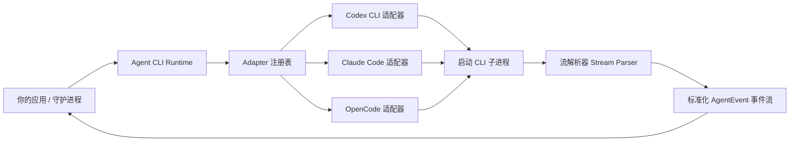

# Agent CLI Runtime

<div align="center">
  <p align="center">
    <b>本地 Coding Agent CLI 的通用适配层与执行引擎</b>
  </p>
  <p align="center">
    <a href="./LICENSE"></a>
    <a href="https://www.npmjs.com/package/agent-cli-runtime"></a>
    <a href="#项目状态"></a>
  </p>
  <p align="center">
    <b><a href="./README.md">English</a></b> | <b><a href="./README.zh-CN.md">简体中文</a></b>
  </p>
</div>

---

> **Agent CLI Runtime** 是一个极轻量、可靠的本地适配层（adapter layer）。它适合你在不想重新造一个 coding agent 时，用同一套强类型的 TypeScript/JavaScript API 将多个本地 agent CLI 快速接入到自己的产品、脚本、后台守护进程（daemon）或桌面应用中。
>
> 现代本地 coding agent（例如 Codex CLI、Claude Code 和 OpenCode）已经具备极强的文件编辑、工具执行、规划和多轮 LLM 循环能力。本项目将这些复杂的 agent 循环留在用户本地已安装的 CLI 内部，同时在外部为产品构建者提供一层规范、一致且安全的外围编排能力。

---

## 💡 为什么选择 Agent CLI Runtime？

在基于本地 coding agent 构建开发者工具时，你通常需要处理凌乱的 CLI 适配、解析混乱的终端流、应对子进程卡死等难题。

Agent CLI Runtime 将这些杂乱、锋利的进程级挑战收拢，为你提供一个清晰、可预测且本地优先（local-first）的执行引擎：

| 子进程痛点 | Runtime 适配层职责 |
| :--- | :--- |
| **CLI 生态割裂** <br><sub>用户安装的工具各不相同（如 `codex`、`claude`、`opencode`）</sub> | **自动化探测** <br><sub>一键检测系统内可用的 coding agent CLI、认证状态和模型支持。</sub> |
| **命令行长度限制** <br><sub>过长的 prompts 容易撞上操作系统的 argv 长度瓶颈</sub> | **安全 Transport 投递** <br><sub>默认使用 stdin 或临时 prompt 关联文件投递，规避 argv 限制。</sub> |
| **Stream 流输出格式不一** <br><sub>每个 CLI 的终端输出、JSON schema 各有差异</sub> | **事件流标准化** <br><sub>把差异巨大的 stdout/stderr 实时解析归一为同一套 `AgentEvent` 协议。</sub> |
| **无头运行挂起/僵尸进程** <br><sub>Headless 子进程可能因网络抖动或配置问题永久卡死</sub> | **全生命周期管控** <br><sub>提供硬性超时、不活跃（inactivity）限制、无缝取消以及退出状态分类。</sub> |
| **特权越界与安全泄漏** <br><sub>Agent 有可能在工作区外运行任意危险的 shell 命令</sub> | **显式沙箱边界** <br><sub>在运行时强制限定显式的 `cwd`、`extraAllowedDirs` 和 `permissionPolicy`。</sub> |

---

## ✨ 核心特性

*   🔍 **自动化 CLI 探测：** 进程内安全探测本地可执行文件、CLI 版本、登录认证状态、支持模型和 capabilities，绝不静默污染用户本地配置。
*   ⚡ **归一化事件流：** 统一订阅 text deltas、thinking 逻辑、tool 调用及结果、文件变动（file events）、Token 消耗以及运行时错误。
*   💾 **可选的本地持久化：** 支持将 runs 和 goals 记录安全持久化至磁盘。提供 single-writer lease 并发锁（`runtime.lock.json`）、崩溃恢复判定和底层的存储健康扫描与修复。
*   🎯 **任务图（Task Graph）调度：** 内置 planner 适配，校验复杂 task 依赖图并按串行或并行策略调度，支持自定义 retry 次数与指数退避（backoff）策略。
*   🛡️ **高强度隐私合规与脱敏：** 默认提供严苛的脱敏机制，自动屏蔽 environment 详情、Token 凭证、Bearer 关键词、主目录和绝对私有路径。
*   🩺 **生产级故障分类：** 详细、无泄露的诊断数据包（diagnostics bundle）导出，配合精细的运行时异常状态码（RuntimeErrorCode），让调试变得极其轻松。

---

## 📦 安装

通过 npm 安装依赖库：

```bash
npm install agent-cli-runtime
```

你也可以直接使用 `npx` 运行 CLI 工具：

```bash
npx --package agent-cli-runtime agent-runtime agents --json
npx --package agent-cli-runtime agent-runtime conformance --mode fixtures --json
```

---

## ⚡ 快速上手 (API)

初始化运行时，并检测当前机器上已安装了哪些适配的 coding agents：

```ts
import { createAgentRuntime } from "agent-cli-runtime";

const runtime = createAgentRuntime();

// 自动探测本地已安装的 coding agents
const agents = await runtime.detect({
  includeUnavailable: true,
});

console.log("已探测到的本地 agents:", agents);
```

### 1. 运行单个 Agent 任务 (Single-Execution)

直接投递 prompt，并实时消费归一化的事件流：

```ts
const run = await runtime.run({
  agentId: "codex",
  cwd: process.cwd(),
  prompt: "Add a focused regression test for the failing parser case.",
  permissionPolicy: "workspace-write",
});

for await (const event of run.events) {
  switch (event.type) {
    case "text_delta":
      process.stdout.write(event.text);
      break;
    case "tool_call":
      console.log(`\n[调用工具] ${event.name}`, event.input);
      break;
    case "thinking_delta":
      process.stdout.write(`💭 ${event.text}`);
      break;
    case "error":
      console.error(`\n[运行时错误 ${event.code}] ${event.message}`);
      break;
    case "run_finished":
      console.log(`\n[任务运行结束] 结果: ${event.result}`);
      break;
  }
}
```

### 2. 依赖感知的高级多任务目标 (Goals)

创建一个复杂的长目标（Objective），runtime 会自动调用 planner 将其拆分为具有依赖关系的 Task Graph 并调度运行：

```ts
const goal = await runtime.createGoal({
  cwd: "/path/to/project",
  objective: "Implement a focused parser regression fix and run tests.",
  defaultAgentId: "codex",
  permissionPolicy: "workspace-write",
  maxConcurrentTasks: 2, // 允许没有依赖关系的就绪任务并行执行
  retryPolicy: {
    maxAttempts: 2,
    retryableErrorCodes: ["AGENT_TIMEOUT", "AGENT_EXECUTION_FAILED"],
    backoffMs: 500,
  },
});

for await (const event of goal.events) {
  if (event.type === "task_attempt_started") {
    console.log(`任务 ${event.taskId} 尝试 ${event.attemptId} 启动。`);
  }
  if (event.type === "goal_finished") {
    console.log(`总目标运行完毕。状态: ${event.result}`);
  }
}
```

---

## 🏗️ 架构模型

核心 runtime 作为一个子进程编排器和事件标准化核心，各个 Adapter 封装了与具体 CLI 交互的所有细节。上层应用只需面对极简的统一契约。



各个 Adapter 分工管理具体的 CLI 差异：
- 探测本地可执行路径、版本号、认证登录状态和模型支持。
- 组装命令行参数（argv）与所需环境变量（env）。
- 挑选最优 Prompt 传输通道（stdin、prompt 文件）。
- 输出流模式匹配与噪点隔离。

---

## 📋 任务图规范 (Task Graph Schema)

当调用 `createGoal` 时，运行时调用 planner 解析并严格校验下述 JSON 结构：

```json
{
  "tasks": [
    {
      "id": "T001",
      "title": "Fix Parser Core",
      "objective": "Identify and correct the off-by-one error in stream-parser.",
      "dependencies": [],
      "allowedFiles": ["src/parsers/stream-parser.ts"],
      "validationCommands": ["npm test"],
      "agentId": "codex",
      "retryPolicy": {
        "maxAttempts": 2,
        "retryableErrorCodes": ["AGENT_TIMEOUT"],
        "backoffMs": 250
      }
    }
  ]
}
```

*   `id`、`title`、`objective` 为必需的字符串。
*   `dependencies`、`allowedFiles`、`validationCommands` 选填，必需为字符串数组。
*   每个 Task 可以单独配置 `retryPolicy` 来覆盖全局重试参数。

---

## 💾 本地持久化与存储设计 (Persistence)

默认情况下运行状态均为 memory-only（内存级）。在初始化时指定 `storageDir` 即可无缝启用本地持久化：

```ts
const runtime = createAgentRuntime({
  storageDir: "./.agent-runtime",
  storage: { durability: "fsync" }, // 选填。默认为 "relaxed"
});
```

### 存储布局
落盘存储采用了对追加写入（append-friendly）和尾部扫描非常友好的精简结构：
```text
.agent-runtime/
  runtime.lock.json           # 本地 Single-Writer 并发租约锁
  runs/
    <runId>/
      manifest.json           # Run 静态配置元数据
      events.jsonl            # 追加写的事件流日志
  goals/
    <goalId>/
      manifest.json           # Goal 元数据与 Task Graph 关系
      events.jsonl            # 追加写的 Goal 事件日志
```

### 关键并发与容灾设计
1.  **Single-Writer 租约保护：** `runtime.lock.json` 会安全存储当前独占实例的 PID、启动时间与心跳。第二个运行实例试图并发写入同一目录时会被安全拒绝，避免脏写坏数据。
2.  **崩溃状态重置：** 新运行时启动时，若探测到由于旧宿主程序崩溃、断电、被强杀而处于 active 的 runs 或 goals，会安全将其标为 `failed` 并注入 `AGENT_RUNTIME_INTERRUPTED` 诊断，确保历史状态单调可信。
3.  **零污染异常隔离：** 若 manifest 或事件日志存在局部行损坏，运行时会安全跳过损坏行并抛出 `AGENT_STORE_RECORD_CORRUPT`，而不会崩溃或影响其余历史数据的加载和 replay。

---

## ⚙️ 运行时配置与环境变量

为了避免污染用户本地的 CLI 配置，我们全面采用环境变量优先的配置模式。

### 1. 可执行文件重写
如需指向非系统默认路径的 binary 路径，请配置以下环境变量：
```bash
export CODEX_BIN=/absolute/path/to/codex
export CLAUDE_BIN=/absolute/path/to/claude
export OPENCODE_BIN=/absolute/path/to/opencode
```

### 2. Claude Code 专属模型与 Provider 变量
在宿主环境中配置：
```bash
export ANTHROPIC_BASE_URL=<兼容-anthropic-的基础-url>
export ANTHROPIC_MODEL=<模型名称>
export ANTHROPIC_DEFAULT_OPUS_MODEL=<模型名称>
export ANTHROPIC_DEFAULT_SONNET_MODEL=<模型名称>
export ANTHROPIC_DEFAULT_HAIKU_MODEL=<模型名称>
export CLAUDE_CODE_SUBAGENT_MODEL=<模型名称>
export CLAUDE_CODE_EFFORT_LEVEL=<effort>
export ANTHROPIC_API_KEY=<你的专属密钥>
```
> ⚠️ **安全警告：** 绝不要将真实的 Token、API 密钥写入 prompts、examples 示例、单元测试 fixtures 或任何会被提交到 git 历史的文档中。

### 3. Proxy 代理支持
适配层会自动继承父进程的代理配置：
```bash
export HTTPS_PROXY=http://127.0.0.1:7897
export HTTP_PROXY=http://127.0.0.1:7897
```

---

## 🛠️ 命令行工具 (CLI) 指南

该包内置了一个功能完备的 `agent-runtime` CLI 命令行，便于测试、调试以及状态健康审计。

```bash
# 1. 检测、健康自检与集成 conformance 证书验证
agent-runtime agents                                          # 检测当前系统内的所有可用 agents
agent-runtime doctor                                          # 诊断当前系统环境与依赖可用性
agent-runtime conformance --mode fake --json                  # 离线运行 fake-CLI 协议一致性套件
agent-runtime conformance --mode real --agent all --json      # 认证本地真实 CLI 运行适配

# 2. 交互式调试运行 (Run & Goal)
agent-runtime run --agent codex --cwd . --prompt "Fix test"   # 运行单次指令
agent-runtime goal --agent codex --cwd . --prompt "Refactor"  # 启动 Task 拆分与执行目标

# 3. 本地存储管理与流回放
agent-runtime runs --storage-dir .agent-runtime --json                    # 列表查看存储的 runs
agent-runtime replay-run run_123 --storage-dir .agent-runtime --jsonl     # 回放指定事件流
agent-runtime store-health --storage-dir .agent-runtime --json            # 扫描本地数据库结构完整性
agent-runtime store-repair --storage-dir .agent-runtime --apply --json     # 自动修复破损的 JSONL 日志
```

---

## 🔌 首期支持的 MVP 适配器 (Adapters)

| 适配器名称 | 对应 Binary | Prompt Transport | Stream 策略 | 支持状态与特有能力 |
| :--- | :--- | :--- | :--- | :--- |
| **Codex CLI** | `codex` | stdin | `codex exec --json` | 完整支持。针对本地网络波动、插件冷启动卡顿提供 Timeout 阶段诊断，支持断连重试解析。 |
| **Claude Code**| `claude` | stdin JSONL | `stream-json` | 基础探测已支持。更深度的 capabilities 和 auth 探测增强正在进行中。 |
| **OpenCode** | `opencode` | stdin | JSON Stream | 完整支持。对 `opencode 1.15.6` 的 stdin 交互进行了深度校验。支持只读隔离策略配置。 |

---

## 🛡️ 安全、沙箱与隐私模型

本运行时需要在本地启动和调用具备极高特权的 coding agents。我们执行了极其严苛的安全沙箱机制：

*   **无自动鉴权：** 运行时绝不替用户保存鉴权账号、密码。我们直接继承用户已经在本地运行 `auth` 登录好的会话。
*   **临时探测沙箱：** 所有的探测流程都在独立的临时目录中运行，绝不读取、不污染用户正在开发的项目工作区。
*   **严格脱敏过滤：** 在向持久化存储或 diagnostics bundles 写入任何数据前，我们会深度扫描并脱敏 `Bearer` 凭据、API Token 变量、绝对 Home 目录以及一切敏感环境变量。
*   **故障强隔离：** 单个适配器鉴权缺失或环境报错，错误会被优雅隔离在对应 Adapter 的探针诊断中，决不导致其余可用 Adapter 的不可用或初始化崩溃。

---

## 🚦 项目状态与路线图

当前仓库处于 **pre-alpha / developer preview**（开发者预览阶段）。

### 🏷️ npm 版本发布简史
*   `agent-cli-runtime@0.1.0-alpha.6` - **下一次 corrective alpha target**。它尚未发布。alpha.6 真实发布、npm dist-tag 变更和 GitHub Release 创建都需要 fresh release-candidate evidence、`npm run package:docs:check`、`npm publish --dry-run --ignore-scripts --tag alpha`，以及维护者明确授权。
*   `agent-cli-runtime@0.1.0-alpha.5` - 已发布到 npm。npm `alpha` 与 `latest` dist-tags 均指向 `0.1.0-alpha.5`。GitHub Release `v0.1.0-alpha.5` 已作为 prerelease 存在并带有 npm registry tarball asset，`release:post-alpha:verify` tarball parity 通过。但它的 immutable npm tarball 内含 stale package docs，因此 aggregate published verification（`published:verify` / `published:verify:evidence`）因 `registry_packaged_docs_failed` 失败；alpha.5 不能作为最终 corrective release 验收。
*   `agent-cli-runtime@0.1.0-alpha.4` - 历史已发布到 npm 的版本。immutable npm tarball 内含 stale release-prep package docs。GitHub Release `v0.1.0-alpha.4` 已存在并带有 npm registry tarball asset，GitHub Release tarball parity 通过。
*   `agent-cli-runtime@0.1.0-alpha.3` - 历史 corrective pre-alpha release。
*   `agent-cli-runtime@0.1.0-alpha.2` - 历史已发布版本，其 immutable npm tarball 内含 stale pre-publish package docs。
*   `agent-cli-runtime@0.1.0-alpha.1` - 更早的已发布 alpha，并有 GitHub pre-release `v0.1.0-alpha.1`。
*   `agent-cli-runtime@0.1.0-alpha.0` - 已弃用，因为 immutable package docs 带有过期发布前状态。

npm registry metadata 和 GitHub Releases 是可用版本与 dist-tags 的 source of truth。易漂移的 run、target-SHA、registry 与 artifact evidence 留在 npm 包外的 `.release-evidence/`。后续 alpha.6 发布、beta promotion 或 stable promotion 都必须为目标版本重新生成 fresh release evidence，包括 package docs、registry state、GitHub Release parity 和 published verification。

`published:usability:audit` 是 repo-only 的 post-publish 审计脚本。它有意不进入 npm package 内容，只用于从 npm registry 验证已经发布的 package。

### 🗺️ 里程碑进度
- [x] **M0:** 完成产品 SSOT 设计、核心接口契约定义、文档骨架。
- [x] **M1:** 核心子进程执行器（Process Runner）开发与 offline fake-CLI 契约验证。
- [x] **M2:** 交付 Codex 适配器 MVP。
- [x] **M3:** 交付 Claude Code 适配器 MVP。
- [x] **M4:** 交付 OpenCode 适配器 MVP。
- [x] **M5:** 提供命令行（`agent-runtime` 包装）与 `doctor` 环境体检能力。
- [x] **M6:** 稳固 Public package 边界，锁定 API/CLI 契约，补全 release candidate 证据合规链。

---

## 📄 关联规范设计矩阵

若要进行深度嵌入和二次开发，请阅读我们详实的底层设计规范：
*   [SSOT 唯一事实源](./docs/ssot.md) — 记录当前产品的完整定位边界和历史合规证据。
*   [API 与 CLI 契约协议](./docs/api-schema-contract.md) — 精确的失败分类、Event envelopes 序列化契约与校验格式。
*   [守护进程嵌入规范 (Daemon Ready)](./docs/daemon-ready-contract.md) — 指导如何将 runtime 嵌入常驻系统服务中。
*   [真实环境兼容性矩阵](./docs/compatibility.md) — 记录测试通过的各 agent 的 flags 兼容配置。
*   [Release 部署操作手册](./docs/release-publish-runbook.md) — 详细的自动化/人工发布与包外证据闭环指南。

---

## 🤝 贡献指南

我们非常欢迎社区贡献！请在提交 Pull Request 前认真阅读 [CONTRIBUTING.md](./CONTRIBUTING.md) 和 [SECURITY.md](./SECURITY.md)。

## ⚖️ 开源协议

基于 Apache License 2.0 协议开源。详细信息请参阅 [LICENSE](./LICENSE) 文件。
