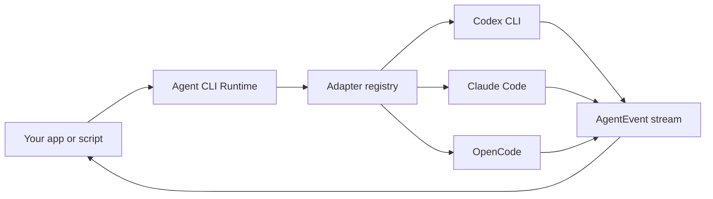

# Agent CLI Runtime

> 一个轻量、本地优先的 runtime，用同一套 typed API 驱动 Codex CLI、Claude Code、OpenCode 以及其他 coding-agent CLI。

[](./LICENSE)
[](#项目状态)

[English](./README.md) | [简体中文](./README.zh-CN.md)

Agent CLI Runtime 是一个 adapter layer。它适合你在不想重新造一个 coding agent 的时候，把多个本地 agent CLI 接到自己的产品、脚本或桌面应用里。

现代本地 coding agent 已经知道如何规划、编辑文件、运行工具、请求权限、管理 session、调用模型。这个项目把这些 agent loop 留在用户已安装的 CLI 内部，只在外面提供一层小而可靠的 runtime：

- 检测本机已安装的 coding agents；
- 在指定 `cwd` 启动 agent；
- 通过 stdin 等安全 transport 传递 prompt；
- 把不同 CLI 的 streaming output 归一成同一种 event protocol；
- 支持 cancel、timeout、diagnose 和 run result classification；
- 让 permissions 和 extra readable directories 保持显式。

## 项目状态

本仓库目前处于 **pre-alpha design stage**。

SSOT 在 [docs/ssot.md](./docs/ssot.md)。实现会在下一阶段开始。第一次 package release 之前，下面的命令和代码示例描述的是目标 API 与 CLI 形态，不代表已经发布到 npm。

## 为什么需要它

每个严肃的 coding-agent 产品，最后都会遇到同一组朴素但锋利的 runtime 问题：

| 问题 | Runtime 负责什么 |
| --- | --- |
| 用户安装的 CLI 各不相同 | 检测 Codex CLI、Claude Code、OpenCode 和未来 adapter |
| 每个 CLI 的 flags 不同 | 把 argv construction 收进 adapter definition |
| 长 prompt 会撞上 argv 长度限制 | 默认优先使用 stdin 或 prompt file |
| stream schema 各不相同 | 把各 agent output 解析成统一 `AgentEvent` stream |
| headless run 可能卡住 | 提供 cancellation、timeout、inactivity 和 exit classification |
| permission 很容易给过头 | 让 `cwd`、`extraAllowedDirs`、`permissionPolicy` 明确可见 |

目标是把这一层做得足够可靠、足够无聊，让更优秀的工具可以放心构建在它上面。

## 它不是什么

Agent CLI Runtime 不是：

- LLM provider router；
- hosted cloud agent；
- Codex CLI、Claude Code 或 OpenCode 的替代品；
- web UI；
- plugin marketplace；
- 自研 `Read` / `Write` / `Edit` tool loop；
- permission bypass wrapper。

Runtime delegate agent loop。它归一的是执行过程，不是智能本身。

## 目标 API

```ts
import { createAgentRuntime } from "agent-cli-runtime";

const runtime = createAgentRuntime();

const agents = await runtime.detect({
  includeUnavailable: true,
});

const run = await runtime.run({
  agentId: "codex",
  cwd: "/path/to/project",
  prompt: "Add a focused regression test for the failing parser case.",
  permissionPolicy: "workspace-write",
});

for await (const event of run.events) {
  if (event.type === "text_delta") process.stdout.write(event.text);
  if (event.type === "tool_call") console.log("tool", event.name);
  if (event.type === "error") console.error(event.code, event.message);
}
```

## 目标 CLI

```bash
agent-runtime agents
agent-runtime run --agent codex --cwd . --prompt "fix the failing test"
agent-runtime run --agent claude --cwd . --permission workspace-write --prompt-file task.md
agent-runtime doctor
```

Library API 是主入口。CLI 会是同一套 runtime 之上的薄包装。

## Runtime Model



每个 adapter 只负责真正因 CLI 而异的部分：

- binary names 和 env overrides；
- version、auth、capability、model probes；
- argv construction；
- prompt transport；
- stream parser；
- permission-policy mapping。

Core runner 负责 process lifecycle、diagnostics、cancellation、timeout、redaction 和 event delivery。

## MVP Adapters

| Adapter | Target binary | Prompt transport | Stream strategy | MVP status |
| --- | --- | --- | --- | --- |
| Codex CLI | `codex` | stdin | `codex exec --json` | Planned |
| Claude Code | `claude` | stdin JSONL | `stream-json` | Planned |
| OpenCode | `opencode-cli`, `opencode` | stdin | JSON stream | Planned |

未来新增 adapter 应该不需要改 core runtime。

## Event Protocol

Runtime 暴露一个小而 append-only 的 event stream：

```ts
type AgentEvent =
  | { type: "run_started"; runId: string; agentId: string; cwd: string }
  | { type: "status"; label: string; detail?: string }
  | { type: "text_delta"; text: string }
  | { type: "thinking_delta"; text: string }
  | { type: "tool_call"; id: string; name: string; input?: unknown }
  | { type: "tool_result"; id: string; output?: unknown; isError?: boolean }
  | { type: "usage"; usage: RuntimeUsage; costUsd?: number }
  | { type: "error"; code: RuntimeErrorCode; message: string; retryable?: boolean }
  | { type: "run_finished"; result: "success" | "failed" | "cancelled" };
```

Adapter-specific raw events 可以进入 debug log，但 public API 应保持稳定、小而清晰。

## Security Model

这个项目会代表 caller 启动本地进程。这件事能力很强，所以默认边界必须明确。

- Runtime 不替用户登录 agent CLI。
- MVP 中 runtime 不编辑用户 CLI config files。
- Metadata probes 运行在 neutral temp directory，而不是用户项目目录。
- Prompt 应优先使用 stdin 或 prompt file，而不是 argv。
- `cwd` 必须显式指定。
- `extraAllowedDirs` 必须显式指定。
- Permission escalation 必须显式指定。
- Logs 和 diagnostics 必须 redact secret-looking env values 和 tokens。
- 单个 adapter 失败不能导致其他 adapter detection 一起失败。

Runtime 不应授予超过 caller 明确请求的权限。

## 与其他项目的关系

Agent CLI Runtime 受到 [OpenDesign](https://github.com/nexu-io/open-design) 的 adapter/runtime boundary 启发，也参考了 [OpenCode](https://github.com/anomalyco/opencode) 在开源项目呈现上的清晰度。

本项目不隶属于 OpenDesign、OpenCode、Anthropic、OpenAI 或任何被支持 CLI 的 vendor。

## Roadmap

- M0：SSOT、README、license、project skeleton。
- M1：core process runner with fake CLI tests。
- M2：Codex adapter。
- M3：Claude Code adapter。
- M4：OpenCode adapter。
- M5：CLI wrapper 和 `doctor` command。
- M6：public package、compatibility matrix、contribution guide、security policy。

## Contributing

项目暂时还没准备好接受外部贡献。第一版 contribution guide 会随 implementation skeleton 一起落地。

未来适合 first contribution 的方向大概率包括：

- fake CLI fixtures；
- 来自真实 CLI streams 的 parser fixtures；
- adapter compatibility tests；
- local CLI setup docs；
- security 和 diagnostics review。

## License

Apache License 2.0。见 [LICENSE](./LICENSE)。

