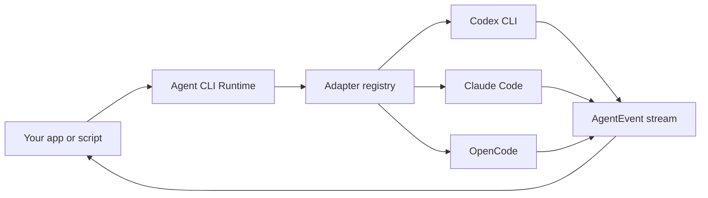

# Agent CLI Runtime

> 一个轻量、本地优先的 runtime，用同一套 typed API 驱动 Codex CLI、Claude Code、OpenCode 以及其他 coding-agent CLI。

[](./LICENSE)
[](#项目状态)

[English](./README.md) | [简体中文](./README.zh-CN.md)

Agent CLI Runtime 是一个 adapter layer。它适合你在不想重新造一个 coding agent 的时候，把多个本地 agent CLI 接到自己的产品、脚本或桌面应用里。

现代本地 coding agent 已经知道如何规划、编辑文件、运行工具、请求权限、管理 session、调用模型。这个项目把这些 agent loop 留在用户已安装的 CLI 内部，只在外面提供一层小而可靠的 runtime：

- 检测本机已安装的 coding agents；
- 在指定 `cwd` 启动 agent；
- 通过 stdin 等安全 transport 传递 prompt；
- 把不同 CLI 的 streaming output 归一成同一种 event protocol；
- 支持 cancel、timeout、diagnose 和 run result classification；
- 让 permissions 和 extra readable directories 保持显式。

## 项目状态

本仓库目前处于 **pre-alpha MVP stage**。

SSOT 在 [docs/ssot.md](./docs/ssot.md)。当前实现是 library-first Node.js/TypeScript MVP，默认 memory-only run / goal 调度，可选 durable local replay storage，包含内置 CLI compatibility profiles、真实 stream parser fixtures、fake CLI 集成测试，以及带 redacted diagnostics 的本地 smoke / query 薄 CLI。

## 为什么需要它

每个严肃的 coding-agent 产品，最后都会遇到同一组朴素但锋利的 runtime 问题：

| 问题 | Runtime 负责什么 |
| --- | --- |
| 用户安装的 CLI 各不相同 | 检测 Codex CLI、Claude Code、OpenCode 和未来 adapter |
| 每个 CLI 的 flags 不同 | 把 argv construction 收进 adapter definition |
| 长 prompt 会撞上 argv 长度限制 | 默认优先使用 stdin 或 prompt file |
| stream schema 各不相同 | 把各 agent output 解析成统一 `AgentEvent` stream |
| headless run 可能卡住 | 提供 cancellation、timeout、inactivity 和 exit classification |
| permission 很容易给过头 | 让 `cwd`、`extraAllowedDirs`、`permissionPolicy` 明确可见 |

目标是把这一层做得足够可靠、足够无聊，让更优秀的工具可以放心构建在它上面。

## 它不是什么

Agent CLI Runtime 不是：

- LLM provider router；
- hosted cloud agent；
- Codex CLI、Claude Code 或 OpenCode 的替代品；
- web UI；
- plugin marketplace；
- 自研 `Read` / `Write` / `Edit` tool loop；
- permission bypass wrapper。

Runtime delegate agent loop。它归一的是执行过程，不是智能本身。

## API

```ts
import { createAgentRuntime } from "agent-cli-runtime";

const runtime = createAgentRuntime();

const agents = await runtime.detect({
  includeUnavailable: true,
});

const run = await runtime.run({
  agentId: "codex",
  cwd: "/path/to/project",
  prompt: "Add a focused regression test for the failing parser case.",
  permissionPolicy: "workspace-write",
});

for await (const event of run.events) {
  if (event.type === "text_delta") process.stdout.write(event.text);
  if (event.type === "tool_call") console.log("tool", event.name);
  if (event.type === "error") console.error(event.code, event.message);
}
```

Goal 会先启动一次 planner run，再用 dependency-aware ready queue 执行 task graph：

```ts
const goal = await runtime.createGoal({
  cwd: "/path/to/project",
  objective: "实现一个聚焦的 parser regression fix。",
  defaultAgentId: "codex",
  permissionPolicy: "workspace-write",
  maxConcurrentTasks: 2,
  retryPolicy: {
    maxAttempts: 2,
    retryableErrorCodes: ["AGENT_TIMEOUT", "AGENT_EXECUTION_FAILED"],
    backoffMs: 500,
  },
});

for await (const event of goal.events) {
  if (event.type === "task_attempt_started") console.log(event.taskId, event.attemptId, event.runId);
  if (event.type === "goal_finished") console.log(event.result);
}
```

task 只有在所有 dependencies 都 `succeeded` 后才会进入 ready。默认 `maxConcurrentTasks: 1`，保持保守串行语义；在 `createGoal()` 或 `createAgentRuntime()` 上配置后，互不冲突的 ready tasks 才会并发执行。`retryPolicy` 默认 `{ maxAttempts: 1 }`；只有 terminal error code 命中 `retryableErrorCodes` 的失败才会重试。cancel 和 validation failure 默认不重试，除非 caller 显式把对应 error code 加进 retry policy。

每个 task evidence 会记录 attempts：

```json
{
  "runId": "run_latest",
  "result": "success",
  "attempts": [
    {
      "attemptId": "T001:attempt:1",
      "runId": "run_1",
      "startedAt": 1760000000000,
      "finishedAt": 1760000001200,
      "result": "failed",
      "diagnostics": [{ "code": "AGENT_EXECUTION_FAILED", "message": "..." }]
    },
    {
      "attemptId": "T001:attempt:2",
      "runId": "run_2",
      "startedAt": 1760000001800,
      "finishedAt": 1760000002600,
      "result": "success",
      "diagnostics": []
    }
  ],
  "validationCommands": [],
  "summary": "Task T001 finished with success after 2 attempts."
}
```

持久化是显式开启的：不传 `storageDir` 时，run 和 goal 仍然只保存在内存里；传入 `storageDir` 后，runtime 会写入可审计的 JSON manifest 和 JSONL replay events：

```ts
const runtime = createAgentRuntime({
  storageDir: ".agent-runtime",
});

const runs = await runtime.listRuns({ status: "active" });
const runEvents = await runtime.replayRunEvents("run_123", { afterEventId: 10 });
const goals = await runtime.listGoals();
const goalEvents = await runtime.replayGoalEvents("goal_123");
```

Public facade 暴露：

- `createAgentRuntime(options?)`
- `runtime.detect(options?)`
- `runtime.detectStream(options?)`
- `runtime.run(request)`
- `runtime.createGoal(request)`
- `runtime.cancelRun(runId)`
- `runtime.cancelGoal(goalId)`
- `runtime.shutdown(reason?)`
- `runtime.getRun(runId)`
- `runtime.replayRunEvents(runId, { afterEventId? })`
- `runtime.listRuns({ status? })`
- `runtime.getGoal(goalId)`
- `runtime.replayGoalEvents(goalId, { afterEventId? })`
- `runtime.listGoals({ status? })`
- `runtime.getAdapter(id)`

### API 契约边界

Pre-alpha release 的 package root 会刻意保持小。它只导出 `createAgentRuntime()` 这个运行时 value，以及调用 runtime、消费 records 所需的 public TypeScript types：

- stable MVP surface：`AgentRuntime`、`RuntimeOptions`、`DetectOptions`、`DetectedAgent`、`RunRequest`、`RunHandle`、`RunRecord`、`RunStatus`、`CreateGoalRequest`、`GoalHandle`、`GoalRecord`、`GoalStatus`、`AgentEvent`、`SchedulerEvent`、`ReplayEvent`、`RuntimeDiagnostic` 和 `RuntimeErrorCode`；
- experimental extension surface：adapter authoring 相关类型，例如 `AgentAdapterDef`、`BuildArgsInput`、`PromptTransport`、`StreamParser` 和 `AdapterCompatibilityProfile`；
- 不从 package root 导出：内置 adapter values、parser helpers、executable-resolution helpers、stores、schedulers 和 task-graph helpers。

`getAdapter(id)` 和 `RuntimeOptions.adapters` 是 pre-alpha 阶段为 adapter 实验保留的 extension points；在 stable release 之前，它们的形状仍可能调整。

## 安装

```bash
npm install agent-cli-runtime
```

从本仓库本地开发：

```bash
npm ci
npm run build
node ./dist/cli/main.js agents --json
```

## CLI

```bash
agent-runtime agents
agent-runtime run --agent codex --cwd . --prompt "fix the failing test"
agent-runtime goal --agent codex --cwd . --prompt "split this objective into tasks and execute them"
agent-runtime goal --agent codex --cwd . --prompt "run independent fixes" --max-concurrent-tasks 2 --max-attempts 2 --retryable-error-codes AGENT_TIMEOUT,AGENT_EXECUTION_FAILED
agent-runtime run --agent claude --cwd . --permission workspace-write --prompt-file task.md
agent-runtime run --agent codex --cwd . --prompt "fix the failing test" --json
agent-runtime run --agent codex --cwd . --prompt "fix the failing test" --stream jsonl --diagnostics
agent-runtime doctor
agent-runtime runs --storage-dir .agent-runtime --json
agent-runtime run-status run_123 --storage-dir .agent-runtime --json
agent-runtime replay-run run_123 --storage-dir .agent-runtime --after 10 --jsonl
agent-runtime goals --storage-dir .agent-runtime --json
agent-runtime goal-status goal_123 --storage-dir .agent-runtime --json
agent-runtime replay-goal goal_123 --storage-dir .agent-runtime --after 10 --jsonl
```

Library API 是主入口。CLI 是同一套 runtime 之上的薄包装，并支持 `--json` 以及 run/goal 的 `--stream jsonl` event stream。对 run/goal 命令，`--json` 输出最终 run 或 goal record；`--stream jsonl --diagnostics` 保留事件流，并在 terminal event 后追加一行 redacted `run_summary` 或 `goal_summary`。

磁盘布局保持简单、方便人工检查和 `tail`：

```text
.agent-runtime/
  runs/<runId>/manifest.json
  runs/<runId>/events.jsonl
  goals/<goalId>/manifest.json
  goals/<goalId>/events.jsonl
```

每一行 JSONL 都是 `{ "id": 1, "sequence": 1, "runId": "run_123", "timestamp": 123, "event": {...} }`，goal event 使用同样形状但带 `goalId`。event id / sequence 在单个 run 或 goal 内单调递增，replay 时保持稳定顺序。`runtime.shutdown(reason?)` 会取消 active runs/goals，并短暂等待 terminal events 后返回。新的 runtime 指向同一个 `storageDir` 后可以直接读取 terminal run/goal；如果发现 `queued`、`running` 或 `planning` 的历史记录，会把它标记为 failed，并写入 `AGENT_RUNTIME_INTERRUPTED` diagnostic/event，避免重启后假装仍在执行。损坏的 manifest 或 JSONL 行只影响对应 record，并通过 `AGENT_STORE_RECORD_CORRUPT` 或 `AGENT_EVENT_LOG_CORRUPT` diagnostic 暴露，不会拖垮 runtime 初始化。

## 配置

Executable override：

```bash
export CODEX_BIN=/absolute/path/to/codex
export CLAUDE_BIN=/absolute/path/to/claude
export OPENCODE_BIN=/absolute/path/to/opencode
```

代理配置会从当前进程环境继承：

```bash
export HTTPS_PROXY=http://127.0.0.1:7897
export HTTP_PROXY=http://127.0.0.1:7897
```

Claude Code 也可以接入 DeepSeek 这类 Anthropic-compatible provider：

```bash
export ANTHROPIC_BASE_URL=https://api.deepseek.com/anthropic
export ANTHROPIC_MODEL='deepseek-v4-pro[1m]'
export ANTHROPIC_DEFAULT_OPUS_MODEL='deepseek-v4-pro[1m]'
export ANTHROPIC_DEFAULT_SONNET_MODEL='deepseek-v4-pro[1m]'
export ANTHROPIC_DEFAULT_HAIKU_MODEL=deepseek-v4-flash
export CLAUDE_CODE_SUBAGENT_MODEL=deepseek-v4-flash
export CLAUDE_CODE_EFFORT_LEVEL=max
```

请在 shell 或进程管理器中设置 provider 文档要求的 Anthropic-compatible auth token 环境变量；不要把真实 token 写入 prompt、fixture、manifest 或已提交文档。

当前真实 CLI smoke matrix 见 [docs/compatibility.md](./docs/compatibility.md)。

## Runtime Model



每个 adapter 只负责真正因 CLI 而异的部分：

- binary names 和 env overrides；
- version、auth、capability、model probes；
- verified / unverified invocation flags 的 compatibility profile notes；
- argv construction；
- prompt transport；
- stream parser；
- permission-policy mapping。

Core runner 负责 process lifecycle、process-tree best-effort termination、diagnostics、cancellation、timeout、shutdown、redaction 和 event delivery。

## MVP Adapters

| Adapter | Target binary | Prompt transport | Stream strategy | MVP status |
| --- | --- | --- | --- | --- |
| Codex CLI | `codex` | stdin | `codex exec --json` | P0-4 已记录 detection/model probe baseline；timeout diagnostics 可分类本地网络/plugin startup 卡顿；transient reconnect events 会解析成 status |
| Claude Code | `claude` | stdin JSONL | `stream-json` | P0-4 已记录 detection baseline；本地 auth 仍 missing |
| OpenCode | `opencode-cli`, `opencode` | stdin | JSON stream | P0-4 已记录 detection/model probe baseline；本地 run smoke timeout 已带 profile/stdin diagnostics |

未来新增 adapter 应该不需要改 core runtime。

## Event Protocol

Runtime 暴露一个小而 append-only 的 event stream：

```ts
type AgentEvent =
  | { type: "run_started"; runId: string; agentId: string; cwd: string; model?: string; timestamp: number }
  | { type: "status"; label: string; detail?: string; timestamp: number }
  | { type: "text_delta"; text: string; timestamp: number }
  | { type: "thinking_delta"; text: string; timestamp: number }
  | { type: "tool_call"; id: string; name: string; input?: unknown; timestamp: number }
  | { type: "tool_result"; id: string; output?: unknown; isError?: boolean; timestamp: number }
  | { type: "file_event"; path: string; action: "created" | "updated" | "deleted" | "unknown"; timestamp: number }
  | { type: "usage"; usage: RuntimeUsage; costUsd?: number; timestamp: number }
  | { type: "error"; code: RuntimeErrorCode; message: string; retryable?: boolean; detail?: unknown; timestamp: number }
  | { type: "run_finished"; result: "success" | "failed" | "cancelled"; exitCode?: number | null; signal?: string | null; timestamp: number };
```

Goal scheduling 会把 run events 包装成 `goal_started`、`task_created`、`task_started`、`task_attempt_started`、`run_event`、`task_attempt_finished`、`task_finished`、`goal_finished` 和 `scheduler_error`。

Adapter-specific raw events 可以进入 debug log，但 public API 应保持稳定、小而清晰。

## Security Model

这个项目会代表 caller 启动本地进程。这件事能力很强，所以默认边界必须明确。

- Runtime 不替用户登录 agent CLI。
- MVP 中 runtime 不编辑用户 CLI config files。
- Metadata probes 运行在 neutral temp directory，而不是用户项目目录。
- Prompt 应优先使用 stdin 或 prompt file，而不是 argv。
- `cwd` 必须显式指定。
- `extraAllowedDirs` 必须显式指定。
- Permission escalation 必须显式指定。
- Logs 和 diagnostics 必须 redact secret-looking env values 和 tokens。
- Disk backed storage 不写入 secret-bearing environment maps；diagnostics 以及 validation stdout/stderr 会先 redaction，再写入 manifest 或 events。
- 单个 adapter 失败不能导致其他 adapter detection 一起失败。
- Detection probe diagnostics 会分类为 `not_installed`、`not_executable`、`auth_missing`、`network_error`、`unsupported_flag` 或 `probe_failed`。
- JSON stream parser 会忽略空行、warning、log 和非 JSON 噪声行；用户可见正文只来自结构化 CLI text 字段。
- Timeout diagnostics 会记录 sanitized argv/profile labels、parsed event count、stdout/stderr tail 和 actionable hints；prompt 仍然不会进入 argv。
- Goal task 的 `validationCommands` 会在 agent run 成功后由 runtime 在 task `cwd` 执行；validation 失败会把 task 和 goal 标记为 failed。

Runtime 不应授予超过 caller 明确请求的权限。

## 与其他项目的关系

Agent CLI Runtime 受到 [OpenDesign](https://github.com/nexu-io/open-design) 的 adapter/runtime boundary 启发，也参考了 [OpenCode](https://github.com/anomalyco/opencode) 在开源项目呈现上的清晰度。

本项目不隶属于 OpenDesign、OpenCode、Anthropic、OpenAI 或任何被支持 CLI 的 vendor。

## Roadmap

- M0：SSOT、README、license、project skeleton。已完成。
- M1：core process runner with fake CLI tests。已完成。
- M2：Codex adapter MVP。已完成。
- M3：Claude Code adapter MVP。已完成。
- M4：OpenCode adapter MVP。已完成。
- M5：CLI wrapper 和 `doctor` command。已完成。
- M6：public package boundary、compatibility matrix、API/CLI contract freeze、contribution guide、security policy。Pre-alpha 发布准备进行中；contribution 和 security policy 文档仍是 post-MVP follow-up。

## Contributing

项目暂时还没准备好接受外部贡献。第一版 contribution guide 会随 implementation skeleton 一起落地。

未来适合 first contribution 的方向大概率包括：

- fake CLI fixtures；
- 来自真实 CLI streams 的 parser fixtures；
- adapter compatibility tests；
- local CLI setup docs；
- security 和 diagnostics review。

## License

Apache License 2.0。见 [LICENSE](./LICENSE)。
