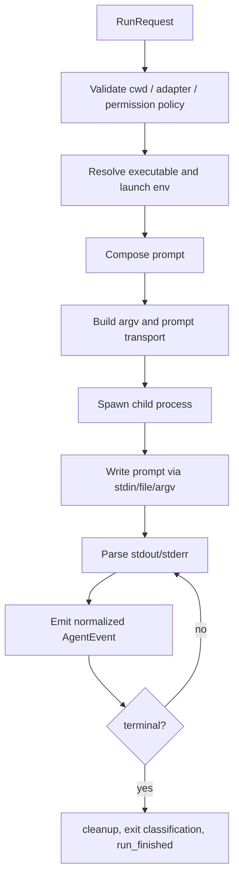

# 本地 Coding Agent CLI Runtime SSOT

状态：MVP implemented v0.2
负责人：local project
最后更新：2026-06-16
主要语言：中文；API 名、CLI 名、模型名、协议名、错误码、代码标识符等技术关键词保留英文。

## 1. 产品意图

本项目计划做一个轻量的本地 Coding Agent CLI Runtime。它提供一套稳定 API，用来检测、启动、流式读取、取消，并在可行时恢复本地 coding agent CLI，例如 Codex CLI、Claude Code、OpenCode。

Runtime 不重新实现 agent loop。模型调用、规划、工具执行、权限提示、代码编辑策略、provider 认证，都交给用户已经安装和登录的本地 CLI。Runtime 只负责这些 CLI 外围的本地编排能力：

- 查找 executable；
- 安全地探测 version、auth、models、capabilities；
- 为每次 run 构造正确的 argv、env、cwd；
- 通过安全 transport 投递 prompt；
- 把各 CLI 的输出解析成统一事件流；
- 暴露 cancel、timeout、diagnostics、run result。

从 OpenDesign 抽取的是 adapter/runtime 边界，而不是整套 OpenDesign daemon、design workspace、plugin system、media pipeline、web UI、artifact model 或 skill marketplace。

## 2. OpenDesign 参考基线

OpenDesign 参考代码当前以本地开发 checkout 形式放在：

```text
.reference/open-design
```

`.reference/` 只用于本地阅读和验证设计，不进入开源仓库、不进入 npm package、不作为本项目源码发布。

参考版本：

```text
nexu-io/open-design HEAD c54e49aae9d2dc8b044467187c081d5d7c50bebc
```

已阅读的关键参考文件：

- `.reference/open-design/docs/agent-adapters.md`
- `.reference/open-design/specs/current/runtime-adapter.md`
- `.reference/open-design/apps/daemon/src/runtimes/types.ts`
- `.reference/open-design/apps/daemon/src/runtimes/registry.ts`
- `.reference/open-design/apps/daemon/src/runtimes/detection.ts`
- `.reference/open-design/apps/daemon/src/runtimes/executables.ts`
- `.reference/open-design/apps/daemon/src/runtimes/invocation.ts`
- `.reference/open-design/apps/daemon/src/runtimes/launch.ts`
- `.reference/open-design/apps/daemon/src/runtimes/env.ts`
- `.reference/open-design/apps/daemon/src/runtimes/prompt-budget.ts`
- `.reference/open-design/apps/daemon/src/runtimes/defs/codex.ts`
- `.reference/open-design/apps/daemon/src/runtimes/defs/claude.ts`
- `.reference/open-design/apps/daemon/src/runtimes/defs/opencode.ts`
- `.reference/open-design/apps/daemon/src/json-event-stream.ts`
- `.reference/open-design/apps/daemon/src/claude-stream.ts`
- `.reference/open-design/apps/daemon/src/run-result.ts`

需要保留的关键经验：

- Adapter 定义应尽量声明式：id、binary 名、probe、argv builder、prompt transport、stream parser、capabilities、adapter-specific env。
- metadata probe 必须运行在中性的 temp cwd，不能继承调用方项目 cwd；一些 CLI 的启动或 model list probe 可能在 cwd 写入文件。
- detection 必须隔离 adapter 故障；一个坏掉的 CLI 不能让整个 runtime catalog 失败。
- prompt 默认通过 stdin 或 prompt file 传递，避免 Windows/Linux argv 长度限制。
- structured stream 由各 adapter parser 解析，再归一成小而稳定的事件契约。
- agent fallback 不能静默切换；不同 CLI 的信任、模型、工具和权限语义不同，fallback 必须由 caller 或用户显式选择。

不要照搬的部分：

- 不引入 OpenDesign 的 design artifacts、media features、web routes、plugin installation、telemetry、database schema、project-storage conventions。
- 不把 OpenDesign 为 web/headless 场景使用的 permission bypass 作为本项目全局默认。
- 不绑定 OpenDesign skill 格式。MVP 先接收 prompt/context；后续再加可选 skill helper。

## 3. 项目范围

### MVP 范围内

- TypeScript/Node.js library API。
- 一个薄 CLI wrapper，用于 smoke test 和简单本地调用。
- 默认 memory-only `RunScheduler`：状态机、event replay、cancel、timeout、run result classification。
- 默认 memory-only `GoalScheduler`：planner run -> JSON task graph -> dependency ordered task runs。
- 可选 `storageDir` disk backed persistence：run/goal manifest JSON、events JSONL、terminal replay、重启 active 状态中断化。
- 内置三个 adapter：
  - Codex CLI
  - Claude Code
  - OpenCode
- 并行 detection 和 diagnostics。
- 基于 `child_process.spawn` 的 run orchestration。
- 默认使用 stdin 投递 prompt。
- 统一事件流，暴露为 `AsyncIterable<AgentEvent>`。
- 通过 `AbortSignal` 和 child process signal 支持 cancellation。
- 基础 timeout 和 inactivity guard。
- task run 成功后执行 `validationCommands`，失败则 task/goal failed。
- 每次 run 可选 `model`、`reasoning`、`env`、`extraAllowedDirs`。
- parser fixture 和 fake CLI tests。

### 明确非目标

- MVP 不做 web UI。
- MVP 不做 remote/cloud fallback API。
- 不做 model-provider router。
- 不做自研 Read/Write/Edit tool loop。
- 不做 plugin marketplace 或 skill installer。
- 不做 multi-agent scheduler。
- 不做后台 daemon database。
- MVP 不做 Docker/SSH remote runtime。
- 不试图统一每个 CLI 的全部特性。
- 不做静默 permission escalation。

## 4. 设计原则

1. Delegate the agent loop。
   本地 CLI 仍然是 model call、tool use、auth、edit behavior 的权威实现。

2. Adapter 要薄。
   新增 adapter 时，主要应新增 definition、argv builder 和 stream parser。

3. Transport 默认安全。
   优先 stdin；CLI 支持时可用 prompt file；只有 CLI 强制要求时才用 argv，并必须做 prompt size guard。

4. probe 不进入用户项目。
   detection、version、model list、auth status 这类 metadata probe 一律使用 temp cwd。

5. 权限边界显式。
   `cwd`、`extraAllowedDirs`、environment override、`permissionPolicy` 必须体现在 `RunRequest`。

6. 归一事件，不归一行为。
   Codex、Claude、OpenCode 的内部行为可以不同；Runtime 只统一可观察输出。

7. 失败可见。
   auth failure、missing binary、prompt too large、stream parser error、timeout、non-zero exit 都要产生结构化 diagnostics。

8. 尊重用户本地设置。
   使用用户安装的 CLI、登录态、shell toolchain path 和 config file。MVP 不主动编辑这些 config file。

## 5. 核心 API

Public API 应足够小，方便产品、脚本、桌面应用直接嵌入，而不继承 daemon 架构。

```ts
export type AgentId = 'codex' | 'claude' | 'opencode' | string;

export interface RuntimeOptions {
  adapters?: AgentAdapterDef[];
  env?: NodeJS.ProcessEnv;
  searchPath?: string[];
  homeDir?: string;
  storageDir?: string;
  logger?: RuntimeLogger;
}

export interface DetectOptions {
  envByAgent?: Record<string, Record<string, string>>;
  includeUnavailable?: boolean;
  timeoutMs?: number;
}

export interface RunRequest {
  agentId: AgentId;
  cwd: string;
  prompt: string;
  systemPrompt?: string;
  contextBlocks?: RuntimeContextBlock[];
  model?: string;
  reasoning?: string;
  env?: Record<string, string>;
  extraAllowedDirs?: string[];
  permissionPolicy?: PermissionPolicy;
  timeoutMs?: number;
  inactivityTimeoutMs?: number;
  signal?: AbortSignal;
  session?: RuntimeSessionRef;
}

export interface RunHandle {
  runId: string;
  events: AsyncIterable<AgentEvent>;
  cancel(reason?: string): Promise<void>;
}

export interface AgentRuntime {
  detect(options?: DetectOptions): Promise<DetectedAgent[]>;
  detectStream(options?: DetectOptions): AsyncIterable<DetectedAgent>;
  run(request: RunRequest): Promise<RunHandle>;
  createGoal(request: CreateGoalRequest): Promise<GoalHandle>;
  cancelRun(runId: string): Promise<void>;
  cancelGoal(goalId: string): Promise<void>;
  getRun(runId: string): Promise<RunRecord | null>;
  getRunEvents(runId: string, options?: { afterEventId?: number }): Promise<ReplayEvent<AgentEvent>[]>;
  listRuns(options?: { status?: 'active' | RunStatus }): Promise<RunRecord[]>;
  getGoal(goalId: string): Promise<GoalRecord | null>;
  getGoalEvents(goalId: string, options?: { afterEventId?: number }): Promise<ReplayEvent<SchedulerEvent>[]>;
  listGoals(options?: { status?: 'active' | GoalStatus }): Promise<GoalRecord[]>;
  getAdapter(id: AgentId): AgentAdapterDef | null;
}
```

`run()` 在 child process 已启动、事件解析已挂载后返回。调用方消费 `handle.events`，直到收到 terminal `run_finished` event。run 开始后的 agent failure 应作为事件发出，而不是在 iterator 外层抛出。

`createGoal()` 会先用 planner prompt 启动一次 run，收集 `text_delta` 作为 strict JSON task graph，校验后按依赖顺序串行执行 task。MVP 不做并发；任一 task failed 时 goal failed，除非 caller 设置 `continueOnFailure`。

Task run 成功后，如果 task 带有 `validationCommands`，runtime 会在 task `cwd` 依次执行这些 shell commands；任一 command 非零退出则 task failed，validation stdout/stderr tail 会 redacted 后写入 task evidence。调用方应只对可信目标或可信 planner 开启自动 validation。

`storageDir` 是 opt-in。未传时保持纯内存行为；传入时，runtime 在该目录下写入：

```text
<storageDir>/
  runs/<runId>/manifest.json
  runs/<runId>/events.jsonl
  goals/<goalId>/manifest.json
  goals/<goalId>/events.jsonl
```

`events.jsonl` 每行格式为 `{ "id": 1, "timestamp": 123, "event": {...} }`。`id` 在单个 run/goal 内单调递增，`getRunEvents()` / `getGoalEvents()` 支持 `afterEventId` 增量 replay。新的 runtime 指向同一 `storageDir` 时必须能读取 terminal run/goal 的 manifest 和 events；若加载到 `queued`、`running` 或 `planning` 的历史记录，必须标记为 failed，并写入 `AGENT_RUNTIME_INTERRUPTED` diagnostic/event，不能假装继续运行。

## 6. Adapter 定义

Adapter 尽量声明式；只有必须读 runtime context 的部分才写 imperative logic。

```ts
export interface AgentAdapterDef {
  id: AgentId;
  displayName: string;
  bin: string;
  fallbackBins?: string[];
  binEnvVar?: string;

  versionArgs: string[];
  helpArgs?: string[];
  capabilityFlags?: Record<string, string>;
  authProbe?: AgentAuthProbe;
  listModels?: AgentListModelsProbe;
  fallbackModels?: RuntimeModelOption[];

  buildArgs(input: BuildArgsInput): string[];
  promptTransport: PromptTransport;
  stream: StreamParserDef;

  env?: Record<string, string>;
  capabilities: AgentCapabilityHints;
  defaults?: AgentRunDefaults;
}

export type PromptTransport =
  | { kind: 'stdin'; inputFormat?: 'text' | 'jsonl' }
  | { kind: 'file'; flag: string }
  | { kind: 'argv'; maxBytes: number };

export interface BuildArgsInput {
  prompt: string;
  cwd: string;
  model?: string;
  reasoning?: string;
  extraAllowedDirs: string[];
  permissionPolicy: PermissionPolicy;
  promptFilePath?: string;
  session?: RuntimeSessionRef;
}
```

Adapter module 不直接 spawn process；它只描述 core runner 如何 spawn。

## 7. 检测契约

当 caller 请求 `includeUnavailable` 时，detection 同时返回可用和不可用 agent：

```ts
export interface DetectedAgent {
  id: AgentId;
  displayName: string;
  available: boolean;
  path?: string;
  version?: string | null;
  authStatus?: 'ok' | 'missing' | 'expired' | 'unknown';
  models: RuntimeModelOption[];
  modelsSource: 'live' | 'fallback' | 'none';
  capabilities: AgentCapabilities;
  diagnostics: RuntimeDiagnostic[];
}
```

检测流程：

1. resolve executable：
   - configured env override，例如 `CODEX_BIN`；
   - `detect()` 传入的 adapter-specific env；
   - `bin`；
   - `fallbackBins`；
   - 用户 toolchain 目录补充到 PATH search。
2. 通过 `versionArgs` probe version。
3. 可选 probe help/capability flags。
4. 可选 probe auth status。
5. 可选 probe live model list。
6. model probing 失败时使用 static fallback model hints。
7. 单个 adapter 失败时返回 diagnostic，不抛出到整个 detection。

检测不变量：

- probe 使用 neutral temp cwd。
- 每个 probe 必须有 timeout。
- 不执行 login flow。
- 不修改 CLI config。
- model-list failure 不等于 adapter unavailable。
- `detectStream()` 服务渐进式 UI；`detect()` 服务脚本和普通 library caller。

## 8. Run 生命周期



Run preflight：

- `cwd` 必须是 absolute path 且存在。
- `agentId` 必须能 resolve 到已知 adapter。
- missing binary 返回 `AGENT_UNAVAILABLE`。
- oversized argv prompt 返回 `AGENT_PROMPT_TOO_LARGE`。
- `extraAllowedDirs` 必须是 absolute path。
- adapter-specific env override 在 inherited env 之后 merge；日志里必须 redact secret-looking keys。

Run close classification：

- exit code `0` 且有 substantive event：success；
- caller 显式 cancel：cancelled；
- parser 发出 error：failed，即使 exit code 是 `0`；
- non-zero exit：failed；
- timeout：根据 caller signal 和 runtime timeout 分类为 failed 或 cancelled；
- zero output：failed，除非 adapter 明确声明 silent success。

## 9. 事件契约

Runtime 暴露 versioned、append-only 的事件 schema。

```ts
export type AgentEvent =
  | { type: 'run_started'; runId: string; agentId: AgentId; cwd: string; model?: string }
  | { type: 'status'; label: string; detail?: string }
  | { type: 'text_delta'; text: string }
  | { type: 'thinking_delta'; text: string }
  | { type: 'tool_call'; id: string; name: string; input?: unknown }
  | { type: 'tool_result'; id: string; output?: unknown; isError?: boolean }
  | { type: 'file_event'; path: string; action: 'created' | 'updated' | 'deleted' | 'unknown' }
  | { type: 'usage'; usage: RuntimeUsage; costUsd?: number }
  | { type: 'error'; code: RuntimeErrorCode; message: string; retryable?: boolean; detail?: unknown }
  | { type: 'run_finished'; result: RunResult; exitCode?: number | null; signal?: string | null };
```

Parser 规则：

- 保持 streaming order。
- text 以 delta 形式输出；除非 CLI 只提供 final output，否则不等到最后一次性输出。
- structured stdout error frame 必须转换成 `error` event。
- CLI 暴露 tool call/result 时要映射出来。
- CLI 暴露 shell command execution 但不暴露通用 tool event 时，可 synthesize `tool_call`。
- 只有真实 usage 可用时才 emit `usage`。
- 默认不把 unknown raw event 暴露在 public contract；debug log 可保留。

Replay 规则：

- memory-only 默认仍保留内存 replay buffer，适合嵌入式短生命周期调用。
- `storageDir` 模式同时 append 到 JSONL，并用 manifest JSON 保存 run/goal/task/evidence 当前快照。
- manifest 写入使用 temp file + rename，避免半写入快照。
- 读取损坏 JSONL 时保留已读事件，并通过 `AGENT_EVENT_LOG_CORRUPT` diagnostic/event 暴露问题，不让 detect/run API 因历史日志损坏整体崩溃。
- Disk backed storage 不写入 secret-bearing env；diagnostics、stderr tail、validation stdout/stderr 写入前必须 redaction。
- `.reference/` 只可阅读，不进入 package，也不进入 runtime storage 约定。

## 10. MVP Adapter 决策

### Codex CLI

默认 invocation shape：

```bash
codex exec --json --skip-git-repo-check --sandbox workspace-write -c sandbox_workspace_write.network_access=true -C <cwd>
```

说明：

- Prompt transport：stdin。
- Model：选择模型时追加 `--model <id>`。
- Reasoning：选择 reasoning 时映射到 Codex config。
- Sandbox：默认 `workspace-write`；只有显式 `permissionPolicy` 才允许升级。
- Parser：消费 Codex JSON events，映射 thread/turn status、command execution、agent messages、errors、usage。
- Detection：支持 `CODEX_BIN`；probe `codex --version`；可选 probe `codex debug models`。

### Claude Code

默认 invocation shape：

```bash
claude -p --input-format stream-json --output-format stream-json --verbose
```

说明：

- Prompt transport：stdin JSONL。
- `--include-partial-messages`、`--add-dir` 等可选 flags 必须通过 help/capability probing gate。
- Model：选择模型时追加 `--model <id>`。
- Session：通过单独 session store interface 支持可选 session id/resume。
- Permission：通过 `permissionPolicy` 暴露；不要把 bypass mode 作为全局默认。
- Parser：使用 Claude stream-json parser，映射 status、text、thinking、tool calls、tool results、usage。
- Detection：支持 `CLAUDE_BIN`；如后续明确需要，可加入兼容 fork fallback binary。

### OpenCode

默认 invocation shape：

```bash
opencode run --format json
```

说明：

- Prompt transport：stdin。
- Binary candidates：`opencode-cli`，然后 `opencode`。
- Model：选择模型时追加 `-m <id>`。
- Detection：支持 `OPENCODE_BIN`；probe `opencode models`，timeout 要比普通 version probe 更长。
- Env：清理继承自 parent OpenCode process 的 runtime/session env keys，避免污染。
- Permission：通过 `permissionPolicy` 暴露；只有显式请求时才传递 skip-permission flags。
- Parser：映射 step start、text deltas、tool use/result、structured stdout errors、usage。

## 11. 权限策略

Permission behavior 必须是 request-level decision，而不是 adapter 隐式副作用。

```ts
export type PermissionPolicy =
  | 'agent-default'
  | 'workspace-write'
  | 'read-only'
  | 'headless-auto'
  | 'danger-full-access';
```

MVP 默认值：

- Library default：`agent-default`。
- CLI smoke command default：adapter 支持时使用 `workspace-write`，方便非交互运行。
- `headless-auto` 和 `danger-full-access` 必须显式传入。

Adapter 映射示例：

- Codex `workspace-write`：`--sandbox workspace-write`。
- Codex `danger-full-access`：`--sandbox danger-full-access`。
- Claude `headless-auto`：adapter 可以传递其非交互 permission mode。
- OpenCode `headless-auto`：adapter 可以传递其文档化的 non-interactive permission bypass flag。

如果 adapter 无法表达 caller 请求的 policy，preflight 应返回 `PERMISSION_POLICY_UNSUPPORTED`。

## 12. Prompt 组合

Runtime 接收已经组合好的 prompt material，不接管产品层 prompt design。

推荐 composition order：

1. `systemPrompt`，如果有；
2. `contextBlocks`，每个 block 有 title/body；
3. 当前用户 `prompt`。

```ts
export interface RuntimeContextBlock {
  title: string;
  body: string;
  priority?: 'required' | 'optional';
}
```

后续可提供 helper：

- `composePrompt(request)`；
- `loadSkillDirectory(path)`；
- `stagePromptFile(prompt)`；
- `checkPromptBudget(adapter, prompt)`。

但 adapter execution 不依赖 OpenDesign skill files。

## 13. 配置

环境变量 override：

- `CODEX_BIN`
- `CLAUDE_BIN`
- `OPENCODE_BIN`
- `AGENT_CLI_RUNTIME_HOME`
- `AGENT_CLI_RUNTIME_LOG_LEVEL`
- `AGENT_CLI_RUNTIME_TIMEOUT_MS`

Config file 可作为 post-MVP 选项：

```json
{
  "agents": {
    "codex": {
      "bin": "/absolute/path/to/codex",
      "env": {
        "HTTPS_PROXY": "http://127.0.0.1:7890"
      }
    }
  }
}
```

MVP 不依赖 config file 也应能工作。

## 14. 项目结构建议

```text
src/
  index.ts
  core/
    runtime.ts
    detection.ts
    executable-resolution.ts
    process-runner.ts
    prompt-transport.ts
    events.ts
    diagnostics.ts
    env.ts
  adapters/
    registry.ts
    codex.ts
    claude.ts
    opencode.ts
  parsers/
    codex-json.ts
    claude-stream-json.ts
    opencode-json.ts
    line-buffer.ts
  cli/
    main.ts
tests/
  fixtures/
    codex/
    claude/
    opencode/
  fake-clis/
docs/
  ssot.md
```

## 15. CLI 形态

CLI 主要用于 smoke testing 和简单 local scripting。

```bash
agent-runtime agents
agent-runtime run --agent codex --cwd . --prompt "fix lint"
agent-runtime goal --agent codex --cwd . --prompt "split and execute this objective"
agent-runtime run --agent claude --cwd . --model sonnet --permission workspace-write --prompt-file prompt.md
agent-runtime doctor
agent-runtime runs --storage-dir .agent-runtime --json
agent-runtime run-events run_123 --storage-dir .agent-runtime --after 10 --json
agent-runtime goals --storage-dir .agent-runtime --json
agent-runtime goal-events goal_123 --storage-dir .agent-runtime --after 10 --json
```

输出模式：

- 默认 human-readable；
- `--json` 输出单个 JSON summary；
- `--stream jsonl` 输出 event stream。
- `runs` / `goals` 支持 `--status active|<terminal-status>` 过滤。
- `run-events` / `goal-events` 支持 `--after <eventId>` 增量 replay。

Library API 是主入口。CLI 必须复用同一套 API，不走第二套逻辑。

## 16. 诊断和错误码

初始 error code set：

- `AGENT_UNAVAILABLE`
- `AGENT_NOT_EXECUTABLE`
- `AGENT_AUTH_REQUIRED`
- `AGENT_PROMPT_TOO_LARGE`
- `AGENT_MODEL_UNAVAILABLE`
- `PERMISSION_POLICY_UNSUPPORTED`
- `AGENT_EXECUTION_FAILED`
- `AGENT_STREAM_PARSE_FAILED`
- `AGENT_TIMEOUT`
- `AGENT_CANCELLED`
- `AGENT_RUNTIME_INTERRUPTED`
- `AGENT_EVENT_LOG_CORRUPT`
- `AGENT_EVENT_PERSIST_FAILED`

Diagnostics 应包含：

- agent id；
- executable path 或 searched locations；
- probe command kind，而不是完整 secret-bearing env；
- exit code 或 signal；
- redact 后的 stderr/stdout tail；
- retryability。

## 17. 测试策略

单元测试：

- executable resolution order；
- env merge 和 secret redaction；
- adapter `buildArgs`；
- prompt transport selection；
- prompt budget checks；
- stream parser fixtures；
- run close classification。

基于 fake CLI 的集成测试：

- successful streaming run；
- structured stdout error with exit code `0`；
- non-zero exit；
- no output；
- long prompt through stdin；
- cancellation；
- timeout；
- run events JSONL persistence 和 `afterEventId` replay；
- terminal run/goal 可由新 runtime 从同一 `storageDir` 读取；
- active run/goal 在新 runtime 加载时写入 interrupted diagnostic/event 并标记 failed；
- goal task evidence 和 validation stdout/stderr redaction 后落盘；
- CLI `runs` / `run-events` / `goals` / `goal-events` 可读取 storageDir；
- model list probe 只写 temp cwd。

真实 CLI 的手动 smoke test：

```bash
agent-runtime agents
agent-runtime run --agent codex --cwd /tmp/agent-runtime-smoke --prompt "create hello.txt"
agent-runtime run --agent claude --cwd /tmp/agent-runtime-smoke --prompt "append one line to hello.txt"
agent-runtime run --agent opencode --cwd /tmp/agent-runtime-smoke --prompt "summarize files"
```

## 18. 里程碑

### M0：SSOT 与项目骨架

- 创建并维护本 SSOT。
- 初始化 package metadata。
- 添加 TypeScript build/test tooling。
- 添加空 adapter registry 和 fake CLI fixtures。

### M1：Core Runtime 与 Fake Adapter

- 实现 executable resolution。
- 实现 process runner。
- 实现 `AgentEvent` async iterator。
- 实现 cancellation 和 timeout。
- 用 fake CLI tests 验证。

### M2：Codex Adapter

- 实现 Codex detection。
- 实现 Codex `buildArgs`。
- 实现 Codex JSON parser。
- 如果本机安装了 Codex CLI，运行 local smoke。

### M3：Claude Adapter

- 实现 Claude detection。
- 实现 capability-gated args。
- 实现 Claude stream-json parser。
- 添加 optional session hooks。

### M4：OpenCode Adapter

- 实现 binary fallback。
- 实现 model list probe。
- 实现 OpenCode JSON parser。
- 添加 env cleanup。

### M5：CLI Wrapper

- 添加 `agents`、`run`、`doctor`。
- 添加 `--json` 和 `--stream jsonl`。
- 补 usage 文档。

### M6：Compatibility And Release Prep

- 真实 Codex / Claude / OpenCode CLI compatibility matrix。
- contribution guide、security policy、package publishing checklist。
- 可选 disk backed event log / goal evidence persistence。

## 19. 待定问题

1. Runtime 是否只做 library-first，还是 post-MVP 保留 long-lived daemon mode？
2. `permissionPolicy` 是否所有入口都默认 `agent-default`，还是 CLI command 默认 `workspace-write` 以保证非交互可用性？
3. resume 是否在 MVP 只支持 Claude，还是等三个 adapter 都稳定后再设计 session storage？
4. `extraAllowedDirs` 是否 MVP 就通用开放，还是等 concrete skill/context use case 出现后再加入？
5. raw event/debug data 应保留多少？日志放在哪里？

## 20. 当前决策摘要

- 使用 TypeScript/Node.js。
- library-first runtime，加一个小 CLI wrapper。
- MVP adapters：Codex、Claude Code、OpenCode。
- core 负责 process orchestration；adapter 负责 argv 和 parser mapping。
- prompt transport 默认 stdin；Claude 使用 stdin JSONL。
- detection 使用 neutral temp cwd；单 adapter 失败不影响整体。
- permission escalation 必须显式。
- GoalScheduler MVP 默认串行，基于 planner JSON task graph。
- MVP 不做 cloud API fallback。
- 不绑定 OpenDesign skill/plugin/artifact。
