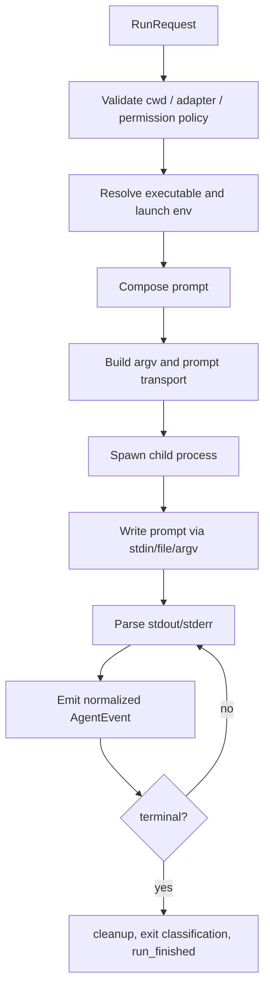

# 本地 Coding Agent CLI Runtime SSOT

状态：0.1.0-alpha.4 已发布到 npm alpha dist-tag；GitHub Release v0.1.0-alpha.4 尚未创建
负责人：local project
最后更新：2026-07-01
主要语言：中文；API 名、CLI 名、模型名、协议名、错误码、代码标识符等技术关键词保留英文。

本页同时记录了当前边界与历史里程碑；凡未以“当前”或“P3-1”明确标注者，均作为历史证据归档，不代表当前承诺 API。

## 1. 产品意图

本项目计划做一个轻量的本地 Coding Agent CLI Runtime。它提供一套稳定 API，用来检测、启动、流式读取、取消，并在可行时恢复本地 coding agent CLI，例如 Codex CLI、Claude Code、OpenCode。

Runtime 不重新实现 agent loop。模型调用、规划、工具执行、权限提示、代码编辑策略、provider 认证，都交给用户已经安装和登录的本地 CLI。Runtime 只负责这些 CLI 外围的本地编排能力：

- 查找 executable；
- 安全地探测 version、auth、models、capabilities；
- 为每次 run 构造正确的 argv、env、cwd；
- 通过安全 transport 投递 prompt；
- 把各 CLI 的输出解析成统一事件流；
- 暴露 cancel、timeout、diagnostics、run result；
- 可选写入本地 durable store，使进程重启后仍可查询历史 run/goal、读取 diagnostics 并稳定 replay events；同一个 `storageDir` 默认由 local single-writer lease 防止多 writer 并发写坏数据。

从 OpenDesign 抽取的是 adapter/runtime 边界，而不是整套 OpenDesign daemon、design workspace、plugin system、media pipeline、web UI、artifact model 或 skill marketplace。

`0.1.0-alpha.4` 已发布到 npm，`alpha` dist-tag 指向该版本，`latest` dist-tag 仍指向 `0.1.0-alpha.1`。该版本不可变 npm tarball 内含过期的 release-prep package docs，因此 alpha.4 的版本和 dist-tags 以 npm registry metadata 为准。GitHub Release `v0.1.0-alpha.4` 尚未创建，因此 alpha.4 的 GitHub Release tarball parity evidence 仍未闭合；创建或修改该 GitHub Release 需要单独 maintainer authorization。P9-6 fresh main release-candidate evidence 和 P9-7 publish/post-publish evidence 都作为包外证据记录在 `.release-evidence/`。
`0.1.0-alpha.3` 是上一条面向 package consumer 的 corrective pre-alpha release。`0.1.0-alpha.2` 已发布到 npm，并创建了 GitHub pre-release `v0.1.0-alpha.2`，但其不可变 npm tarball 内含过期的发布前 package docs。可用版本和 dist-tags 以 npm registry metadata 与 GitHub Releases 为准。P7-5 corrective evidence、fresh release-candidate evidence、registry package-docs verification、installed-package smoke 和 GitHub Release verification 均作为包外证据记录。

P3-11 target-SHA evidence boundary 继续约束 release-candidate 与 post-alpha evidence：易漂移发布证据必须留在包外，并且每个 workflow run 只证明自己的 workflow head SHA。Published verification 和 release-candidate run id、artifact metadata、target SHA、下载复验命令和 registry 摘要记录在 `.release-evidence/`，不写入 npm package。

Target-SHA-bound release-candidate 的易漂移证据必须移出 npm package：run id、artifact metadata、tarball hash、pack hash、下载归一化路径和本地命令摘录写入 `.release-evidence/` 或作为 GitHub Release assets 长期保留，包内 README/docs 只保留稳定发布规则、artifact 名称、验证命令、dry-run 边界、人工发布门禁和历史证据的 historical-only 说明。`package:check` 与 `release:verify` 均拒绝 `.release-evidence/` 出现在 npm pack metadata 中。fresh release-candidate workflow 只证明它自己的 workflow head SHA；`npm publish --dry-run --ignore-scripts --tag alpha` 只是 dry-run，不是真实发布。

`0.1.0-alpha.2` 已发布到 npm，并创建了 GitHub pre-release `v0.1.0-alpha.2`，但其不可变 npm tarball 内含过期的发布前 package docs。`0.1.0-alpha.3` 是上一条 corrective pre-alpha release。`0.1.0-alpha.4` 已发布到 npm，`alpha` dist-tag 指向该版本，`latest` 仍指向 `0.1.0-alpha.1`；该版本不可变 npm tarball 内含过期的 release-prep package docs，且 GitHub Release `v0.1.0-alpha.4` 尚未创建。`0.1.0-alpha.1` 已发布到 npm，并创建了 GitHub pre-release `v0.1.0-alpha.1`。`0.1.0-alpha.0` 已发布到 npm，并创建了 GitHub pre-release `v0.1.0-alpha.0`；该不可变 tarball 内含过期的发布前状态说明，所以 `0.1.0-alpha.0` 已 deprecate。可用版本和 dist-tags 以 npm registry metadata 与 GitHub Releases 为准。P4-1 post-alpha normalization 的规则是：registry 和 GitHub Release asset 分别证明各自 raw gzip artifact；两者 gzip hash 可以不同，但解包后的 `package/` 文件列表和内容必须一致，否则停止并报告 blocker。验证入口是 `npm run release:post-alpha:verify`、`npm run smoke:published`、`npm run package:docs:check` 和 `npm run release:verify -- --dir <downloaded-github-release-assets-dir>`。alpha.4 当前的 `release:post-alpha:verify` 会在缺少 GitHub Release asset 时失败，published packaged-docs inspection 会因 stale release-prep docs 失败，直到后续 corrective alpha 或其他 maintainer-approved remedy。历史 workflow run 只证明各自的 `headSha`，不得作为后续 commit 的发布证据。P3-7 的 schema inventory、version bump policy、public root boundary 和 failure taxonomy 入口是 [docs/api-schema-contract.md](./api-schema-contract.md)。HTTP/API、auth、tenant/team、queue admission、remote worker、UI/artifact、telemetry、database/WAL 仍由上层负责。具体嵌入契约见 [docs/daemon-ready-contract.md](./daemon-ready-contract.md)。

P5-1 的 published-package daemon consumer harness 使用 `npm run published:daemon:verify`。该 gate 从 npm registry 安装 `agent-cli-runtime@0.1.0-alpha.1` 到临时 consumer project，不依赖本仓库源码 import、不使用本地 `dist/` 或 freshly packed tarball。consumer 进程只从 package root import `createAgentRuntime`，使用 fake Codex/Claude/OpenCode binaries 和独立临时 `storageDir`，覆盖 detect、run success、goal success、cancel、timeout、run/goal replay、writer active 时 read-only inspection、second-writer refusal、shutdown/reopen 和 stale owner recovery。输出 schema 固定为 `agent-runtime.publishedDaemonConsumer.v1`，必须包含 `packageSource: "npm-registry"`、`version`、`checks`、`diagnostics` 和 `noAuthenticatedRealRun`，且不得泄露 temp path、真实用户路径、token、raw secret 或完整 prompt。P5-1 不发布新 npm 版本、不引入 daemon server/HTTP/RPC/database/WAL/remote worker/queue service/UI/telemetry、不扩大 package root value exports，`createAgentRuntime` 仍是唯一 package-root value export。

P5-2 的 published-package built-in adapter compatibility gate 使用 `npm run published:adapters:verify`。该 gate 同样从 npm registry 安装当前 `package.json` version 的 `agent-cli-runtime`，不依赖本地 checkout、本地 `dist/` 或 freshly packed tarball；在临时 consumer project 中创建 fake `codex`、`claude`、`opencode-cli`/`opencode` binaries，通过已发布包的内置 adapter 验证 detection、`buildArgs` invocation shape、stdin prompt transport、parser noise tolerance、`agent-runtime conformance --mode fake --json` schema、redaction，以及单 adapter run 失败不影响其他 adapter summary。输出 schema 固定为 `agent-runtime.publishedAdapters.v1`，必须包含 `packageSource: "npm-registry"`、`agents`、`checks`、`diagnostics` 和 `noAuthenticatedRealRun`，且不得泄露 temp path、真实用户路径、完整 prompt、raw stdout/stderr、token-looking value、Bearer value 或 auth env assignment value。P5-2 是 fake-CLI built-in adapter contract evidence，不得表述为 authenticated real Codex/Claude/OpenCode compatibility success；它不发布新 npm 版本、不配置 trusted publishing/npm token/provenance、不引入 daemon/API server/database/WAL/remote worker/UI/telemetry、不扩大 package root value exports。

P5-3 的 published package remote verification evidence 使用 `npm run published:verify -- --out-dir published-verification` 和 manual workflow `.github/workflows/published-package-verification.yml`。聚合脚本依次运行 `smoke:published`、`published:daemon:verify`、`published:adapters:verify`、`release:post-alpha:verify`，并执行 `npm view agent-cli-runtime@<package.json version> version dist-tags dist --json`；输出 `published-verification/published-verification.json`，schema 固定为 `agent-cli-runtime.publishedVerification.v1`。summary 必须包含 `packageName`、`version`、`gitSha`、`checkedAt`、`packageSource: "npm-registry"`、`gates`、`registry`、`diagnostics`、`noAuthenticatedRealRun: true`、`noNpmPublish: true`、`noNpmToken: true`；每个 gate 只保存 command、ok、schemaVersion、durationMs、summary fields 和 redacted diagnostics，不保存 raw stdout/stderr、temp path、private path、完整 prompt、token、Bearer 或 auth env assignment。`published:verify:evidence` 只验证既有 `published-verification.json`，不会生成 evidence；默认 evidence 文件缺失时以 redacted JSON exit `1`，提示先运行 `npm run published:verify -- --out-dir published-verification`，或对下载的 `agent-cli-runtime-published-verification` artifact 使用 `--dir <downloaded-artifact-dir>`。manual workflow 仅 `workflow_dispatch`，Node.js 22，执行 `npm ci`、`npm run published:verify -- --out-dir published-verification`、`npm run published:verify:evidence -- --dir published-verification`，上传 artifact `agent-cli-runtime-published-verification`，retention 14 days。P5-3 是 clean runner 上的 post-publish verification evidence，不发布 npm、不修改 dist-tags、不配置 npm token/trusted publishing/provenance、不执行 authenticated real agent runs、不新增 daemon/API server/database/WAL/remote worker/UI/telemetry。

P5-4 的 Remote Published Verification Evidence Closure 触发 fresh `.github/workflows/published-package-verification.yml` on `main`，确认 `gh run view <run-id> --json headSha,status,conclusion,url,jobs,createdAt,updatedAt` 的 `headSha` 等于当前 target SHA，然后下载 artifact `agent-cli-runtime-published-verification`，归一化为包含 `published-verification.json` 的目录，并运行 `npm run published:verify:evidence -- --dir <normalized-downloaded-artifact-dir>`。包外 evidence `.release-evidence/p5-4-published-verification.json` 只记录 redacted summary：stage、targetSha、runId、runUrl、status/conclusion、createdAt/updatedAt、artifact metadata、downloaded verification schema/ok、checked gates、registry version/dist-tags、本地复验命令占位符，以及 `noAuthenticatedRealRun/noNpmPublish/noNpmToken`。P5-4 run 只证明自己的 `headSha`，不得作为未来 commit、未来 publish、authenticated real run、daemon/control-plane 或 registry mutation evidence。

P6-1 的 Real CLI Compatibility Refresh 只审计本地真实 CLI 漂移和 `needsVerification` 边界，不扩大调度器、daemon、HTTP/RPC、database/WAL、remote worker、UI、telemetry 或 artifact model。新增 `npm run compat:real:evidence` 作为 repo-only evidence 生成入口，默认只执行 safe real preflight：`agents --json`、`doctor --json`、`conformance --mode real --agent all --json` 和各 adapter `smoke --mode real --json`。authenticated real smoke 必须显式传入 `--allow-real-run --agent <id> --expect-text <text>`；输出写入 `.release-evidence/p6-1-real-cli-compatibility.json`，只保存 redacted summary，不保存 raw stdout/stderr、完整 prompt、真实私有路径、token、Bearer 或 auth env assignment。P6-2 新增 `npm run compat:real:evidence:verify` 作为离线 evidence drift gate，输出 `agent-cli-runtime.realCompatibilityEvidenceVerification.v1`，默认只读取既有 evidence 文件，不启动 authenticated real agent run；它拒绝泄露、缺失 dirty-state evidence、把 `real_run_skipped` / `auth_missing` / `needs_verification` 伪装成 success、authenticated success 缺少 expected-text/cwd-mutation 证据、必需 `needsVerification` audit 缺失，以及 `.release-evidence/` repo-only 边界无效。P6-3 将该离线 verifier 接入 `prepublish:check` 和 `release:candidate` evidence：`gate-evidence.json` 新增 `compat:real:evidence:verify` gate，只保存 command、ok、verifier schema、被验证 evidence schema 和 diagnostic count/codes；不刷新真实 CLI 证据，不传 `--allow-real-run`，不让 `dogfood` 依赖 repo-only `.release-evidence/`。CI 不接入该 verifier，原因是 CI/dogfood 仍是 deterministic package / installed-consumer gate，而 compatibility verifier 的输入是 repo-only evidence。2026-06-23 本机证据显示 Codex `codex-cli 0.142.0` 和 OpenCode `1.15.6` 的 opt-in smoke 均为 `success`、expected text matched、cwd 未变更；Claude Code `2.1.178` 为 `auth_missing`，未尝试 authenticated run。Codex `session`/`authProbe`、Claude `session.id`/`reasoning`、OpenCode `extraAllowedDirs`/`session`/`permissionPolicy.read-only` 均继续保留在 `needsVerification`，不得因 smoke success 被猜进默认 argv。

P6-4 针对尚未合入 `origin/main` 的 P6-3 branch target 触发 fresh `.github/workflows/release-candidate.yml`，下载五个 artifacts 后执行 `npm run release:verify -- --dir <normalized-downloaded-artifact-dir>`。下载的 `gate-evidence.json` 包含 `daemon:verify`、`runtime:safety` 和 `compat:real:evidence:verify`；compat gate 输出 schema 为 `agent-cli-runtime.realCompatibilityEvidenceVerification.v1`，被验证 evidence schema 为 `agent-cli-runtime.realCompatibilityEvidence.v1`，diagnostics 只有 count/codes 摘要。证据摘要记录在 `.release-evidence/p6-4-remote-release-candidate.json`，属于 branch evidence，不是 main evidence。

P6-5 在 P6-1 至 P6-4 合入 `main` 后触发 fresh `.github/workflows/release-candidate.yml`，下载五个 artifacts 后执行 `npm run release:verify -- --dir <normalized-downloaded-artifact-dir>`。下载的 `gate-evidence.json` 包含 `daemon:verify`、`runtime:safety` 和 `compat:real:evidence:verify`；compat gate 输出 schema 为 `agent-cli-runtime.realCompatibilityEvidenceVerification.v1`，被验证 evidence schema 为 `agent-cli-runtime.realCompatibilityEvidence.v1`，diagnostics 只有 count/codes 摘要。证据摘要记录在 `.release-evidence/p6-5-main-release-candidate.json`，属于 main-scoped evidence；它不发布 npm、不创建 npm token、不配置 trusted publishing、不执行 authenticated real agent run。

P6-6 记录 P6-5 合并后的 main HEAD release-candidate artifact 可复验证据，摘要保存在 `.release-evidence/p6-6-main-head-release-candidate.json`。P6-6 证据只在包外，不改变 npm package 内容；P7-4 记录 `0.1.0-alpha.2` 的 post-publish evidence，摘要保存在 `.release-evidence/p7-4-alpha-2-post-publish.json`；P7-5 记录 `0.1.0-alpha.3` corrective release evidence，摘要保存在 `.release-evidence/p7-5-alpha-3-corrective-release.json`，并继续遵守同一边界。

P8-2 的 Real CLI Compatibility Matrix v1 不新增 runtime API，不改 `RunScheduler` / `GoalScheduler` 行为，只把本机真实 Codex / Claude Code / OpenCode 的 detection、auth、model probe、argv drift、safe preflight 和 opt-in smoke 状态固化为 repo-only evidence。默认入口仍是 `npm run compat:real:evidence`，输出 `.release-evidence/p8-2-real-cli-compatibility-matrix.json`，schema 固定为 `agent-cli-runtime.realCompatibilityMatrix.v1`。矩阵顶层记录 `checkedAt`、`packageVersion`、`gitSha`、输入 dirty 状态（`gitDirty` / `gitInputDirty`）、evidence 输出文件 dirty 状态（`gitOutputDirty`）、`dirtySummary`，每个 adapter 记录 executable resolution、version、auth、modelsSource、capabilities、argvProfile、parserMode、promptTransport、safePreflight、optionalSmoke、diagnostics 和 `needsVerification`。`npm run compat:real:evidence:verify` 默认离线复验该矩阵，输出仍为 `agent-cli-runtime.realCompatibilityEvidenceVerification.v1`；它也可通过 `--file` 复验 legacy P6 evidence。P8-2 当前 checked-in matrix 的本机观测：Codex `codex-cli 0.142.3` safe preflight 为 `real_run_skipped`，不包含 authenticated smoke；Claude Code `2.1.178 (Claude Code)` 为 `auth_missing`，不尝试 authenticated run；OpenCode `1.15.6` safe preflight 为 `real_run_skipped`，不包含 authenticated smoke。Codex `session`/`authProbe`、Claude `session.id`/`reasoning`、OpenCode `extraAllowedDirs`/`session`/`permissionPolicy.read-only` 均继续保留在 `needsVerification`，不得因任何 smoke success 被猜入默认 argv。该证据不得保存 raw stdout/stderr、完整 prompt、token、Bearer、auth env、真实 home path、临时目录或 CLI debug logs。

P8-3 不新增 hosted daemon、DB、telemetry、UI 或 authenticated real run 默认路径；只增强 P8-2 matrix 的 release evidence freshness / target SHA / dirty policy 判断。`npm run compat:real:evidence:verify` 支持 `--target-sha <sha>`、`--max-age-hours <n>`、`--release-strict` 和 `--allow-dirty`，输出 schema 仍是 `agent-cli-runtime.realCompatibilityEvidenceVerification.v1`，并稳定包含 `targetSha`、`freshness`、`dirtyPolicy` 和 `diagnosticSummary`。默认 verifier 可以接受结构有效的 dirty repo-only evidence，但必须在 `dirtyPolicy.status` 中标记；release review 使用 `npm run compat:real:evidence:verify -- --target-sha <target-sha> --max-age-hours 24 --release-strict`，要求 evidence target SHA 等于 release target SHA，`checkedAt` 未过期，且 dirty input evidence 未被静默当作 clean evidence。Dirty 状态只来自 matrix 输出文件自身时，release-strict 输出 `dirtyPolicy.status: "self_dirty_only"` 并允许通过；其它 dirty input evidence 需要显式 `--allow-dirty`。Local `release:candidate` 默认使用 `--real-compatibility-mode local-strict`，以 matrix `gitSha` 作为 release target，在 `gate-evidence.json` 中保存 verifier schema、已验证 matrix schema、target SHA match、freshness、dirty policy 和 diagnostic count/codes；`--target-sha <sha>` 可用于显式覆盖目标。Remote clean-checkout `.github/workflows/release-candidate.yml` 使用 `--real-compatibility-mode repo-only-skipped`，在 `gate-evidence.json` 中记录 `repo_only_not_run` 和 `not_refreshed_in_ci`，不把缺失的本机 matrix 伪装成 workflow head SHA 的兼容性结论。Release candidate artifacts 不保存 raw `.release-evidence/` matrix、raw stdout/stderr、prompt、token、Bearer、auth env、本机路径或临时目录。workflow head SHA、release target SHA、evidence target SHA 和 evidence-recording HEAD 必须分开记录；branch-only、stale 或 repo-only skipped evidence 只能作为对应 target SHA / workflow mode 的证据，不能写成当前 `main` / 当前 release 的真实 CLI compatibility 通过结论。

P8-4 使用 `.release-evidence/p8-4-release-strict-compatibility.json` 记录 release-strict compatibility closure。该 repo-only summary 由 `npm run release:strict-compatibility:evidence -- --target-sha <target-sha> --local-release-dir <tmp-local-strict>` 生成，记录 P8-2 matrix schema、strict verifier schema、`compat:real:evidence:verify -- --target-sha <target-sha> --max-age-hours 24 --release-strict` 摘要、本地 strict `release:candidate` / `release:verify` artifact 摘要、远端 release-candidate workflow 触发状态、下载 artifact 复验状态、`noAuthenticatedRealRun`、`noNpmPublish`、`noNpmToken` 和 branch/main evidence 判定。`targetSha` 是 matrix 证明的 release target；`currentHeadSha` 只表示 summary 生成时的 HEAD，后续 repo-only evidence commit 可以改变分支 HEAD，但不改变 release target。Target SHA 未进入 `origin/main` 时，P8-4 summary 必须记录 `branchEvidence: true`、`mainEvidence: false`、远端 main workflow 未触发原因和下载 artifact 复验 skipped reason；不得把 branch/local evidence 写成当前 `main` release evidence。该 summary 不保存 raw stdout/stderr、完整 prompt、token、Bearer、auth env assignment、真实 home path、临时目录、resolved executable path、workflow logs 或实际本地 artifact 目录。

P8-5 使用 `.release-evidence/p8-5-main-release-candidate.json` 记录 main-scoped remote release-candidate evidence closure。该 repo-only summary 由 `npm run release:main-candidate:evidence -- --release-target-sha <origin-main-sha> --local-release-dir <local-strict-dir> --remote-run-json <run.json> --artifacts-json <artifacts.json> --downloaded-dir <normalized-artifact-dir>` 生成，绑定 `releaseTargetSha` 到当前 `origin/main`，要求 P8-2 matrix `gitSha` 等于该 target、`gitInputDirty: false`，并允许 matrix 输出文件自身 dirty 记录为 `self_dirty_only`。P8-5 同时记录本地 strict `compat:real:evidence:verify -- --target-sha <releaseTargetSha> --max-age-hours 24 --release-strict` 摘要、本地 strict `release:candidate` / `release:verify` 摘要、fresh `.github/workflows/release-candidate.yml --ref main` run metadata、五个 artifact 名称/count，以及下载归一化 artifact 目录的 `release:verify` 摘要。P8-5 必须记录 `mainEvidence: true`、`branchEvidence: false`，且 `releaseTargetSha == origin/main == workflow headSha`。Remote workflow metadata 必须是 `event: workflow_dispatch`、`headBranch: main`、`status: completed`、`conclusion: success`；artifact metadata 必须正好包含 `agent-cli-runtime-tarball`、`agent-cli-runtime-pack-metadata`、`agent-cli-runtime-package-files`、`agent-cli-runtime-gate-evidence` 和 `agent-cli-runtime-release-verification`，不得缺失、重复、过期、未知、缺少 `sha256:` digest 或缺少 `expired: false` 证明。Remote clean-checkout artifact 中的 real compatibility gate 继续记录 `repo_only_not_run` / `not_refreshed_in_ci`；真实兼容性结论来自本地 strict matrix verifier。P8-5 不是 npm publish evidence，不创建 GitHub Release，不配置 npm token 或 trusted publishing，不执行 authenticated real agent run，不保存 raw stdout/stderr、workflow logs、完整 prompt、token、Bearer、auth env、真实 home path、临时目录、resolved executable path 或实际本地 artifact 目录。

P8-6 的 Release Evidence Tooling Hardening 提供 repo-only 下载 artifact 归一化入口 `npm run release:artifacts:normalize -- --download-dir <gh-download-dir> --out-dir <normalized-artifact-dir>`。该工具输出 `schemaVersion: "agent-cli-runtime.releaseArtifactNormalization.v1"`，只从匹配的 GitHub artifact 子目录复制 `npm-pack.json`、`package-files.txt`、`gate-evidence.json`、`release-verification.json` 和 `agent-cli-runtime-*.tgz` 到单层目录，缺失、重复、未知或目录不匹配的 artifact file 都以稳定 JSON 失败；repo 外输入/输出目录在 JSON 中显示为 `<external_artifact_dir>` / `<external_output_dir>`，不暴露本机绝对路径。Normalization 只处理 GitHub Actions 下载目录结构，不替代 `npm run release:verify -- --dir <normalized-artifact-dir>` 对 package boundary、gate evidence、tarball 文件和 repo-only evidence 边界的校验。`scripts/normalize-release-artifacts.mjs`、`scripts/create-main-release-candidate-evidence.mjs` 和 `.release-evidence/` 均保持 repo-only，不进入 npm package。

P8-7 使用 main-scoped evidence 文件记录 P8-6 合入后的 fresh `main` release-candidate 闭环。入口为 `npm run release:main-candidate:evidence -- --stage P8-7 --release-target-sha <origin-main-sha> --local-release-dir <local-strict-dir> --remote-run-json <run.json> --artifacts-json <artifacts.json> --downloaded-dir <normalized-artifact-dir> --out .release-evidence/p8-7-main-release-candidate.json`。该 summary 绑定 `releaseTargetSha == origin/main == workflow headSha`，记录 fresh `.github/workflows/release-candidate.yml --ref main` run metadata、五个 non-expired `sha256:` artifact metadata、P8-6 normalizer 后的 downloaded `release:verify` 摘要、本地 strict matrix verifier 和本地 strict release artifact 摘要。该 evidence 只证明 `releaseTargetSha`；记录 evidence 的提交或未来 PR merge commit 成为 release target 时，需要重新生成 fresh main evidence。P8-7 不是 npm publish evidence；不执行 GitHub Release mutation、不配置 npm token 或 trusted publishing、不执行 authenticated real agent run，不保存 raw stdout/stderr、workflow logs、完整 prompt、token、Bearer、auth env、真实 home path、临时目录、resolved executable path 或实际本地 artifact 目录。

P8-8 使用 `npm run release:package-content:verify -- --base-ref <release-target-sha> --head-ref <sha-or-ref>` 判断两个 git refs 的 npm package 内容是否等价。输出 schema 固定为 `agent-cli-runtime.packageContentEquivalence.v1`，字段包括 refs、resolved SHAs、package name/version、package file counts、stable package content digest、changed package files、`evidenceOnlyDrift` 和 `freshReleaseCandidateRequired`。该 verifier 使用临时 git worktree 生成每个 ref 的实际 npm package 文件集合，基于 package 内相对路径、mode、size 和文件内容 hash 计算 digest；gzip/tarball 非确定性不作为等价判定依据。`.release-evidence/`、tests 和 repo-only scripts 等包外变化不会触发 package content drift；README、README.zh-CN、docs、package.json、dist、types、bin 或其它 package-visible 文件变化会触发 `freshReleaseCandidateRequired: true`。P8-8 evidence 保存在 `.release-evidence/p8-8-package-content-equivalence.json`，只用于判定 P8-7 `releaseTargetSha` 与后续 ref 是否 package-content equal；它不把后续 HEAD 写成已被 P8-7 workflow head SHA 证明。P8-8 外部副作用边界固定为：npm publish 未执行，GitHub Release mutation 未执行，npm token/trusted publishing 未配置，authenticated real agent run 未执行；evidence 不保存 raw stdout/stderr、workflow logs、完整 prompt、token、Bearer、auth env、真实 home path、临时目录或实际 worktree 路径。

Main-scoped release-candidate evidence generator 是 stage-neutral repo-only 工具。入口 `npm run release:main-candidate:evidence -- --stage <stage>` 支持 `P9-2` 这类当前阶段标签，输出 schema 固定为 `agent-cli-runtime.mainReleaseCandidateEvidence.v1`，默认输出不绑定 P8 阶段名。新 summary 必须绑定 `releaseTargetSha == origin/main == workflow headSha`，记录 local strict matrix verifier、local strict release artifacts、fresh `release-candidate.yml --ref main` run、五个 artifact metadata、normalized downloaded artifact verification、`mainEvidence: true`、`branchEvidence: false` 和 no-auth/no-publish/no-token 边界。P8 main evidence 文件只作为 `historicalMainEvidence` 摘要保留，并以 `currentMainFreshEvidence: false` 明确不代表 P9 或后续 package-visible 变化的 current main evidence。

## 2. OpenDesign 参考基线

OpenDesign 参考代码当前以本地开发 checkout 形式放在：

```text
.reference/open-design
```

`.reference/` 只用于本地阅读和验证设计，不进入开源仓库、不进入 npm package、不作为本项目源码发布。

参考版本：

```text
nexu-io/open-design HEAD c54e49aae9d2dc8b044467187c081d5d7c50bebc
```

已阅读的关键参考文件：

- `.reference/open-design/docs/agent-adapters.md`
- `.reference/open-design/specs/current/runtime-adapter.md`
- `.reference/open-design/apps/daemon/src/runtimes/types.ts`
- `.reference/open-design/apps/daemon/src/runtimes/registry.ts`
- `.reference/open-design/apps/daemon/src/runtimes/detection.ts`
- `.reference/open-design/apps/daemon/src/runtimes/executables.ts`
- `.reference/open-design/apps/daemon/src/runtimes/invocation.ts`
- `.reference/open-design/apps/daemon/src/runtimes/launch.ts`
- `.reference/open-design/apps/daemon/src/runtimes/env.ts`
- `.reference/open-design/apps/daemon/src/runtimes/prompt-budget.ts`
- `.reference/open-design/apps/daemon/src/runtimes/defs/codex.ts`
- `.reference/open-design/apps/daemon/src/runtimes/defs/claude.ts`
- `.reference/open-design/apps/daemon/src/runtimes/defs/opencode.ts`
- `.reference/open-design/apps/daemon/src/json-event-stream.ts`
- `.reference/open-design/apps/daemon/src/claude-stream.ts`
- `.reference/open-design/apps/daemon/src/run-result.ts`

需要保留的关键经验：

- Adapter 定义应尽量声明式：id、binary 名、probe、argv builder、prompt transport、stream parser、capabilities、adapter-specific env。
- metadata probe 必须运行在中性的 temp cwd，不能继承调用方项目 cwd；一些 CLI 的启动或 model list probe 可能在 cwd 写入文件。
- detection 必须隔离 adapter 故障；一个坏掉的 CLI 不能让整个 runtime catalog 失败。
- prompt 默认通过 stdin 或 prompt file 传递，避免 Windows/Linux argv 长度限制。
- structured stream 由各 adapter parser 解析，再归一成小而稳定的事件契约。
- agent fallback 不能静默切换；不同 CLI 的信任、模型、工具和权限语义不同，fallback 必须由 caller 或用户显式选择。

不要照搬的部分：

- 不引入 OpenDesign 的 design artifacts、media features、web routes、plugin installation、telemetry、database schema、project-storage conventions。
- 不把 OpenDesign 为 web/headless 场景使用的 permission bypass 作为本项目全局默认。
- 不绑定 OpenDesign skill 格式。MVP 先接收 prompt/context；后续再加可选 skill helper。

## 3. 项目范围

### MVP 范围内

- TypeScript/Node.js library API。
- 一个薄 CLI wrapper，用于 smoke test 和简单本地调用。
- 默认 memory-only `RunScheduler`：状态机、event replay、cancel、timeout、run result classification。
- 默认 memory-only `GoalScheduler`：planner run -> JSON task graph -> dependency-aware ready queue。
- 可选 `storageDir` durable local persistence：run/goal manifest JSON、events JSONL、terminal replay、重启 active 状态中断化、corrupt record diagnostic isolation。
- `storageDir` local single-writer lease：`runtime.lock.json` 记录 `runtimeInstanceId`、`pid`、`startedAt`、`heartbeatAt`；active run/goal manifest 记录 owner；live owner 阻止第二个 writer，stale/closed owner 可接管并记录 diagnostic。
- 内置三个 adapter：
  - Codex CLI
  - Claude Code
  - OpenCode
- 并行 detection 和 diagnostics。
- 基于 `child_process.spawn` 的 run orchestration。
- 默认使用 stdin 投递 prompt。
- 统一事件流，暴露为 `AsyncIterable<AgentEvent>`。
- 通过 `AbortSignal` 和 child process signal 支持 cancellation。
- 基础 timeout 和 inactivity guard。
- task run 成功后执行 `validationCommands`，失败则 task/goal failed。
- 每次 run 可选 `model`、`reasoning`、`env`、`extraAllowedDirs`。
- parser fixture 和 fake CLI tests。

### 明确非目标

- MVP 不做 web UI。
- MVP 不做 remote/cloud fallback API。
- 不做 model-provider router。
- 不做自研 Read/Write/Edit tool loop。
- 不做 plugin marketplace 或 skill installer。
- 不做 multi-agent scheduler。
- 不做后台 daemon database。
- MVP 不做 Docker/SSH remote runtime。
- 不试图统一每个 CLI 的全部特性。
- 不做静默 permission escalation。

### 发布边界（pre-alpha / developer preview）

- 当前阶段为 pre-alpha / developer preview（P2-1）；
- 不承诺稳定 API，主要关注本地编排与验证边界；
- 不提供后台 daemon、数据库同步服务、WAL、或 remote runtime；
- 不把 local lease 声称为 daemon coordination、distributed lock、WAL、数据库事务、多机调度或 live process resume；
- package root 保持精简，内部 adapter/parser/store 仅作内部实现，不作为包根 API 承诺。

## 4. 设计原则

1. Delegate the agent loop。
   本地 CLI 仍然是 model call、tool use、auth、edit behavior 的权威实现。

2. Adapter 要薄。
   新增 adapter 时，主要应新增 definition、argv builder 和 stream parser。

3. Transport 默认安全。
   优先 stdin；CLI 支持时可用 prompt file；只有 CLI 强制要求时才用 argv，并必须做 prompt size guard。

4. probe 不进入用户项目。
   detection、version、model list、auth status 这类 metadata probe 一律使用 temp cwd。

5. 权限边界显式。
   `cwd`、`extraAllowedDirs`、environment override、`permissionPolicy` 必须体现在 `RunRequest`。

6. 归一事件，不归一行为。
   Codex、Claude、OpenCode 的内部行为可以不同；Runtime 只统一可观察输出。

7. 失败可见。
   auth failure、missing binary、prompt too large、stream parser error、timeout、non-zero exit 都要产生结构化 diagnostics。

8. 尊重用户本地设置。
   使用用户安装的 CLI、登录态、shell toolchain path 和 config file。MVP 不主动编辑这些 config file。

## 5. 核心 API

Public API 应足够小，方便产品、脚本、桌面应用直接嵌入，而不继承 daemon 架构。

```ts
export type AgentId = 'codex' | 'claude' | 'opencode' | string;

export interface RuntimeOptions {
  adapters?: AgentAdapterDef[];
  env?: NodeJS.ProcessEnv;
  searchPath?: string[];
  storageDir?: string;
  storage?: {
    durability?: 'relaxed' | 'fsync';
  };
  maxConcurrentTasks?: number;
}

export interface DetectOptions {
  envByAgent?: Record<string, Record<string, string>>;
  includeUnavailable?: boolean;
  timeoutMs?: number;
}

export interface RunRequest {
  agentId: AgentId;
  cwd: string;
  prompt: string;
  systemPrompt?: string;
  contextBlocks?: RuntimeContextBlock[];
  model?: string;
  reasoning?: string;
  env?: Record<string, string>;
  extraAllowedDirs?: string[];
  permissionPolicy?: PermissionPolicy;
  timeoutMs?: number;
  inactivityTimeoutMs?: number;
  signal?: AbortSignal;
  session?: RuntimeSessionRef;
}

export interface RunHandle {
  runId: string;
  events: AsyncIterable<AgentEvent>;
  cancel(reason?: string): Promise<void>;
}

export interface AgentRuntime {
  detect(options?: DetectOptions): Promise<DetectedAgent[]>;
  detectStream(options?: DetectOptions): AsyncIterable<DetectedAgent>;
  run(request: RunRequest): Promise<RunHandle>;
  createGoal(request: CreateGoalRequest): Promise<GoalHandle>;
  cancelRun(runId: string): Promise<void>;
  cancelGoal(goalId: string): Promise<void>;
  shutdown(reason?: string): Promise<void>;
  getRun(runId: string): Promise<RunRecord | null>;
  replayRunEvents(runId: string, options?: { afterEventId?: number }): Promise<ReplayEvent<AgentEvent>[]>;
  listRuns(options?: { status?: 'active' | RunStatus }): Promise<RunRecord[]>;
  getGoal(goalId: string): Promise<GoalRecord | null>;
  replayGoalEvents(goalId: string, options?: { afterEventId?: number }): Promise<ReplayEvent<SchedulerEvent>[]>;
  listGoals(options?: { status?: 'active' | GoalStatus }): Promise<GoalRecord[]>;
  inspectStore(options?: { storageDir?: string }): Promise<StoreHealth>;
  exportDiagnostics(request: ExportDiagnosticsRequest): Promise<DiagnosticsBundle>;
  getAdapter(id: AgentId): AgentAdapterDef | null;
}
```

P1-1 package root 契约：

- 稳定 MVP surface：`createAgentRuntime(options?)`、`AgentRuntime` facade、`DetectOptions` / `DetectedAgent`、`RunRequest` / `RunHandle` / `RunRecord` / `RunStatus`、`CreateGoalRequest` / `GoalHandle` / `GoalRecord` / `GoalStatus`、`AgentEvent` / `SchedulerEvent` / `ReplayEvent`、`RuntimeDiagnostic` / `RuntimeErrorCode`。
- 实验 extension surface：`RuntimeOptions.adapters`、`AgentAdapterDef`、`BuildArgsInput`、`PromptTransport`、`StreamParser`、`AdapterCompatibilityProfile` 等 adapter authoring 类型。它们用于 pre-alpha adapter 实验，但 stable release 前仍可能调整。
- 不从 package root 导出 runtime internals：内置 adapter values、parser helpers、executable resolution helpers、stores、schedulers、task graph helpers。内部测试可以继续从 `src/` 直接引用。
- 发布 tarball 可包含内部 `dist/` 文件以支持 declarations 和 CLI，但文档承诺的 consumer API 只有 package root：`import { createAgentRuntime } from "agent-cli-runtime"`。

P1-1 将 replay API 命名为 `replayRunEvents()` / `replayGoalEvents()`，因为它们返回的是可排序的 replay envelope，而不是 live event stream。实现可保留 `getRunEvents()` / `getGoalEvents()` 作为 pre-alpha 兼容 alias，但 README、CLI 和 SSOT 主契约使用 `replay*` 命名。

`run()` 在 child process 已启动、事件解析已挂载后返回。调用方消费 `handle.events`，直到收到 terminal `run_finished` event。run 开始后的 agent failure 应作为事件发出，而不是在 iterator 外层抛出。

`createGoal()` 会先用 planner prompt 启动一次 run，收集 `text_delta` 作为 planner output。主路径仍要求 strict JSON task graph；P1-3 起 runtime 也可以从 Markdown fenced code 或短 surrounding prose 中提取唯一一个 JSON object。多个 JSON objects、malformed JSON、缺少 `tasks` 或 task graph 字段类型非法时，planning 必须以 `AGENT_TASK_GRAPH_INVALID` 写入 `scheduler_error` 和 goal diagnostics，并将 goal 标记为 `failed`；不得误报成 task failure 或 `AGENT_UNAVAILABLE`。诊断信息必须包含字段名，task 级字段错误必须包含 task id；对超大 planner output 只报告长度/原因，不把原文完整写入 diagnostics。

P1-3 task graph schema contract：

```json
{
  "tasks": [
    {
      "id": "T001",
      "title": "Short title",
      "objective": "Self-contained objective",
      "dependencies": [],
      "allowedFiles": ["src/file.ts"],
      "validationCommands": ["npm test"],
      "agentId": "codex",
      "retryPolicy": {
        "maxAttempts": 2,
        "retryableErrorCodes": ["AGENT_TIMEOUT"],
        "backoffMs": 250
      }
    }
  ]
}
```

Runtime-side validation rules：

- `task.id` / `task.title` / `task.objective` 必须是 non-empty string。
- `task.dependencies` 必须存在且为 string array；每个 dependency 必须指向已存在 task id，整个 graph 必须 acyclic。
- `task.allowedFiles` 和 `task.validationCommands` 如存在必须是 string array。
- `task.agentId` 如存在必须是 string。
- `task.retryPolicy` 如存在必须是 object，且 `maxAttempts` 为正整数、`retryableErrorCodes` 为 string array、`backoffMs` 为非负 number。

通过校验后，task graph 交给 dependency-aware ready queue。task 只有在全部 dependencies 都 `succeeded` 后才可进入 ready；ready task 会按 planner 输出顺序稳定入队。默认 `maxConcurrentTasks: 1`，保持 P1-1 的保守串行行为；caller 可在 `createGoal()` request 或 `createAgentRuntime()` options 上配置更大的 `maxConcurrentTasks`，此时互不依赖且已 ready 的 task 可并发执行。为避免 package root 扩张，新增能力只通过 existing facade 的 options/request types 暴露，不新增 root value exports。

P1-2 task retry contract：

- `retryPolicy.maxAttempts` 默认 `1`，不改变现有行为。
- `retryPolicy.retryableErrorCodes` 默认空数组；只有 task terminal failure 的 error code 命中该列表才会重试。
- `retryPolicy.backoffMs` 默认 `0`，仅在 retry 前等待。
- 用户取消的 goal 永远停止；`cancelled` 不会被普通 retry policy 自动恢复。
- runtime-side validation failure 使用 `AGENT_EXECUTION_FAILED` 作为 retry 判断 code，因此默认不重试；只有 caller 显式把该 code 加入 retryable list 且 `maxAttempts > 1` 时才重试。

每个 task evidence 必须记录 attempts：

```ts
export interface TaskAttemptEvidence {
  attemptId: string;
  runId: string;
  startedAt: number;
  finishedAt?: number;
  result?: RunResult;
  diagnostics: RuntimeDiagnostic[];
}

export interface TaskEvidence {
  runId?: string; // latest attempt run
  result?: RunResult;
  attempts?: TaskAttemptEvidence[];
  validationCommands: string[];
  validationResults?: ValidationCommandResult[];
  summary: string;
}
```

P1-2 cancellation / failure contract：

- `cancelGoal()` 对 queued/ready/pending tasks 标记 `canceled`，对 running attempt 的 run 调用 `cancelRun()`，running task 在 run terminal 后标记 `canceled` 并写入 `task_finished(cancelled)`。
- goal cancellation 结果固定为 `status: "canceled"` / `result: "cancelled"`。
- task failed 且 `continueOnFailure` 未开启时采用 fail-fast：失败 task 标记 `failed`；直接或传递依赖该 task 的 pending dependents 标记 `blocked`；其他尚未启动 pending tasks 标记 `canceled`；并发 running tasks 会被 cancel，但 goal terminal result 仍保持 `failed`。
- `continueOnFailure` 开启时，失败 task 的 dependents 标记 `blocked`，不依赖失败 task 的 ready work 可继续；只要存在 failed/blocked task，最终 goal result 为 `failed`。

Task run 成功后，如果 task 带有 `validationCommands`，runtime 会在 task `cwd` 依次执行这些 shell commands；任一 command 非零退出则 task failed，validation stdout/stderr tail 会 redacted 后写入 task evidence。P2-1 起 validation evidence 还记录 redacted command、logical cwd、timeout、redacted caller env overrides、exitCode、signal、duration、passed 和 `classification`（`success` / `failed` / `timeout` / `spawn_error`）。Validation timeout 产生 `AGENT_TIMEOUT` diagnostic；其他 validation failure 产生 `AGENT_EXECUTION_FAILED`。状态机必须单调：validation 未通过前 task 不得先写成 `succeeded`。调用方应只对可信目标或可信 planner 开启自动 validation。

`shutdown(reason?)` 用于 library caller 主动收尾：runtime 会 cancel 所有 active goals/runs，尽力终止子进程树，并短暂等待它们写入 terminal manifest/events。若进程重启而不是显式 shutdown，`storageDir` reload 仍沿用 interrupted recovery：历史 active run/goal 标记为 failed 并写入 `AGENT_RUNTIME_INTERRUPTED`。

`storageDir` 是 opt-in。未传时保持纯内存行为；传入时，runtime 在该目录下写入：

```text
<storageDir>/
  runs/<runId>/manifest.json
  runs/<runId>/events.jsonl
  goals/<goalId>/manifest.json
  goals/<goalId>/events.jsonl
```

`events.jsonl` 每行是一条完整 append record，格式为 `{ "id": 1, "sequence": 1, "runId": "run_123", "timestamp": 123, "event": {...} }` 加尾随换行；goal event 使用同样 shape 但带 `goalId`。`id` / `sequence` 在单个 run/goal 内单调递增，`replayRunEvents()` / `replayGoalEvents()` 支持 `afterEventId` 增量 replay，并按 `sequence` / `id` / `timestamp` 稳定排序。新的 runtime 指向同一 `storageDir` 时必须能读取 terminal run/goal 的 manifest 和 events；若加载到 `queued`、`running` 或 `planning` 的历史记录，必须标记为 failed，并写入 `AGENT_RUNTIME_INTERRUPTED` diagnostic/event，不能假装继续运行。

P1-7 起，`storageDir` 的 write durability 可通过 `RuntimeOptions.storage.durability` 配置：

- 默认 `relaxed`，保持 pre-alpha 性能和兼容性，不承诺 host crash 后最后一条 in-flight record 一定落盘。
- `fsync` 会在 manifest temp file 写入后尽量 `fdatasync` / `fsync`，rename 后尽量 fsync parent directory；JSONL append 写入一条完整 record 后尽量 `fdatasync` / `fsync`。
- Windows/macOS/Linux 上如果某个 sync primitive 不可用或失败，runtime 必须 graceful fallback，并持久化 redacted store-level diagnostic；`store-health` 和 diagnostics bundle 必须可见，不能只保存在进程内存里，也不能把平台差异变成不可恢复 crash。

P1-1 durable store 可靠性要求：

- store 目录不存在时自动创建。
- manifest JSON 使用 temp file + rename 原子写入。
- event JSONL append 前必须 redaction；manifest、diagnostics、validation stdout/stderr 写入前也必须 redaction。
- 单个损坏 manifest 以 failed record 形式加载，并通过 `AGENT_STORE_RECORD_CORRUPT` diagnostic 暴露，不能阻塞其他 records。
- 单个损坏 JSONL line 保留可解析事件，并通过 `AGENT_EVENT_LOG_CORRUPT` diagnostic/event 暴露；diagnostic 记录 file、line、reason、retained event count、corrupt line count、partial tail flag、last good event id/sequence 和 repair recommendation。中间坏行会被跳过，后续合法 records 仍可 replay；partial tail 停在最后一个完整 record boundary。
- 重启后 terminal run/goal 可查询 status、result、diagnostics 并 replay events；active run/goal 被中断化，而不是 resume 一个已失去 child process 的内存状态。
- 加载 corrupt manifest 时不得静默覆盖原始坏文件；health scan 仍应能报告 corrupt manifest。

P1-4 storage health / diagnostics bundle contract：

- `runtime.inspectStore({ storageDir? })` 和 CLI `agent-runtime store-health --storage-dir <dir> --json` 扫描磁盘 store，返回 lock/lease status、active records 及 owner live/stale/closed 状态、run/goal 总数、corrupt manifests、corrupt event logs、corrupt line count、partial tail detected、last good event id/sequence、repair recommendation、active/interrupted records、storage-level diagnostics、一致性 warnings 和 diagnostic summary。
- CLI `agent-runtime store-lock --storage-dir <dir> --json` 只读输出当前 lock owner/status。
- CLI `runs`、`goals`、`run-status`、`goal-status`、`replay-run`、`replay-goal`、`store-health`、`store-lock`、`diagnostics` 是只读 inspection path，不获取 writer lock，不应改写 live owner 的 active records。
- partial/corrupt JSONL tail 必须保留有效 prefix replay，并在 health 中报告 file、line、reason、retained event count；不得把完整损坏行写入 diagnostics。
- terminal manifest 缺少 terminal event 时报告 `AGENT_STORE_TERMINAL_EVENT_MISSING` warning。
- event log 有 terminal event 但 manifest status 非 terminal 时报告 `AGENT_STORE_TERMINAL_EVENT_MANIFEST_MISMATCH` warning；health scan 不自动静默改写 manifest。
- `runtime.exportDiagnostics(request)` 和 CLI `agent-runtime diagnostics run|goal <id> --storage-dir <dir> --json [--out <file>]` 导出 redacted JSON bundle。
- diagnostics bundle 使用 `schemaVersion: "agent-runtime.diagnostics.v1"`，包含 subject、redacted manifest、event summary、`RuntimeDiagnostic[]` items、storage-level diagnostics、consistency warnings、goal task attempt evidence、带 terminal reason 和 owner/lease status 的 supervisor summary，以及 environment-safe adapter summary；它不导出完整 event payload、不导出完整 env dump、不导出 prompt、raw corrupt line 或真实私有路径。
- `--out <file>` 使用 temp file + rename 原子写入。
- P2-7 起 CLI `agent-runtime store-repair --storage-dir <dir> [--dry-run|--apply] --json` 输出 `schemaVersion: "agent-runtime.storeRepair.v1"` 的 versioned plan。默认和 `--dry-run` 都不改文件；只有显式 `--apply` 才会执行修复，且 `--apply` 必须带 `--storage-dir`。
- repair plan item 至少包含 subject kind/id、file、action、reason、dryRun、applied、backupPath、retainedEventCount、removedLineCount、truncatedBytes 和 diagnostics。partial tail 使用 `truncate_partial_tail`；中间 corrupt line 使用 `isolate_corrupt_line`；terminal manifest/event mismatch 或 terminal event missing 只报告 `manual_review`，不自动改 manifest。
- apply 对 live writer owner 默认拒绝，不中断或改写 live owner 的 active run/goal；写入期间必须持有本地 store lease，避免检查后新 writer 进入。允许 apply 时，原始 `events.jsonl` 先通过 temp file + rename 备份到 `<storageDir>/repair-backups/<timestamp>/...`；partial tail 写回最后完整 record boundary；中间坏行通过 temp file + rename 重写为仅包含可解析 replay records 的 JSONL。backup 写失败不得改原文件；rewrite 失败必须保留已创建 backup，原文件不得变成不可解析残片，并以 `AGENT_STORE_REPAIR_FAILED` 持久化 redacted diagnostic。修复尽量 fsync，失败时 graceful fallback 并记录 redacted diagnostic；成功 apply 也要持久化 redacted repair summary，供后续 health / diagnostics bundle 审计。
- apply 必须幂等；连续第二次执行应输出 no-op plan 或 `applied: false`，不得制造新的备份或改写已修复文件。P2-7 repair 不是 WAL、不是数据库事务、不是 compaction daemon、不是 daemon resume，只是本地 JSONL 安全修复工具。
- health、bundle 和 repair diagnostics 均走统一 redaction：token、Bearer value、auth-token env assignment、secret-looking value、绝对私密路径和 raw corrupt line 都不得泄露。

P2-2 local supervisor lease / recovery contract：

- 每个 durable runtime 创建新的 `runtimeInstanceId`。memory-only runtime 不写 heartbeat、不创建 lock file。
- `storageDir` writer mode 默认获取 `runtime.lock.json`。live owner 存在时第二个 writer 必须失败，错误短且可行动，并经过 redaction。
- lock owner stale 或 closed 时允许接管，并把 `AGENT_STORAGE_LEASE_TAKEOVER` 写入 redacted storage diagnostics。
- active run/goal manifest 或等价 sidecar 必须记录 owner：`runtimeInstanceId`、`pid`、`startedAt`、`heartbeatAt`，shutdown 时 lock 可释放或标记 closed。
- recovery 只处理当前 writer 可接管的 active records：owner missing/stale/closed 的 active run 标记 `AGENT_RUNTIME_INTERRUPTED`，owner missing/stale/closed 的 active goal 标记 failed 且 pending/running tasks 变为 canceled。
- 检测到另一个 live owner 时，不得把对方 active run/goal 标记 failed；只能通过 store-health/diagnostics 报告 live owner 状态。
- 该 lease 是本机 best-effort single-writer guard，不是 daemon coordination、distributed lock、WAL、事务存储、多机调度或 live process resume。

## 6. Adapter 定义

Adapter 尽量声明式；只有必须读 runtime context 的部分才写 imperative logic。

```ts
export interface AgentAdapterDef {
  id: AgentId;
  displayName: string;
  bin: string;
  fallbackBins?: string[];
  binEnvVar?: string;

  versionArgs: string[];
  helpArgs?: string[];
  capabilityFlags?: Record<string, string>;
  authProbe?: AgentAuthProbe;
  listModels?: AgentListModelsProbe;
  fallbackModels?: RuntimeModelOption[];

  buildArgs(input: BuildArgsInput): string[];
  promptTransport: PromptTransport;
  stream: StreamParserDef;

  env?: Record<string, string>;
  capabilities: AgentCapabilityHints;
  defaults?: AgentRunDefaults;
  compatibility?: AdapterCompatibilityProfile;
}

export type PromptTransport =
  | { kind: 'stdin'; inputFormat?: 'text' | 'jsonl' }
  | { kind: 'file'; flag: string }
  | { kind: 'argv'; maxBytes: number };

export interface BuildArgsInput {
  prompt: string;
  cwd: string;
  model?: string;
  reasoning?: string;
  extraAllowedDirs: string[];
  permissionPolicy: PermissionPolicy;
  promptFilePath?: string;
  session?: RuntimeSessionRef;
}
```

Adapter module 不直接 spawn process；它只描述 core runner 如何 spawn。

P0-3 起，内置 adapter 还会声明 lightweight compatibility profile，用来记录真实 CLI invocation 基线，而不是把未验证 flags 混进默认路径。P1-5 后 profile 必须同时包含 human-readable 和 structured 字段：`executableNames` / `executableCandidates`、version/model/auth probe、`defaultArgs`、`knownFlags`、`needsVerification`、`promptTransport` / `promptTransportMode`、`streamFormat` / `streamMode` 和 capability notes。不确定 flags 必须进入 `needsVerification`，不能进入默认 `buildArgs()` 路径；例如 Claude `session.id`、Codex session、OpenCode extra dirs/session/read-only mapping 均保持未映射，直到有真实 CLI 证据。

## 7. 检测契约

当 caller 请求 `includeUnavailable` 时，detection 同时返回可用和不可用 agent：

```ts
export interface DetectedAgent {
  id: AgentId;
  displayName: string;
  available: boolean;
  path?: string;
  version?: string | null;
  authStatus?: 'ok' | 'missing' | 'expired' | 'unknown';
  models: RuntimeModelOption[];
  modelsSource: 'live' | 'fallback' | 'none';
  capabilities: AgentCapabilities;
  diagnostics: RuntimeDiagnostic[];
}
```

检测流程：

1. resolve executable：
   - configured env override，例如 `CODEX_BIN`；
   - `detect()` 传入的 adapter-specific env；
   - `bin`；
   - `fallbackBins`；
   - 用户 toolchain 目录补充到 PATH search。
2. 通过 `versionArgs` probe version。
3. 可选 probe help/capability flags。
4. 可选 probe auth status。
5. 可选 probe live model list。
6. model probing 失败时使用 static fallback model hints。
7. 单个 adapter 失败时返回 diagnostic，不抛出到整个 detection。

检测不变量：

- probe 使用 neutral temp cwd。
- 每个 probe 必须有 timeout。
- 不执行 login flow。
- 不修改 CLI config。
- model-list failure 不等于 adapter unavailable。
- version/model/auth probe diagnostics 必须 redaction，并按 `not_installed`、`not_executable`、`auth_missing`、`network_error`、`unsupported_flag`、`probe_failed` 这类原因分类。
- model probe parser 必须过滤空行、warning/log line 和明显非模型行；解析失败时回退到 static fallback model hints，并保留 diagnostic。
- `detectStream()` 服务渐进式 UI；`detect()` 服务脚本和普通 library caller。

## 8. Run 生命周期



Run preflight：

- `cwd` 必须是 absolute path 且存在。
- `agentId` 必须能 resolve 到已知 adapter。
- missing binary 返回 `AGENT_UNAVAILABLE`。
- oversized argv prompt 返回 `AGENT_PROMPT_TOO_LARGE`。
- `extraAllowedDirs` 必须是 absolute path。
- adapter-specific env override 在 inherited env 之后 merge；日志里必须 redact secret-looking keys。

Run close classification：

- exit code `0` 且有 substantive event：success；
- caller 显式 cancel：cancelled；
- parser 发出 error：failed，即使 exit code 是 `0`；
- non-zero exit：failed；
- timeout：根据 caller signal 和 runtime timeout 分类为 failed 或 cancelled；
- zero output：failed，除非 adapter 明确声明 silent success。

## 9. 事件契约

Runtime 暴露 versioned、append-only 的事件 schema。

```ts
export type AgentEvent =
  | { type: 'run_started'; runId: string; agentId: AgentId; cwd: string; model?: string }
  | { type: 'status'; label: string; detail?: string }
  | { type: 'text_delta'; text: string }
  | { type: 'thinking_delta'; text: string }
  | { type: 'tool_call'; id: string; name: string; input?: unknown }
  | { type: 'tool_result'; id: string; output?: unknown; isError?: boolean }
  | { type: 'file_event'; path: string; action: 'created' | 'updated' | 'deleted' | 'unknown' }
  | { type: 'usage'; usage: RuntimeUsage; costUsd?: number }
  | { type: 'error'; code: RuntimeErrorCode; message: string; retryable?: boolean; detail?: unknown }
  | { type: 'run_finished'; result: RunResult; exitCode?: number | null; signal?: string | null };
```

Parser 规则：

- 保持 streaming order。
- text 以 delta 形式输出；除非 CLI 只提供 final output，否则不等到最后一次性输出。
- structured stdout error frame 必须转换成 `error` event。
- CLI 暴露 tool call/result 时要映射出来。
- CLI 暴露 shell command execution 但不暴露通用 tool event 时，可 synthesize `tool_call`。
- 只有真实 usage 可用时才 emit `usage`。
- JSON stream parser 只从结构化 JSON events 产出 normalized events；空行、warning、日志和非 JSON 行默认作为噪声忽略，不伪装成 assistant text。
- 已知 transient 状态不能冒充 fatal error；例如 Codex `Reconnecting... n/5` 在最终成功前可能以 structured `error` frame 出现，P0-4 起解析为 `status: reconnecting`。
- 默认不把 unknown raw event 暴露在 public contract；debug log 可保留。

Replay 规则：

- memory-only 默认仍保留内存 replay buffer，适合嵌入式短生命周期调用。
- `storageDir` 模式同时 append 到 JSONL，并用 manifest JSON 保存 run/goal/task/evidence 当前快照。
- manifest 写入使用 temp file + rename，避免半写入快照。
- 读取损坏 JSONL 时保留已读事件，并通过 `AGENT_EVENT_LOG_CORRUPT` diagnostic/event 暴露问题，不让 detect/run API 因历史日志损坏整体崩溃。
- 读取 partial/corrupt JSONL 时保留可解析 records，并追加 `AGENT_EVENT_LOG_CORRUPT` diagnostic/event；中间坏行跳过后继续读取后续合法 records，partial tail 停在最后完整 record boundary。P1-7 支持 opt-in `fsync` durability，但仍不承诺 WAL、segment log 或 database 级 recovery。
- Disk backed storage 不写入 secret-bearing env；diagnostics、stderr tail、validation stdout/stderr 写入前必须 redaction。
- `.reference/` 只可阅读，不进入 package，也不进入 runtime storage 约定。

Goal scheduler event 扩展：

```ts
export type SchedulerEvent =
  | { type: 'goal_started'; goalId: string; objective: string }
  | { type: 'task_created'; goalId: string; task: ScheduledTask }
  | { type: 'task_started'; goalId: string; taskId: string; runId: string }
  | { type: 'task_attempt_started'; goalId: string; taskId: string; attemptId: string; attemptNumber: number; runId: string }
  | { type: 'run_event'; goalId?: string; taskId?: string; runId: string; event: AgentEvent }
  | { type: 'task_attempt_finished'; goalId: string; taskId: string; attemptId: string; attemptNumber: number; runId: string; result: RunResult; retryable: boolean }
  | { type: 'task_finished'; goalId: string; taskId: string; result: RunResult }
  | { type: 'goal_finished'; goalId: string; result: RunResult }
  | { type: 'scheduler_error'; code: RuntimeErrorCode; message: string; retryable?: boolean };
```

所有 replay envelope 继续固定包含 `id`、`sequence`、`timestamp`、`goalId`，并按 `sequence` / `id` / `timestamp` 稳定排序。

## 10. MVP Adapter 决策

### Codex CLI

默认 invocation shape：

```bash
codex exec --json --skip-git-repo-check --sandbox workspace-write -c sandbox_workspace_write.network_access=true -C <cwd>
```

说明：

- Prompt transport：stdin。
- Model：选择模型时追加 `--model <id>`。
- Reasoning：选择 reasoning 时映射到 Codex config。
- Sandbox：默认 `workspace-write`；只有显式 `permissionPolicy` 才允许升级。
- Parser：消费 Codex JSON events，映射 thread/turn status、command execution、agent messages、errors、usage。
- Detection：支持 `CODEX_BIN`；probe `codex --version`；可选 probe `codex debug models`。
- Compatibility：P1-5 本机检测通过，`codex debug models` live model source 可用；auth probe 暂无稳定非变更命令，状态为 `unknown`。
- P0-4：真实 smoke 发现 `Reconnecting... n/5` 可在最终正文和 usage 前出现，parser 不再把这类 transient reconnect 当作 run failure。
- P1-5 historical：`smoke --mode real --agent codex --allow-real-run --expect-text "agent-runtime codex smoke ok" --json --diagnostics --timeout-ms 30000` 在 isolated temp cwd、read-only prompt 下通过，`runClassification` 为 `success`。Session/resume flag 仍未映射，profile 标记为 `needsVerification`。

### Claude Code

默认 invocation shape：

```bash
claude -p --input-format stream-json --output-format stream-json --verbose
```

说明：

- Prompt transport：stdin JSONL。
- `--include-partial-messages`、`--add-dir` 等可选 flags 必须通过 help/capability probing gate。
- Model：选择模型时追加 `--model <id>`。
- Session：`session.resumeId` 映射到已验证的 `--resume`；`session.id` 对应的 `--session-id` 仍标记 `needsVerification`，P1-5 起不再由 `buildArgs()` 猜测传入。
- Permission：通过 `permissionPolicy` 暴露；不要把 bypass mode 作为全局默认。
- Parser：使用 Claude stream-json parser，映射 status、text、thinking、tool calls、tool results、usage。
- Detection：支持 `CLAUDE_BIN`；如后续明确需要，可加入兼容 fork fallback binary。
- Compatibility：P1-5 本机检测通过，但 `claude auth status` 返回 `loggedIn:false`，runtime 分类为 `auth_missing`；live model probe 暂不启用，使用 fallback aliases。`smoke --mode real` 对 auth missing 会在 detection preflight 阶段分类并跳过真实 run，不要求本机未登录 Claude 通过 run smoke。

### OpenCode

默认 invocation shape：

```bash
opencode run --format json --dir <cwd>
```

说明：

- Prompt transport：stdin。
- Binary candidates：`opencode-cli`，然后 `opencode`。
- Model：选择模型时追加 `-m <id>`。
- Detection：支持 `OPENCODE_BIN`；probe `opencode models`，timeout 要比普通 version probe 更长。
- Compatibility：P1-5 本机 `opencode-cli` 不存在，fallback 到 `/opt/homebrew/bin/opencode`；live model source 可用。`read-only` / `workspace-write` 权限映射保持未验证，不进入默认 argv。
- P1-5 historical：`smoke --mode real --agent opencode --allow-real-run --expect-text "agent-runtime opencode smoke ok" --json --diagnostics --timeout-ms 30000` 在 isolated temp cwd、非写入 prompt、runtime 请求 read-only 行为下通过，说明本机 OpenCode 1.15.6 的 `opencode run --format json --dir <cwd>` 可接收 stdin prompt。`extraAllowedDirs`、session/resume 和 read-only/workspace-write explicit flags 仍标记为 `needsVerification`，不由 `buildArgs()` 猜测传入。
- Env：清理继承自 parent OpenCode process 的 runtime/session env keys，避免污染。
- Permission：通过 `permissionPolicy` 暴露；只有显式请求时才传递 skip-permission flags。
- Parser：映射 step start、text deltas、tool use/result、structured stdout errors、usage。

## 11. 权限策略

Permission behavior 必须是 request-level decision，而不是 adapter 隐式副作用。

```ts
export type PermissionPolicy =
  | 'agent-default'
  | 'workspace-write'
  | 'read-only'
  | 'headless-auto'
  | 'danger-full-access';
```

MVP 默认值：

- Library default：`agent-default`。
- CLI smoke command default：adapter 支持时使用 `workspace-write`，方便非交互运行。
- `headless-auto` 和 `danger-full-access` 必须显式传入。

Adapter 映射示例：

- Codex `workspace-write`：`--sandbox workspace-write`。
- Codex `danger-full-access`：`--sandbox danger-full-access`。
- Claude `headless-auto`：adapter 可以传递其非交互 permission mode。
- OpenCode `headless-auto`：adapter 可以传递其文档化的 non-interactive permission bypass flag。

如果 adapter 无法表达 caller 请求的 policy，preflight 应返回 `PERMISSION_POLICY_UNSUPPORTED`。

## 12. Prompt 组合

Runtime 接收已经组合好的 prompt material，不接管产品层 prompt design。

推荐 composition order：

1. `systemPrompt`，如果有；
2. `contextBlocks`，每个 block 有 title/body；
3. 当前用户 `prompt`。

```ts
export interface RuntimeContextBlock {
  title: string;
  body: string;
  priority?: 'required' | 'optional';
}
```

后续可提供 helper：

- `composePrompt(request)`；
- `loadSkillDirectory(path)`；
- `stagePromptFile(prompt)`；
- `checkPromptBudget(adapter, prompt)`。

但 adapter execution 不依赖 OpenDesign skill files。

## 13. 配置

环境变量 override：

- `CODEX_BIN`
- `CLAUDE_BIN`
- `OPENCODE_BIN`

`AGENT_CLI_RUNTIME_HOME`、`AGENT_CLI_RUNTIME_LOG_LEVEL`、`AGENT_CLI_RUNTIME_TIMEOUT_MS` 这类 runtime-level config env 暂不属于 MVP 契约；如后续实现，需要先补类型、文档和 CLI/API 测试。

Config file 可作为 post-MVP 选项：

```json
{
  "agents": {
    "codex": {
      "bin": "/absolute/path/to/codex",
      "env": {
        "HTTPS_PROXY": "http://127.0.0.1:7890"
      }
    }
  }
}
```

MVP 不依赖 config file 也应能工作。

## 14. 项目结构建议

```text
src/
  index.ts
  core/
    runtime.ts
    detection.ts
    executable-resolution.ts
    process-runner.ts
    prompt-transport.ts
    events.ts
    diagnostics.ts
    env.ts
  adapters/
    registry.ts
    codex.ts
    claude.ts
    opencode.ts
  parsers/
    codex-json.ts
    claude-stream-json.ts
    opencode-json.ts
    line-buffer.ts
  cli/
    main.ts
tests/
  fixtures/
    codex/
    claude/
    opencode/
  fake-clis/
docs/
  ssot.md
```

## 15. CLI 形态

CLI 主要用于 smoke testing 和简单 local scripting。

```bash
agent-runtime agents
agent-runtime conformance --mode fixtures --json
agent-runtime conformance --mode fake --json
agent-runtime conformance --mode real --agent all --json
agent-runtime smoke --mode real --agent codex --allow-real-run --expect-text <safe_text> --json
agent-runtime smoke --mode real --agent claude --allow-real-run --expect-text <safe_text> --json
agent-runtime smoke --mode real --agent opencode --allow-real-run --expect-text <safe_text> --json
agent-runtime smoke --mode detection --json
agent-runtime smoke --mode fixtures --json
agent-runtime smoke --mode real --agent codex --allow-real-run --prompt-file task.md --expect-text "expected reply" --json --diagnostics --timeout-ms 30000
agent-runtime run --agent codex --cwd . --prompt "fix lint"
agent-runtime goal --agent codex --cwd . --prompt "split and execute this objective"
agent-runtime run --agent claude --cwd . --model sonnet --permission workspace-write --prompt-file prompt.md
agent-runtime doctor
agent-runtime runs --storage-dir .agent-runtime --json
agent-runtime run-status run_123 --storage-dir .agent-runtime --json
agent-runtime replay-run run_123 --storage-dir .agent-runtime --after 10 --jsonl
agent-runtime goals --storage-dir .agent-runtime --json
agent-runtime goal-status goal_123 --storage-dir .agent-runtime --json
agent-runtime replay-goal goal_123 --storage-dir .agent-runtime --after 10 --jsonl
```

输出模式：

- 默认 human-readable；
- `--json` 输出单个 JSON summary；run/goal 输出最终 run/goal record。
- `--stream jsonl` 输出 `schemaVersion: "agent-runtime.event.v1"` event envelope；run/goal 可加 `--diagnostics` 在 terminal event envelope 后追加 redacted summary。`replay-run --jsonl` 和 `replay-goal --jsonl` 使用同一 envelope；library replay API 保持 source-compatible，仍返回旧 `ReplayEvent<T>`。
- v1 event envelope 字段：`schemaVersion`、`id`、`sequence`、`timestamp`、`scope: { kind: "run" | "goal", id }`、`event`，terminal events 额外包含 `terminal: { result, reason }`。`result` 使用既有 `success | failed | cancelled`；`reason` 使用统一词表 `success | failed | timeout | canceled | interrupted | validation_failed | execution_failed | unavailable | auth_missing | task_graph_invalid`。
- `store-health --json` 顶层输出 `schemaVersion: "agent-runtime.storeHealth.v1"`，并输出 `ok`、`storageDir`、`checkedAt`、`lock`、`totals`、`corruptManifests`、`corruptEventLogs`、`partialTails`、`activeRecords`、`activeInterrupted`、`warnings`、`storageDiagnostics`、`diagnostics`。
- `store-repair --json` 顶层输出 `schemaVersion: "agent-runtime.storeRepair.v1"`；带 `--json` 的 CLI usage failure 顶层输出 `schemaVersion: "agent-runtime.cliError.v1"`、`ok: false` 和短的 redacted `error`。
- `conformance --mode fixtures|fake|real` 是 P2-4 production gate。JSON 顶层输出 `schemaVersion: "agent-runtime.conformance.v1"`，并输出 per-adapter 稳定 summary：`adapter`、`version`、`resolvedExecutable`、`auth`、`modelsSource`、`capabilities`、`argvProfile`、`promptTransport`、`parserMode`、`runClassification`、`expectedTextMatched`、`observedTextTail`、`cwdMutationChecked`、`cwdMutated`、`diagnosticsCount`、`diagnostics`、`skippedReason`、`failureReason`。`fixtures` 只检查 parser fixtures；`fake` 通过临时 fake CLIs 走真实 adapter argv/stdin/parser；`real` 默认只做真实本地 detection/profile certification，不启动真实 agent run。只有显式 `--allow-real-run` 时才会运行真实 CLI；未授权时可运行 adapter 返回 `runClassification: "real_run_skipped"` 和 `skippedReason: "real_run_not_allowed"`。`--agent all` 中单 adapter unavailable/auth-missing/unsupported/fail 不得吞掉其他 adapter summary。
- P2-4 conformance drift detection：tracked flag 不再出现在 help 中时输出 `unsupported_flag` diagnostic；version/help 输出形状不在当前 profile 中时输出 `needs_verification` diagnostic；stream/parser error 必须写入 run diagnostic 并进入 conformance diagnostics count。不得猜测真实 CLI 新 flag；未知项必须保留在 `argvProfile.needsVerification`，直到有 fixtures 与 real local observed 证据。
- P2-4 conformance/redaction boundary：JSON 输出不得包含真实 token、Bearer value、auth-token env assignment、完整 prompt、真实私有绝对路径或未脱敏 observed text tail。`--expect-text` 可用于授权 real run 的文本验收；失败时 `observedTextTail` 必须截断并脱敏。
- `smoke --mode detection` 只做 detection；`smoke --mode fixtures` 离线执行内置 parser conformance fixtures；`smoke --mode real` 默认只做 detection/profile certification，不启动真实 run；只有显式 `--allow-real-run` 和 `--agent <id>` 才会执行真实 CLI。真实 run 默认由 runtime 请求 read-only 行为、使用非写入 prompt、未传 `--cwd` 时使用临时目录，并支持 `--prompt`、`--prompt-file`、`--expect-text`、`--timeout-ms`、`--storage-dir`、`--json`、`--stream jsonl`、`--diagnostics`。real smoke 会先做 detection preflight：missing executable / non-executable / auth missing / unsupported flag / 未授权 real run 会分类为 redacted smoke summary，不强行启动真实 CLI。
- P3-6 起，real smoke JSON 输出 `schemaVersion: "agent-runtime.realSmoke.v1"` 和 `type: "real_smoke_summary"`，字段包括 `adapter`、`version`、`auth`、`modelsSource`、`runClassification`、`expectedTextMatched`、截断脱敏的 `observedTextTail`、`cwdMutationChecked`、`cwdMutated`、`diagnosticsCount`、`skippedReason`、`failureReason`。summary 不包含 prompt、token、私有 cwd、raw stdout/stderr 或 final run record。失败/跳过分类包括 `auth_missing`、`unavailable_executable`、`unsupported_flag`、`unexpected_output`、`cwd_mutated`、`needs_verification`、`real_run_skipped`。
- 默认 real smoke prompt 为 `Reply exactly: agent-runtime <agent> smoke ok. Do not edit files.`，并自动要求聚合后的 `text_delta` 包含 `agent-runtime <agent> smoke ok`。`--expect-text <text>` 覆盖 expected text；若用户传 `--prompt` 或 `--prompt-file` 但未传 `--expect-text`，不能因为 exit `0` 或存在 text delta 判成功，必须分类为 `unexpected_output`。required text 缺失分类为 `unexpected_output`。
- P1-6 real smoke 会在 run 前后轻量扫描 cwd，跳过 `.git`、`node_modules`、`dist`、`.agent-runtime` 并设置条目上限。summary 输出 `cwdMutationChecked`、`cwdMutated`、`cwdMutationCount`、`cwdMutationSample`；默认 read-only/non-mutating smoke 检测到新增/修改/删除时分类为 `cwd_mutated`。observed text tail、expected text、mutation sample、cwd 和 diagnostics 必须 redaction/truncation，不泄露 token、Bearer、`sk-*` 或私有绝对路径。
- `runs` / `goals` 支持 `--status active|<terminal-status>` 过滤。
- `run-status` / `goal-status` 输出单个历史 record，适合进程重启后的状态查询。
- `replay-run` / `replay-goal` 支持 `--after <eventId>` 增量 replay；`--jsonl` 每行输出一个 v1 replay envelope，包含 `schemaVersion`、`id`、`sequence`、`timestamp`、`scope` 和 `event`。

Library API 是主入口。CLI 必须复用同一套 API，不走第二套逻辑。

## 16. 诊断和错误码

初始 error code set：

- `AGENT_UNAVAILABLE`
- `AGENT_NOT_EXECUTABLE`
- `AGENT_AUTH_REQUIRED`
- `AGENT_PROMPT_TOO_LARGE`
- `AGENT_MODEL_UNAVAILABLE`
- `PERMISSION_POLICY_UNSUPPORTED`
- `AGENT_EXECUTION_FAILED`
- `AGENT_STREAM_PARSE_FAILED`
- `AGENT_TIMEOUT`
- `AGENT_CANCELLED`
- `AGENT_TASK_GRAPH_INVALID`
- `AGENT_RUNTIME_INTERRUPTED`
- `AGENT_EVENT_LOG_CORRUPT`
- `AGENT_EVENT_PERSIST_FAILED`
- `AGENT_STORAGE_SYNC_FALLBACK`
- `AGENT_STORAGE_LEASE_TAKEOVER`
- `AGENT_STORE_REPAIR_APPLIED`
- `AGENT_STORE_REPAIR_FAILED`
- `AGENT_STORE_REPAIR_REFUSED_LIVE_OWNER`
- `AGENT_STORE_RECORD_CORRUPT`

Diagnostics 应包含：

- agent id；
- executable path 或 searched locations；
- probe command kind，而不是完整 secret-bearing env；
- sanitized argv（不得包含 prompt；`cwd` 等路径应替换为 `<cwd>` 或 `~`）；
- prompt transport 和 stream format；
- parsed event count；
- exit code 或 signal；
- redact 后的 stderr/stdout tail；
- actionable hints，例如 unsupported flag、auth/network、interactive wait、parser/profile mismatch；
- retryability。

## 17. 测试策略

单元测试：

- executable resolution order；
- env merge 和 secret redaction；
- adapter `buildArgs`；
- prompt transport selection；
- prompt budget checks；
- stream parser fixtures；
- run close classification。

基于 fake CLI 的集成测试：

- successful streaming run；
- structured stdout error with exit code `0`；
- non-zero exit；
- no output；
- long prompt through stdin；
- cancellation；
- timeout；
- run events JSONL persistence 和 `afterEventId` replay；
- terminal run/goal 可由新 runtime 从同一 `storageDir` 读取；
- active run/goal 在新 runtime 加载时写入 interrupted diagnostic/event 并标记 failed；
- corrupt manifest 不影响其他 record 加载，并通过 `AGENT_STORE_RECORD_CORRUPT` diagnostic 暴露；
- run/goal replay envelope 包含稳定 `id`、`sequence`、`timestamp`、`runId` / `goalId`；
- goal task evidence 和 validation stdout/stderr redaction 后落盘；
- independent goal tasks 在 `maxConcurrentTasks > 1` 时可并发；默认 `maxConcurrentTasks = 1` 时稳定串行；
- retryable task failure 在 `maxAttempts > 1` 且 code 命中 `retryableErrorCodes` 时产生多次 attempt evidence；non-retryable failure 不重试；
- `cancelGoal()` 同时覆盖 running run 和 queued/ready pending tasks；
- partial/corrupt JSONL tail line replay 可读 prefix，并产生 `AGENT_EVENT_LOG_CORRUPT`；
- store health scan 覆盖 empty store、corrupt run/goal manifest、partial JSONL tail、terminal manifest/event 不一致、active/interrupted records 和 redaction；
- diagnostics bundle 覆盖 run/goal manifest、event summary、diagnostics、goal task attempt evidence、supervisor summary、`--out` 原子写入和 redaction；
- planner fenced JSON / surrounding prose 可提取；multiple JSON、malformed JSON、非法 task graph 字段类型以 `AGENT_TASK_GRAPH_INVALID` 进入 `scheduler_error` 并使 goal failed；
- parser conformance fixtures 覆盖 Codex / Claude / OpenCode 的 normal output、structured error、usage、tool/file event、warning/log/noise、partial line、corrupt line 和 unknown event；非 JSON 噪声不得转成 `text_delta`；
- adapter `buildArgs` contract 覆盖长 prompt 不进入 argv，以及 cwd/model/permission/session/extra dir 映射；
- CLI `conformance --mode fixtures` / `conformance --mode fake` 不联网、不启动真实 agent；CLI `smoke --mode detection` / `smoke --mode fixtures` 不联网、不启动真实 agent write run；Claude auth missing 对 doctor 是 expected diagnostic，不导致整体失败；
- CLI `conformance --mode real` 无 `--allow-real-run` 必须完成 detection/profile certification 且不启动真实 run；real all-agent summary 中单 adapter fail/skip 不影响其他 adapter summary；
- CLI `runs` / `goals` / `run-status` / `goal-status` / `replay-run` / `replay-goal` 可读取 storageDir；
- CLI `store-health` / `diagnostics run` / `diagnostics goal --out` 可读取 storageDir 并输出 redacted evidence；
- CLI `smoke --mode real` 无 `--allow-real-run` 必须只做 detection/profile certification，不启动真实 run，并以 `real_run_skipped` 或其它 preflight 分类输出 redacted summary；有 `--prompt-file` 时长 prompt 仍通过 stdin/file transport，不进入 argv；
- CLI `smoke --mode real` 默认 expected text 匹配才可通过；status-only exit `0`、wrong text、或 `--prompt-file` / `--prompt` 未带 `--expect-text` 均分类为 `unexpected_output`；
- CLI `smoke --mode real` 输出 cwd mutation evidence，默认 isolated cwd 被写文件时分类为 `cwd_mutated`；
- real smoke preflight 将 unavailable executable 和 auth missing 分类为诊断，不把 Claude 本机未登录当作 doctor 整体失败；
- real smoke timeout diagnostics 和 diagnostics bundle 暴露 sanitized argv、promptTransport、streamFormat、parsedEventCount、stdout/stderr tail 与 actionable hints；
- model list probe 只写 temp cwd。

真实 CLI 的手动 smoke test：

```bash
agent-runtime agents
agent-runtime smoke --mode detection --json
agent-runtime smoke --mode fixtures --json
agent-runtime smoke --mode real --agent codex --allow-real-run --expect-text <safe_text> --json
```

## 18. 里程碑

### M0：SSOT 与项目骨架

- 创建并维护本 SSOT。
- 初始化 package metadata。
- 添加 TypeScript build/test tooling。
- 添加空 adapter registry 和 fake CLI fixtures。

### M1：Core Runtime 与 Fake Adapter

- 实现 executable resolution。
- 实现 process runner。
- 实现 `AgentEvent` async iterator。
- 实现 cancellation 和 timeout。
- 用 fake CLI tests 验证。

### M2：Codex Adapter

- 实现 Codex detection。
- 实现 Codex `buildArgs`。
- 实现 Codex JSON parser。
- 如果本机安装了 Codex CLI，运行 local smoke。

### M3：Claude Adapter

- 实现 Claude detection。
- 实现 capability-gated args。
- 实现 Claude stream-json parser。
- 添加 optional session hooks。

### M4：OpenCode Adapter

- 实现 binary fallback。
- 实现 model list probe。
- 实现 OpenCode JSON parser。
- 添加 env cleanup。

### M5：CLI Wrapper

- 添加 `agents`、`run`、`doctor`。
- 添加 `--json` 和 `--stream jsonl`。
- 补 usage 文档。

### M6：Compatibility And Release Prep

- 真实 Codex / Claude / OpenCode CLI compatibility matrix。
- public API / CLI contract freeze。
- package publishing boundary review。
- contribution guide、security policy、package publishing checklist 仍为 post-MVP 文档补强项。
- disk backed event log / goal evidence persistence 已在 MVP 内通过 `storageDir` opt-in 实现。

### P1-1：Durable Store And Replay Hardening

- durable local store 继续保持 opt-in：未传 `storageDir` 时仍是 memory-only runtime。
- `RunRecord` / `GoalRecord`、replay events、result 和 diagnostics 写入文件系统，新 runtime 指向同一 `storageDir` 后可查询历史状态并 replay。
- replay envelope 固定包含 `id`、`sequence`、`timestamp`、`runId` 或 `goalId`，输出顺序稳定。
- CLI 新增 `run-status`、`goal-status`、`replay-run --jsonl`、`replay-goal --jsonl`。
- 损坏 manifest / JSONL record 不拖垮 runtime 初始化；以 `AGENT_STORE_RECORD_CORRUPT` 或 `AGENT_EVENT_LOG_CORRUPT` 暴露。
- package root value export 仍只暴露 `createAgentRuntime`。

### P1-2：Goal Scheduling Production Hardening

- GoalScheduler 从串行 dependency order 升级为 dependency-aware ready queue。
- 默认 `maxConcurrentTasks = 1`；request/runtime options 可配置并发上限。
- 新增 task attempt events 与 task evidence attempts。
- 新增 request/task `retryPolicy`，默认 `maxAttempts = 1`。
- `cancelGoal()`、`shutdown()` 与 durable reload 的 queued/running/pending 状态一致。
- corrupt/partial JSONL prefix replay 与 diagnostic isolation 继续保持。

### P1-3：Planner Contract And CLI Conformance Hardening

- planner output 主路径保持 strict JSON，同时支持从唯一 Markdown fenced JSON 或 surrounding prose 中提取 task graph。
- `validateTaskGraph()` 严格校验 `id`、`title`、`objective`、`dependencies`、`allowedFiles`、`validationCommands`、`agentId` 和 task-level `retryPolicy` 类型。
- planner parse/validation failure 统一进入 `scheduler_error`，code 为 `AGENT_TASK_GRAPH_INVALID`，goal failed，且写入 goal diagnostics；不会创建 task attempt。
- Codex / Claude / OpenCode parser fixtures 覆盖 normal output、structured error、usage、tool/file event、partial line、unknown event。
- adapter `buildArgs` contract 明确 long prompt 不进入 argv，并覆盖 cwd/model/permission/session/extra dir 映射。
- CLI 新增 `smoke`：detection only、offline parser fixture、显式 opt-in real smoke，并由 runtime 请求 read-only 行为。`--mode real` 默认关闭，不进入 `npm test` 或 CI。
- `doctor` 把 Claude auth missing 作为 expected diagnostic；只要有可用 adapter，整体 `ok` 不因此失败。

### P1-4：Durable Store Health And Diagnostics Bundle Hardening

- 新增 runtime facade：`inspectStore()` 和 `exportDiagnostics()`；package root value export 仍只暴露 `createAgentRuntime`，新增能力只通过类型和 facade 暴露。
- 新增 CLI：`store-health --storage-dir <dir> --json`、`diagnostics run <runId> --storage-dir <dir> --json [--out <file>]`、`diagnostics goal <goalId> --storage-dir <dir> --json [--out <file>]`。
- `store-health` 报告 corrupt manifests、corrupt event logs、partial tails、active/interrupted records、terminal manifest/event consistency warnings 和 diagnostic summary。
- JSONL recovery 继续保留 valid prefix；partial/corrupt tail diagnostics 不写原始坏行。
- diagnostics bundle 输出 `schemaVersion: "agent-runtime.diagnostics.v1"`、redacted manifest、event summary、diagnostics、storageDiagnostics、goal attemptEvidence、supervisorSummary 和 environment-safe adapterSummary；不输出完整 env dump、prompt、raw corrupt line 或完整 event payload。
- corrupt manifest reload 不再静默覆盖原始坏 manifest，避免把 evidence 当作自动 repair 消掉。
- `--out` 使用原子 temp-file-and-rename 写入。
- P1-4 不做 destructive mutation；P1-7 只新增 dry-run repair plan。若后续添加真实修复，必须显式 `--apply` 并先备份原文件。

### P1-5：Real CLI Smoke Matrix And Invocation Profile Calibration

- 内置 adapter compatibility profile 增加 structured executable candidates、prompt transport mode、stream mode 和 `needsVerification` 列表。
- `buildArgs()` 不再传入未验证的 Claude `--session-id`；Codex session、OpenCode session/extra dirs/read-only mapping 继续只记录为待验证 profile 项。
- `agent-runtime smoke --mode real` 支持 `--agent <id>`、`--prompt-file`、`--cwd`、`--timeout-ms`、`--storage-dir`、`--json`、`--stream jsonl`、`--diagnostics`。
- real smoke 默认由 runtime 请求 read-only 行为、使用非写入 prompt 和 isolated temp cwd；P3-6 起，没有 `--allow-real-run` 时输出 redacted preflight summary，不启动真实 run。
- real smoke 先做 detection preflight；auth missing / unavailable executable 不启动真实 run，而是输出分类清楚的 redacted smoke envelope。
- run diagnostics 对 unsupported flag / auth-looking / network-looking 输出给出 explicit diagnostic 或 actionable hints。
- diagnostics bundle 的 run `adapterSummary` 汇总 sanitized argv、promptTransport、streamFormat、parsedEventCount 和 hints，方便从 storageDir 导出 real smoke evidence。
- P1-5 本机 evidence：Codex `codex-cli 0.140.0-alpha.19` detection/live models 通过，read-only real smoke 通过；Claude Code `2.1.178` detection 通过但 auth missing；OpenCode `1.15.6` detection/live models 通过，非写入 isolated real smoke 通过且 stdin prompt 在本机版本已验证，但显式 read-only/workspace-write flags 仍未验证。

### P1-6：Real Smoke Evidence Hardening

- real smoke 从“进程成功”提升为“可验收的非破坏性行为证据”：默认 expected text 必须出现在聚合 `text_delta`；`--expect-text` 可覆盖。
- P3-6 后，用户自定义 `--prompt` / `--prompt-file` 且未传 `--expect-text` 时不能成功；即使 exit `0` 且有 text delta，也必须分类为 `unexpected_output`。
- real smoke run 前后扫描 cwd，输出 `cwdMutationChecked`、`cwdMutated`、`cwdMutationCount`、`cwdMutationSample`；检测到 mutation 时分类为 `cwd_mutated`。
- JSON 和 `--stream jsonl --diagnostics` 都输出同等 redacted `real_smoke_summary`，包含 `schemaVersion`、`adapter`、`version`、`auth`、`modelsSource`、`runClassification`、`expectedTextMatched`、`observedTextTail`、cwd mutation evidence、`diagnosticsCount`、`skippedReason` 和 `failureReason`；不包含 prompt、token、私有 cwd、raw stderr/stdout 或 final run record。
- 新增字段和 diagnostics 继续走 redaction；observed text tail 截断，expected text 与 mutation sample 不泄露 token、Bearer、`sk-*` 或私有 cwd。
- P1-6 historical 本机 evidence：Codex 和 OpenCode real smoke 均 `runClassification: "success"`、`expectedTextMatched: true`、`cwdMutationChecked: true`、`cwdMutated: false`；Claude Code 仍在 detection preflight 阶段返回 `runClassification: "auth_missing"`。P3-6 latest same-machine opt-in evidence keeps the same Codex/OpenCode success shape with explicit `--expect-text --timeout-ms 120000`, while default release gates still omit `--allow-real-run`。

### P1-7：Durable Store Hardening

- `RuntimeOptions.storage.durability` 新增 `relaxed` / `fsync`；默认 `relaxed`，不破坏现有 `storageDir` API。
- `fsync` 模式覆盖 manifest temp-file write、rename 后 parent directory sync、JSONL append 后 sync；平台不支持时 graceful fallback，并把 `AGENT_STORAGE_SYNC_FALLBACK` 作为 redacted store-level diagnostic 持久化到 health/bundle 可见的排障面。
- JSONL append boundary 明确为单行 JSON + trailing newline；replay/health 按 record boundary 读取。
- corrupt middle line 不再截断整个 replay；runtime 跳过坏行并继续读取后续合法 records。partial tail 仍停在最后 good record，并报告 `truncate_partial_tail` recommendation。
- `store-health` 新增 corrupt line count、partial tail detected、last good event id/sequence、repair recommendation 和 redacted tail preview。
- 新增 `store-repair --storage-dir <dir> --dry-run --json`，仅输出非破坏性 repair plan；P1-7 不实现 `--apply`。
- interrupted run reload 和 interrupted planning/running goal reload 均验证 manifest 更新、replay diagnostic event、terminal event、active list 清空和 health interrupted evidence。
- health、repair dry-run、diagnostics bundle 继续走 redaction，不输出 token、Bearer、`sk-*`、真实私有 cwd 或完整 corrupt raw line。

### P2-7：Durable Store Repair & Recovery Hardening

- `store-repair` 从 dry-run-only 升级为默认 dry-run、显式 `--apply` 的本地 JSONL 修复工具，输出 `schemaVersion: "agent-runtime.storeRepair.v1"`。
- apply 在 live writer owner 存在时拒绝；不会中断 live owner，也不会改写 live owner active records。
- partial tail 会先通过 temp file + rename 备份原文件，再通过 temp file + rename 写回最后完整 record boundary；中间 corrupt line 会先备份，再重写为仅包含可解析 replay records 的 JSONL，保留后续合法事件。
- terminal manifest/event mismatch 和 terminal event missing 只进入 `manual_review` plan，不自动修 manifest。
- apply 幂等；第二次执行应无可修 JSONL action，或 `applied: false`。
- repair output、health、diagnostics bundle 均禁止 raw corrupt line、token、Bearer、`ANTHROPIC_AUTH_TOKEN`、真实私有路径泄露。
- 成功 apply 的 repair summary 会作为 redacted storage diagnostic 持久化；它不应让已修复 store-health 重新变成 unhealthy。
- package boundary 排除 `repair-backups/`、测试 fixtures、真实私有路径和 token-looking values。
- P2-7 仍不引入数据库、WAL、compaction daemon、remote worker、web UI、telemetry 或 live process resume。

### P2-8：Crash Consistency & Fault Injection Gate

- 新增 test-only storage fault injection hooks，覆盖 manifest temp write、manifest rename、JSONL append、fsync/fdatasync fallback、repair backup write、repair rewrite、lock acquire 和 lock close；这些 hooks 只走内部构造参数或直接测试入口，不扩大 package root public API，生产默认路径不受影响。
- manifest temp write 或 rename 失败时，旧 manifest 必须保持可读，失败 temp file 清理尽力执行，不得用半写入内容覆盖旧 record。
- JSONL append 失败会把 run/goal 标记为 failed，并产生 `AGENT_EVENT_PERSIST_FAILED` diagnostic；如果 manifest 仍可写，failed manifest 会尽力落盘，避免重启后把未持久化事件假装成功。
- `store-repair --apply` 在 backup 写失败时不改原 `events.jsonl`，不产生 `applied: true`；rewrite 失败时保留已创建 backup path，原 event log 不变成不可解析残片，并记录 redacted `AGENT_STORE_REPAIR_FAILED` storage diagnostic。
- fsync/fdatasync 不可用继续 graceful fallback，`AGENT_STORAGE_SYNC_FALLBACK` 在 store-health 和 diagnostics bundle 可见；相关 message 仍走 redaction。
- stale/closed lock takeover 后 active recovery 只处理中断的 active records，不误伤 terminal records；corrupted lock file 不阻塞 read-only `store-health`、`store-lock` 或 `diagnostics`。
- diagnostics、health、repair report、CLI JSON 输出继续禁止泄露 token、Bearer、`ANTHROPIC_AUTH_TOKEN`、prompt、raw corrupt line、真实私有路径。
- package boundary 继续排除 `.reference/`、`tests/`、fixtures、fault fixtures、repair backups、raw corrupt samples、真实私有路径和 token-looking values，并由 `npm run package:check` 覆盖。
- P2-8 仍不引入数据库、WAL、daemon、remote worker、web UI、telemetry、live process resume 或 package root API 扩张。

### P2-2：Local Supervisor Lease And Storage Concurrency Hardening

- 每个 `storageDir` writer runtime 生成 `runtimeInstanceId` 并获取 `runtime.lock.json` local lease；第二个 live writer 被拒绝。
- active run/goal manifest 写入 owner metadata，并由 durable runtime heartbeat 更新；memory-only runtime 不写 heartbeat。
- stale/closed lock 可被接管，接管 diagnostic 进入 redacted storage diagnostics。
- active recovery 只中断 owner missing/stale/closed 的记录；live owner 的 active run/goal 不被误杀。
- goal interrupted recovery 会取消 pending/running tasks，并保留已 terminal task 状态。
- CLI 查询命令改为 read-only store inspection path，不获取 writer lock：`runs`、`goals`、`run-status`、`goal-status`、`replay-run`、`replay-goal`、`store-health`、`store-lock`、`diagnostics`。
- `store-health` 输出 lock/lease 状态和 active record owner status；diagnostics `supervisorSummary` 输出 redacted owner/lease summary。
- 仍明确非目标：无 daemon、无 WAL、无 distributed lock、无多机调度、无 live process resume。

### P2-3：Event Contract And Schema Versioning

- 新增稳定 CLI event envelope：`schemaVersion: "agent-runtime.event.v1"`、`id`、`sequence`、`timestamp`、`scope`、`event`，terminal event envelope 带 `terminal.result` 与 `terminal.reason`。
- `run --stream jsonl`、`goal --stream jsonl`、`replay-run --jsonl`、`replay-goal --jsonl` 使用同一 v1 envelope；`--diagnostics` 追加的 summary line 仍是 summary，不属于 event envelope。
- `runtime.replayRunEvents()` / `runtime.replayGoalEvents()` 保持旧 `ReplayEvent<T>` source-compatible；新增 envelope 能力只用于 CLI 和 type-only public surface，不新增 package root value export。
- terminal reason 统一映射：timeout -> `timeout`，cancel/cancelled -> `canceled`，runtime restart -> `interrupted`，task graph invalid -> `task_graph_invalid`，auth missing -> `auth_missing`，unavailable executable/model -> `unavailable`，validation failure -> `validation_failed`，execution/parser/persistence failure -> `execution_failed`。
- `agent-runtime conformance --json` 顶层输出 `schemaVersion: "agent-runtime.conformance.v1"`，保留 per-adapter fields：`adapter`、`version`、`auth`、`modelsSource`、`runClassification`、`expectedTextMatched`、`cwdMutated`、`diagnosticsCount`、`skippedReason`。
- `agent-runtime.diagnostics.v1` contract 明确包含 diagnostics item shape、storageDiagnostics、supervisorSummary、adapterSummary 和 attemptEvidence；新增字段继续走 redaction，禁止 token、Bearer、auth env、prompt、raw corrupt line、真实私有路径泄露。
- Package root value export 仍只暴露 `createAgentRuntime`；新增 `VersionedEventEnvelope`、`EventScope`、`EventTerminalContract`、`EventTerminalReason` 只作为 type export。
- 仍明确非目标：无 daemon、无 WAL、无 remote runtime、无 UI、无 artifact model。

### P2-4：Real CLI Compatibility Certification

- `agent-runtime conformance --mode real --agent all --json` 默认只做真实本地 detection/profile certification，不启动真实 agent run；这条命令可作为不会消耗真实账号/网络 run 的本机兼容性证据。
- 显式 `--allow-real-run` 后才启动真实 CLI run；默认使用 isolated temp cwd、read-only permission request、stdin prompt transport 和 expected-text/cwd-mutation 验收。
- Conformance summary 升级为 adapter certification record：记录 detected version、resolved executable、auth state、models source、capabilities、argv profile、prompt transport、parser mode、run classification、diagnostics count、compact diagnostics、skip/fail reason。
- 单 adapter `unavailable_executable`、`auth_missing`、`unsupported_flag`、`needs_verification` 或真实 run failure 不会阻止其它 adapter summary 输出；`--agent all` 的整体 `ok` 只表达认证命令是否完成或授权 run 是否存在未跳过失败，不把 skipped adapter 当作进程崩溃。
- Drift detection 不猜真实 CLI 新 flag：tracked capability flag 缺失输出 `unsupported_flag`；陌生 version/help shape 输出 `needs_verification`；stream/parser error 写入 run diagnostic；未知能力保留在 `argvProfile.needsVerification`。
- Redaction contract 扩展到 conformance：不得输出真实 token、Bearer、auth env assignment、完整 prompt、真实私有绝对路径、未脱敏 observed text tail 或 cwd mutation secret path。
- `fixtures`、`fake`、`real local observed` 三类证据必须在 docs/compatibility.md 中分开描述；本机观测结果只可写脱敏摘要，不写真实用户名路径或 secret。

### P2-5：Release Candidate Dogfood And Publish Readiness

- 新增 `npm run dogfood` 作为 pre-alpha release candidate 的本地综合 gate。
- `dogfood` 默认不启动真实 agent run；真实本地 run 仍必须显式传入 `--allow-real-run`，并且不传 `--cwd` 时使用 isolated temp cwd 与 runtime-requested read-only 行为。
- `dogfood` 覆盖：
  - `npm run build`；
  - `conformance --mode fixtures --json`；
  - `conformance --mode fake --json`；
  - `conformance --mode real --agent all --json`，只做 detection/profile certification；
  - `smoke --mode fixtures --json`；
  - `agents --json` 和 `doctor --json`；
  - `examples/library-run.js` 与 `examples/library-goal.js` 的 fake CLI path；
  - `npm pack --dry-run`；
  - 从 `npm pack --json --ignore-scripts` 生成的 tarball 安装到临时项目，并验证 package root import、installed CLI fixtures/fake conformance。
- 新增 examples：
  - `examples/library-run.js`：使用本地 fake Codex CLI 演示 `detect -> run -> replay/diagnostics/store health`；
  - `examples/library-goal.js`：使用本地 fake Codex CLI 演示 `createGoal -> task graph -> final result/replay/diagnostics`；
  - `examples/cli-dogfood.md`：记录 fixtures/fake/real profile conformance、run、goal、diagnostics、store-health 与 package boundary 的本地试用步骤。
- 发布包边界：`examples/` 和 docs 可进入 npm package；`.reference/`、`tests/`、fixtures、真实私有路径、raw real CLI output 和 secret 不进入 package。
- package root value export 仍只暴露 `createAgentRuntime`；replay、diagnostics、storage inspection 只通过 facade methods 和 type exports 暴露。
- `status-only real smoke exit 0` 的契约保持：只要没有 `text_delta`，即便进程退出码为 `0`，也必须分类为 `unexpected_output`。若真实 CLI detection preflight 偶发 unavailable，应优先检查本地 executable/auth/network/proxy 状态；不能把 preflight skip 记成 real run success。

### P2-6：CI Release Automation And Prepublish Guard

- GitHub Actions CI 保留 Node.js 20/22/24 matrix，覆盖 `typecheck`、`lint`、`test`、`build`、`npm audit --omit=dev`、package boundary check 与 `npm pack --dry-run`。
- `npm test` 使用 Vitest verbose reporter 覆盖默认 contract tests；较慢的 installed-package gates 和 install smoke 不进入 Node.js matrix，改由单 Node release gates、`npm run dogfood`、`npm run prepublish:check` 或显式 opt-in 测试路径执行。
- `npm run dogfood` 只在单 Node 版本 CI job 中执行，避免 matrix 重复运行完整 dogfood/install smoke。
- 新增 manual `workflow_dispatch` release candidate workflow：执行 `npm ci`、`npm run ci`、`npm run dogfood`，生成 `npm pack --json` tarball、pack metadata 与 package file list artifact；不执行 `npm publish`，不需要 npm token。
- 新增 `npm run prepublish:check` 本地 guard：组合 typecheck、lint、test、build、dogfood、production audit、package boundary check 与 pack dry-run。
- 新增 package boundary script，校验 npm pack file list 不包含 `.reference/`、`tests/`、fixtures、raw real CLI output、真实私有路径或 token-looking values，并扫描 docs/examples/scripts 中的真实 token、Bearer value、auth env assignment value 和私有用户路径。
- P2-6 仍是 pre-alpha / developer preview；不引入 OpenDesign daemon/web/db/telemetry/artifact，也不把 CI/dogfood/prepublish 默认边界扩大到 authenticated real agent run。

### P2-9：Release Candidate API & Consumer Compatibility Gate

- Package root value export 冻结为 `createAgentRuntime`；package root type exports 只覆盖 runtime facade、public record/event/diagnostics/store-health shapes 和 adapter-authoring public types。
- `StoreHealth`、`StoreRepairReport`、`DiagnosticsBundle`、owner/lock 等对 consumer 有意义的 shape 归入 public type layer；root 不再从 `storage/*` 直接 re-export 这些类型。
- Tarball 可保留内部 `dist/` 文件以支持 CLI 与 declarations；但外部 consumer 只应依赖 package root import，不应 import storage/parser/store/internal adapter paths。
- Contract tests 覆盖 built package root：runtime value exports 只能看到 `createAgentRuntime`，`dist/index.d.ts` 不从 storage/parser/store internals 暴露 package-root public types。
- Package install smoke 从 `npm pack --json --ignore-scripts` 生成 tarball，安装到临时 consumer project，写入 `consumer.ts`，执行 `tsc --noEmit`，并通过 installed package 执行 fake adapter library run、goal、run replay、goal replay、diagnostics export 和 store health。
- `npm run dogfood` 同步执行上述 tarball TypeScript consumer smoke，不需要真实 Codex/Claude/OpenCode 凭据。
- CLI JSON success contract 覆盖：`agents --json`、`doctor --json`、`conformance --mode fixtures --json`、`conformance --mode fake --json`、`store-health --json`、`store-repair --dry-run --json`。
- CLI JSON error contract 覆盖：缺少必需参数，以及 `store-repair --apply --dry-run` 互斥错误；`--json` 错误输出为短、可解析、redacted JSON，退出码为 `1`，不泄露 cwd/token/prompt 内容。
- `docs/compatibility.md` 刷新到 2026-06-20 当前本机 detection/preflight evidence：Codex `codex-cli 0.142.0-alpha.1` 为 `real_run_skipped`，Claude Code `2.1.178` 为 `auth_missing`，OpenCode `1.15.6` 为 `real_run_skipped`；未带 `--allow-real-run` 的 skipped 不写成真实执行成功。
- P2-9 不发布 npm，不新增 scheduler 大功能，不引入 daemon、database、WAL、remote worker、web UI 或 telemetry。

### P2-10：Release Candidate Artifact & Remote CI Audit

- P2-10 不新增 runtime 大功能；目标是把 P2-9 本地 release-candidate 证据推进到远端 CI 与 release-candidate artifact 可审查状态。
- `.github/workflows/ci.yml` 保持 Node.js 20/22/24 matrix，覆盖 typecheck、lint、test、build、production dependency audit、package boundary check 与 pack dry-run。
- CI dogfood 只在 Node.js 22 单独执行 `npm run dogfood`，不传 `--allow-real-run`，不启动 authenticated real agent run。
- `.github/workflows/release-candidate.yml` 保持 manual `workflow_dispatch`，执行 `npm ci`、`npm run ci`、`npm run dogfood`，生成 `npm pack --json` metadata、tarball 与 package file list，校验 file list 后上传 artifact；不执行 `npm publish`，不设置 `NODE_AUTH_TOKEN`，不需要 npm token。
- Release-candidate artifacts 为 `agent-cli-runtime-tarball`、`agent-cli-runtime-pack-metadata`、`agent-cli-runtime-package-files`，保留 14 天；file list 不得包含 `.reference/`、tests、fixtures、fault fixtures、repair backups、raw corrupt samples、raw real CLI output、真实私有路径或 token-looking values。
- 新增 `docs/release-report.md` 作为 0.1.0-alpha.0 release-candidate evidence 入口，记录本地验证命令、远端 workflow 预期证据、artifact review checklist、package boundary、real CLI evidence 边界、known risks 和 explicit non-goals。
- `npm publish --dry-run --ignore-scripts --tag alpha` 是本地手动 dry-run gate；显式 `--tag alpha` 用来保证 dry-run 输出符合 pre-alpha 发布意图，不发布 npm，不要求 npm token，不放进远端 required CI，以免 npm dry-run 输出和 registry 状态造成 flaky gate。
- P2-10 仍不宣称 stable API，不宣称 OpenDesign daemon parity，不新增 daemon、database、WAL、remote worker、web UI、telemetry 或 scheduler expansion。

### P2-11：Release Candidate Artifact Verification & Remote Evidence Intake

- P2-11 不新增 runtime API；目标是把 P2-10 的 release-candidate workflow/artifact 设计推进成可本地复现、可下载审查、可机器校验的候选发布证据闭环。
- 新增 `scripts/verify-release-artifacts.mjs` 和 `npm run release:verify`，校验 `npm-pack.json`、`package-files.txt`、tarball basename/path/existence、package file list parity、禁止路径、私有路径与 token-looking values，并输出 `schemaVersion: "agent-cli-runtime.releaseVerification.v1"` 的 redacted JSON。
- 新增 `scripts/create-release-candidate.mjs` 和 `npm run release:candidate`，本地生成 release-candidate 目录：运行 `npm pack --json --pack-destination <out-dir>`，写入 `npm-pack.json`、`package-files.txt`、tarball 和 `release-verification.json`；不执行 `npm publish`，默认不在仓库根目录留下 tarball。
- `.github/workflows/release-candidate.yml` 继续只允许 manual `workflow_dispatch`，继续运行 `npm ci`、`npm run ci`、`npm run dogfood`，但 artifact 校验改为复用 `npm run release:verify`；上传 tarball、pack metadata、package file list 和 release verification JSON，retention 仍为 14 天。
- Contract tests 覆盖合法 release artifact verification、`.reference/`、tests、fixtures、raw real CLI output、private paths、token-looking/Bearer values 的拒绝、verification JSON schema/redaction、workflow 不包含 `npm publish`、`NODE_AUTH_TOKEN` 或 `--allow-real-run`，以及 `npm publish --dry-run --ignore-scripts --tag alpha` 文档约束。
- P2-11 当时只把远端 GitHub Actions 视为 manual/pending evidence；P2-12 已用真实 run 和下载 artifact 复验闭环，后续 commit 仍需重新触发并审查 workflow。
- P2-11 仍不发布 npm，不要求 npm token，不执行 authenticated real agent run，不新增 daemon、database、WAL、remote worker、web UI、telemetry 或 package root value API；`createAgentRuntime` 仍是唯一 root value export。

### P2-12：Remote Release Candidate Evidence Closure

- P2-12 不新增 runtime API；目标是把 P2-11 的本地可复现 artifact verification 推进到真实 GitHub Actions `workflow_dispatch` run、artifact 下载、本地机器复验和文档证据闭环。
- 2026-06-20 remote audit 触发了 `.github/workflows/release-candidate.yml` 的真实 `workflow_dispatch` run：run id <recorded outside package>，URL `https://github.com/iiwish/agent-cli-runtime/actions/runs/27869580048`，commit `2f8832119b4ebdb8393077052560589a398ebf56`，branch `main`，status/conclusion 为 `completed` / `success`。
- 该 run 的 job `Build release candidate artifacts` 执行并通过 `npm ci`、`npm run ci`、`npm run dogfood`、`npm pack --json`、`npm run release:verify` 和四个 artifact upload step；workflow 没有执行 `npm publish`，没有要求 npm token，也没有传 `--allow-real-run`。
- 下载并复验 artifacts：`agent-cli-runtime-tarball`、`agent-cli-runtime-pack-metadata`、`agent-cli-runtime-package-files`、`agent-cli-runtime-release-verification`。GitHub 下载目录按 artifact name 分层，因此临时归一化到同层 review dir 后执行 `npm run release:verify -- --dir <local-temp-dir>`。
- 下载 artifact 复验结果为 `schemaVersion: "agent-cli-runtime.releaseVerification.v1"`、`ok: true`、package file count `145`、tarball `agent-cli-runtime-0.1.0-alpha.0.tgz`、tarball size <recorded outside package>、tarball sha256 <recorded outside package>、diagnostics empty。
- P2-12 仍不发布 npm，不要求 npm token，不执行 authenticated real agent run，不新增 daemon、database、WAL、remote worker、web UI、telemetry 或 package root value API；remote evidence 只证明 commit `2f8832119b4ebdb8393077052560589a398ebf56`，不能自动外推到后续提交。

### P2-13：Alpha Publish Readiness Decision

- P2-13 不新增 runtime API；目标是把 alpha 发布前的 package metadata、npm dry-run、2FA/token/provenance/trusted-publishing 策略、dist-tag、rollback 和 runbook 做成可审查的决策包。
- P2-13 当时只做 publish readiness decision，没有执行真实 `npm publish`、没有创建 npm token、没有配置 npm trusted publishing、没有创建 GitHub release，也没有执行 authenticated real agent run。
- `package.json` 发布 metadata 补齐到 npm 用户可用的最小完整集合：`repository`、`homepage`、`bugs` 与既有 `name`、`version`、`description`、`license`、`type`、`bin`、`main`、`types`、`exports`、`files`、`engines`、`keywords`、`publishConfig.tag: "alpha"` 一起接受 contract test 覆盖。
- Package root value export 继续只承诺 `createAgentRuntime`；public types 仍通过 package root declarations 暴露，不扩大 runtime value API。
- 新增 `docs/release-publish-runbook.md`，记录 `npm publish --dry-run --ignore-scripts --tag alpha`、未来真人确认后的 `npm publish --tag alpha`、2FA、trusted publishing/provenance、token 策略、dist-tag 检查、rollback/deprecation/unpublish 边界，以及版本不可覆盖规则。
- `.github/workflows/ci.yml` 和 `.github/workflows/release-candidate.yml` 继续 artifact/check-only：不包含 `npm publish`，不配置 registry credential env，不要求 npm token，不传 `--allow-real-run`。
- `docs/release-report.md`、`docs/release-checklist.md`、`docs/production-readiness.md` 和 `docs/compatibility.md` 更新为 P2-13 alpha publish readiness 口径，同时保持 pre-alpha / developer preview，不宣称 production-ready 或 stable API。
- P2-13 的推荐进入下一步条件是：本地完整验证通过、dry-run 明确 `tag alpha`、package boundary 继续排除 `.reference/`、tests、fixtures、raw real CLI output、真实私有路径和 token-looking values，然后由 human maintainer 决定是否配置 trusted publishing 或执行一次手动 alpha publish。

### P3-1：Daemon-Ready Execution Kernel Contract Freeze

- P3-1 不实现真实 daemon；目标是冻结上层 daemon/product shell 嵌入 runtime 时依赖的 contracts。
- 新增 [docs/daemon-ready-contract.md](./daemon-ready-contract.md)，集中说明 runtime instance lifecycle、single-writer storage lease、stale owner takeover、read-only inspection、active run/goal recovery、shutdown semantics、schema versioning、failure taxonomy、redaction、store health/repair 和 root API boundary。
- Daemon embedding contract：上层通过 `createAgentRuntime()` 创建 runtime，调用 `detect()`、`run()`、`createGoal()`、`replayRunEvents()`、`replayGoalEvents()`、`cancelRun()`、`cancelGoal()`、`shutdown()`、`exportDiagnostics()`、`inspectStore()`；runtime 不暴露 HTTP/API server，也不接管 auth、tenant/team、queue admission、remote worker、UI/artifact、telemetry 或 database/WAL。
- Schema/versioning freeze：event envelope 为 `agent-runtime.event.v1`，diagnostics bundle 为 `agent-runtime.diagnostics.v1`，conformance report 为 `agent-runtime.conformance.v1`，store health 为 `agent-runtime.storeHealth.v1`，store repair 为 `agent-runtime.storeRepair.v1`，CLI JSON error 为 `agent-runtime.cliError.v1`。新增 optional field 兼容；删除、重命名、改类型或改语义必须 bump schema。
- Failure taxonomy：event terminal reasons 保持 `success`、`failed`、`timeout`、`canceled`、`interrupted`、`validation_failed`、`execution_failed`、`unavailable`、`auth_missing`、`task_graph_invalid`；CLI/conformance classification 继续区分 `real_run_skipped`、`unsupported_flag`、`unexpected_output`、`cwd_mutated`、`needs_verification`、`unavailable_executable`。`cancelled` 是 result 历史拼写，daemon-facing reason/status 使用 `canceled`。
- Root value API 仍只导出 `createAgentRuntime`；新增契约只扩大/冻结文档和 type/schema surface，不新增 daemon value API。
- P3-1 仍明确非目标：不发布 npm，不配置 publish workflow/npm token/trusted publishing，不新增 daemon/API server/database/WAL/remote worker/UI/telemetry，不执行 authenticated real agent run 矩阵。

### P3-2：Daemon Embedding Stability Gate

- P3-2 不实现 daemon/API server；目标是把 P3-1 的“可被 daemon/product shell 嵌入”契约变成可执行、离线、可复验的 installed-package gate。
- 新增 `scripts/verify-daemon-ready.mjs` 和 `npm run daemon:verify`。脚本执行 `npm pack --json --ignore-scripts`，安装 tarball 到临时 consumer，用 fake adapter/CLI 和 temp `storageDir` 验证 detect、fake conformance、fake run、fake goal、run/goal replay、store health、run/goal diagnostics、shutdown、reopen terminal records。
- `daemon:verify` 输出 `schemaVersion: "agent-runtime.daemonVerification.v1"`、`packageSource: "installed-tarball"`、run/goal terminal event counts、replay counts、diagnostics schema versions、store health summary 和 reopened statuses；输出不得包含真实路径、token、prompt、raw corrupt line 或 auth env assignment。
- 新增 `tests/daemon-embedding.test.ts`，覆盖 long-lived embedding happy path、read-only inspection 不获取 writer lease、不恢复 live-owner active records、第二 writer 拒绝不修改 live active records、shutdown/recovery terminal event idempotence、active goal recovery 后 pending/running tasks 稳定。
- `tests/contract.test.ts` 增加 daemon-facing schema compatibility fixture-like 断言，覆盖 event envelope v1、diagnostics v1、conformance v1、storeHealth v1、storeRepair v1、cliError v1，并确认 fixture shape 脱敏。
- `npm run prepublish:check` 纳入 `npm run daemon:verify`；默认 gate 仍不运行 authenticated real agent run。
- P3-2 仍明确非目标：不新增 HTTP/IPC/RPC daemon server，不做 auth/user/tenant，不做 remote worker/Docker/SSH，不做 telemetry/database/WAL/compaction，不扩大 package root value exports，不声明 OpenDesign daemon parity。

### P3-3：Long-Lived Runtime Resource Safety Gate

- P3-3 不实现 daemon/API server；目标是验证并硬化 runtime 被 daemon/product shell 长期嵌入时的资源、安全退出、事件消费、重复运行和取消压力边界。
- 新增 `tests/runtime-safety.test.ts`，覆盖单 runtime 连续 fake runs / fake goals、active state 清理、terminal 后 iterator 自然结束、慢 consumer 不丢 terminal event、cancel churn、timeout/process close race、goal cancel queued/running task 状态、repeated shutdown 幂等、shutdown 后 lease close、reopen 后无 false active recovery，以及 diagnostics stdout/stderr tail bounded + redacted。
- 新增 `scripts/verify-runtime-safety.mjs` 和 `npm run runtime:safety`。脚本执行 `npm pack --json --ignore-scripts`，安装 tarball 到临时 consumer，用 fake CLI 和 temp `storageDir` 连续跑 run/goal/cancel/replay/diagnostics/shutdown/reopen，输出 `schemaVersion: "agent-runtime.runtimeSafety.v1"`。
- `runtime:safety` summary 只输出 redacted 计数和状态：package source、repeated run/goal counts、slow consumer live/replay counts、cancel churn terminal counts、timeout race terminal count、goal cancel task statuses、diagnostic tail length/redaction、active before shutdown、active after reopen、store health summary 和 reopened statuses。不得包含真实路径、token、prompt、raw corrupt line 或 auth env assignment。
- `npm run prepublish:check` 纳入 `npm run runtime:safety`。`npm run dogfood` 保持当前 bounded package/API dogfood gate，不重复执行 P3-3 churn verifier，以控制默认 dogfood 耗时。
- P3-3 仍明确非目标：不新增 HTTP/IPC/RPC daemon server，不做 auth/user/tenant，不做 queue admission，不做 remote worker/Docker/SSH，不做 telemetry backend、database/WAL/compaction、UI/artifact layer，不扩大 package root value exports，不声明 OpenDesign daemon parity，也不默认运行 authenticated real agent run。

### P3-4：CI / Release Gate Alignment & Remote Evidence Closure

- P3-4 不新增 runtime API，不实现 daemon/API server，也不发布 npm；目标是把 P3-2 `daemon:verify` 和 P3-3 `runtime:safety` 纳入 CI / release-candidate evidence chain。
- `.github/workflows/ci.yml` 保持 Node.js 20/22/24 matrix 跑 typecheck、lint、tests、build、production dependency audit、package boundary check 和 pack dry-run；`npm run daemon:verify`、`npm run runtime:safety`、`npm run dogfood` 移到单 Node.js 22 release-gates job，避免在 matrix 中重复 installed-package gates。
- `.github/workflows/release-candidate.yml` 保持 manual `workflow_dispatch`，执行 `npm ci`、`npm run ci`、`npm run dogfood`，再执行 `npm run release:candidate -- --out-dir release-candidate --real-compatibility-mode repo-only-skipped`；workflow 继续不执行 `npm publish`，不设置 `NODE_AUTH_TOKEN` / `NPM_TOKEN`，不配置 trusted publishing credential，不传 `--allow-real-run`。
- `scripts/create-release-candidate.mjs` 在生成 pack artifacts 前实际执行 `npm run daemon:verify` 和 `npm run runtime:safety`。本地默认 `--real-compatibility-mode local-strict` 还执行 `npm run compat:real:evidence:verify -- --target-sha <target-sha> --max-age-hours 24 --release-strict`；远端 `repo-only-skipped` mode 不运行 verifier，只写入 repo-only not refreshed summary。`gate-evidence.json` 固定包含 `schemaVersion: "agent-cli-runtime.releaseGateEvidence.v1"`、gate commands、output schema versions、installed-package `packageSource: "installed-tarball"`、compatibility evidence schema、target SHA/freshness/dirty-policy summary、diagnostic count/codes，以及 no authenticated real run / no npm publish / no npm token flags。
- `scripts/verify-release-artifacts.mjs` 要求 `gate-evidence.json` 存在且包含 `daemon:verify` / `runtime:safety` / `compat:real:evidence:verify`，缺失、失败、schema/command/source 不匹配、local strict compatibility summary 不 matched/fresh/dirty-policy 合规、repo-only skipped summary 不为 `repo_only_not_run` / `not_refreshed_in_ci`，或 compatibility diagnostics 非 count/codes 摘要都会失败；原有 `.reference/`、tests/fixtures、raw real CLI output、repo-only real compatibility scripts、private path、token-looking value、Bearer、auth env assignment 检查保持有效。
- Release-candidate artifacts 变为五个：`agent-cli-runtime-tarball`、`agent-cli-runtime-pack-metadata`、`agent-cli-runtime-package-files`、`agent-cli-runtime-gate-evidence`、`agent-cli-runtime-release-verification`。
- P3-4 远端证据在 P3-5 闭环；不得复用 P2-12 run `27869580048` 作为 P3-5 workflow head SHA 证据。
- P3-4 仍明确非目标：不发布 npm，不新增 npm token，不配置 trusted publishing，不移动 latest dist-tag，不执行 authenticated real agent run，不新增 daemon/API server、HTTP/IPC/RPC、auth/user/tenant、remote worker、Docker/SSH、database/WAL、telemetry backend、UI/artifact layer，不扩大 package root value exports。

### P3-5：Remote Release Evidence Closure

- P3-5 不新增 runtime API，不发布 npm，不创建 npm token，不配置 trusted publishing/provenance publish，不执行 authenticated real agent run；目标是把 P3-4 新增的 CI / release-candidate gate evidence 从未闭合的远端证据推进到 workflow head SHA 可审查证据闭环。
- Workflow head SHA：`8d7bc2a19c626caa1ad5223acbcd35df34aff18e` on `main`。
- 远端触发：`gh workflow run release-candidate.yml --ref main`，GitHub Actions run `27932628093`，URL `https://github.com/iiwish/agent-cli-runtime/actions/runs/27932628093`，status/conclusion 为 `completed` / `success`。
- Job `Build release candidate artifacts` 在 `2026-06-22T05:56:53Z` 开始、`2026-06-22T05:57:58Z` 完成；`Run CI gate`、`Run dogfood gate without authenticated real runs`、`Create npm pack artifact and gate evidence without publishing` 及五个 upload artifact steps 均为 `success`。
- GitHub API 返回五个 artifacts：`agent-cli-runtime-tarball` id <recorded outside package> size `206911` digest `sha256:<redacted>` expires `2026-07-06T05:57:52Z`；`agent-cli-runtime-pack-metadata` id <recorded outside package> size `1960` digest `sha256:<redacted>` expires `2026-07-06T05:57:53Z`；`agent-cli-runtime-package-files` id <recorded outside package> size `947` digest `sha256:<redacted>` expires `2026-07-06T05:57:54Z`；`agent-cli-runtime-gate-evidence` id <recorded outside package> size `443` digest `sha256:<redacted>` expires `2026-07-06T05:57:55Z`；`agent-cli-runtime-release-verification` id <recorded outside package> size `649` digest `sha256:<redacted>` expires `2026-07-06T05:57:56Z`。
- 下载路径 `<local-temp-dir>` 按 artifact name 分目录；归一化到 `<local-temp-dir>` 后执行 `npm run release:verify -- --dir <local-temp-dir>`。
- 下载 artifact 复验结果为 `schemaVersion: "agent-cli-runtime.releaseVerification.v1"`、`ok: true`、package file count `147`、review-time 本地 pack file count `147`、diagnostics empty、tarball `agent-cli-runtime-0.1.0-alpha.0.tgz`、tarball size <recorded outside package>、tarball sha256 <recorded outside package>。
- `gate-evidence.json` 包含 `daemon:verify` 和 `runtime:safety`，两个 gate 的 `packageSource` 均为 `installed-tarball`，并记录 `noAuthenticatedRealRun: true`、`noNpmPublish: true`、`noNpmToken: true`。
- 本地 sanity gate：`git diff --check`、`node ./dist/cli/main.js agents --json`、`node ./dist/cli/main.js doctor --json`、`node ./dist/cli/main.js conformance --mode real --agent all --json` 均通过；未带 `--allow-real-run`，Codex/OpenCode 为 `real_run_skipped`，Claude 为 `auth_missing`。

### P3-7：API / CLI Schema Freeze & Versioning Policy

- P3-7 不新增 daemon/API server、HTTP/RPC、database/WAL、remote worker、UI、telemetry，不发布 npm，不创建 token，不配置 trusted publishing，也不把 authenticated real agent run 加入默认 gates。
- 新增 [docs/api-schema-contract.md](./api-schema-contract.md)，集中冻结 public root boundary、CLI JSON schema inventory、version bump policy、redaction rules 和 failure taxonomy。
- Public root value export 仍只有 `createAgentRuntime`；公开 TypeScript type imports 保持在 package root，内部 storage/parser/adapter implementation 不作为稳定 public API。`dist/**` 可能进入 tarball，但不承诺 subpath import。
- Schema inventory 覆盖 `agent-runtime.event.v1`、`agent-runtime.diagnostics.v1`、`agent-runtime.conformance.v1`、`agent-runtime.realSmoke.v1`、`agent-runtime.storeHealth.v1`、`agent-runtime.storeRepair.v1`、`agent-runtime.cliError.v1`、`agent-cli-runtime.releaseVerification.v1` 和 `agent-cli-runtime.releaseGateEvidence.v1`。
- Version bump policy：新增 optional field 可留在同一 schema version；字段删除、重命名、类型变化或语义变化必须 bump schema；terminal reason / classification 词表变化必须同步 docs、tests 和 migration note；CLI command removal 或 flag semantic change 需要 pre-alpha breaking note。
- Failure taxonomy 明确：`skipped` 不等于 `success`；`auth_missing` 不等于 `unavailable`；`needs_verification` 不允许猜 flag；`unsupported_flag`、`unexpected_output`、`cwd_mutated` 是 smoke/conformance classifications，不是普通 run terminal reasons。
- Contract tests 增加 schema inventory 与 docs 同步、failure taxonomy 同步、release artifact schema docs/scripts 对齐、public docs 禁止夸大稳定/hosted daemon 表述的漂移保护。

### P3-8：Target SHA Remote Release-Candidate Evidence Refresh

- P3-8 不新增 runtime API，不发布 npm，不创建 npm token，不配置 trusted publishing/provenance publish，不执行 authenticated real agent run；目标是把 P3-7 schema-freeze target SHA 从本地可验收推进到远端 release-candidate artifact 可审查证据闭环。
- 证据目标 SHA：`eb8de0f9b1edfa3f94c35a50b31005c5d3c105d4` on `main`。触发远端 workflow 前，本地 `main` clean 且领先 `origin/main` 三个提交；已执行 `git push origin main`，将远端 `main` 从 `8d7bc2a19c626caa1ad5223acbcd35df34aff18e` 推进到该证据目标 SHA。
- 本地完整 gate：`npm run typecheck`、`npm run lint`、`npm test`（196 passed、1 skipped）、`npm run build`、`npm run package:check`（151 files checked）、`npm run dogfood`、`npm run daemon:verify`、`npm run runtime:safety`、`npm run release:candidate -- --out-dir <local-temp-dir>`、`npm run release:verify -- --dir <local-temp-dir>`、`node ./dist/cli/main.js agents --json`、`node ./dist/cli/main.js doctor --json`、`node ./dist/cli/main.js conformance --mode real --agent all --json`、`node ./dist/cli/main.js smoke --mode real --agent codex --json`、`git diff --check` 均通过或按预期安全跳过真实 run；未使用 `--allow-real-run`。
- 远端触发：`gh workflow run release-candidate.yml --ref main`，GitHub Actions run `27940814340`，URL `https://github.com/iiwish/agent-cli-runtime/actions/runs/27940814340`，status/conclusion 为 `completed` / `success`，head SHA 为 `eb8de0f9b1edfa3f94c35a50b31005c5d3c105d4`。
- Job `Build release candidate artifacts` id <recorded outside package> 在 `2026-06-22T08:49:47Z` 开始、`2026-06-22T08:51:09Z` 完成；`Run CI gate`、`Run dogfood gate without authenticated real runs`、`Create npm pack artifact and gate evidence without publishing` 及五个 upload artifact steps 均为 `success`。
- GitHub API 返回五个 artifacts：`agent-cli-runtime-tarball` id <recorded outside package> size `220040` digest `sha256:<redacted>` expires `2026-07-06T08:50:58Z`；`agent-cli-runtime-pack-metadata` id <recorded outside package> size `2011` digest `sha256:<redacted>` expires `2026-07-06T08:51:00Z`；`agent-cli-runtime-package-files` id <recorded outside package> size `963` digest `sha256:<redacted>` expires `2026-07-06T08:51:02Z`；`agent-cli-runtime-gate-evidence` id <recorded outside package> size `443` digest `sha256:<redacted>` expires `2026-07-06T08:51:03Z`；`agent-cli-runtime-release-verification` id <recorded outside package> size `649` digest `sha256:<redacted>` expires `2026-07-06T08:51:04Z`。
- 下载路径 `<local-temp-dir>` 按 artifact name 分目录；归一化到 `<local-temp-dir>` 后执行 `npm run release:verify -- --dir <local-temp-dir>`。
- 下载 artifact 复验结果为 `schemaVersion: "agent-cli-runtime.releaseVerification.v1"`、`ok: true`、package file count `151`、diagnostics empty、tarball `agent-cli-runtime-0.1.0-alpha.0.tgz`、tarball size <recorded outside package>、tarball sha256 <recorded outside package>、npm pack shasum <recorded outside package>。
- `gate-evidence.json` 包含 `daemon:verify` 和 `runtime:safety`，两个 gate 的 `packageSource` 均为 `installed-tarball`，并记录 `noAuthenticatedRealRun: true`、`noNpmPublish: true`、`noNpmToken: true`。
- Package file list 151 项，无 `.reference/`、`tests/`、fixtures、raw real CLI output、private paths、token-looking values、Bearer values 或 auth env assignments。下载 artifacts 和 tarball 保留在 `<local-temp-dir>`，不进入仓库。

### P3-10：Pre-Documentation Alpha Release Candidate Evidence & Human-Gated Publish Packet

- P3-10 不新增 runtime API，不发布 npm，不创建 npm token，不配置 trusted publishing/provenance publish，不执行 authenticated real agent run；目标是避免复用历史 release-candidate run。
- P3-10 把提交证据文档前的 HEAD 重新建立为可审查的 alpha release candidate，并生成只到 dry-run 为止的人工发布 packet。
- 提交证据文档前的 SHA：`fdba3ebccb2e57a0ad295101028a2a3937a92204` on `main`。触发远端 workflow 前，本地 `main`、`origin/main` 与 `HEAD` 均为该 SHA，worktree clean。
- 远端触发：`gh workflow run release-candidate.yml --ref main`，GitHub Actions run `27945938663`，URL `https://github.com/iiwish/agent-cli-runtime/actions/runs/27945938663`，status/conclusion 为 `completed` / `success`，head SHA 为 `fdba3ebccb2e57a0ad295101028a2a3937a92204`。
- Job `Build release candidate artifacts` id <recorded outside package>，URL `https://github.com/iiwish/agent-cli-runtime/actions/runs/27945938663/job/82690587870`，在 `2026-06-22T10:22:18Z` 开始、`2026-06-22T10:23:33Z` 完成；`Run CI gate`、`Run dogfood gate without authenticated real runs`、`Create npm pack artifact and gate evidence without publishing` 及五个 upload artifact steps 均为 `success`。
- GitHub API 返回五个 artifacts：`agent-cli-runtime-tarball` id <recorded outside package> size `225632` digest `sha256:<redacted>` expires `2026-07-06T10:23:22Z`；`agent-cli-runtime-pack-metadata` id <recorded outside package> size `1998` digest `sha256:<redacted>` expires `2026-07-06T10:23:24Z`；`agent-cli-runtime-package-files` id <recorded outside package> size `961` digest `sha256:<redacted>` expires `2026-07-06T10:23:25Z`；`agent-cli-runtime-gate-evidence` id <recorded outside package> size `443` digest `sha256:<redacted>` expires `2026-07-06T10:23:27Z`；`agent-cli-runtime-release-verification` id <recorded outside package> size `649` digest `sha256:<redacted>` expires `2026-07-06T10:23:28Z`。
- 下载路径 `<local-temp-dir>` 按 artifact name 分目录；归一化到 `<local-temp-dir>` 后执行 `npm run release:verify -- --dir <local-temp-dir>`。
- 下载 artifact 复验结果为 `schemaVersion: "agent-cli-runtime.releaseVerification.v1"`、`ok: true`、package file count `151`、diagnostics empty、tarball `agent-cli-runtime-0.1.0-alpha.0.tgz`、tarball size <recorded outside package>、tarball sha256 <recorded outside package>、npm pack shasum <recorded outside package>、integrity <recorded outside package>。
- `gate-evidence.json` 包含 `daemon:verify` 和 `runtime:safety`，两个 gate 的 `packageSource` 均为 `installed-tarball`，并记录 `noAuthenticatedRealRun: true`、`noNpmPublish: true`、`noNpmToken: true`。
- Package file list 151 项，无 `.reference/`、`tests/`、fixture paths、raw real CLI output、private paths、token-looking values、Bearer values 或 auth env assignments。下载 artifacts 和 tarball 保留在 `<local-temp-dir>`，不进入仓库。
- Human-gated publish packet 只记录未来发布路径；P3-10 在 `npm publish --dry-run --ignore-scripts --tag alpha` 后保持 human gate，真发布命令必须由用户后续单独明确授权后才可执行。
- Release docs 包含在 `package.json` `files` 中；提交本 P3-10 packet 会改变 npm pack shasum。run `27945938663` 不能作为提交这些文档后的最终发布证据；真实发布前必须在提交后触发 fresh release-candidate workflow 并重新下载复验 artifacts。

### P3-9：Final Alpha Dry-Run & Evidence-Target Release Readiness Lock（historical）

- P3-9 不新增 runtime API，不发布 npm，不创建 npm token，不配置 trusted publishing/provenance publish，不执行 authenticated real agent run；目标是把 P3-8 文档证据提交后的证据目标提交重新建立最终 pre-alpha release-candidate 证据，并用 alpha dist-tag 完成本地 publish dry-run。
- 证据目标 SHA：`65fac505ca3eb830a06d8656068cf4ed5f6dd46a` on `main`。触发远端 workflow 前，本地 `main` clean 且领先 `origin/main` 一个 package-boundary/evidence-lock 提交；已执行 `git push origin main`，将远端 `main` 从 `a0299a7d81bb614661922bebc8c75496cf0a3d11` 推进到该证据目标 SHA。推送后本地 `HEAD` 与 `origin/main` 均为 `65fac505ca3eb830a06d8656068cf4ed5f6dd46a`。
- 本地完整 gate：`npm run typecheck`、`npm run lint`、`npm test`（196 passed、1 skipped）、`npm run build`、`npm run package:check`（151 files checked）、`npm run dogfood`、`npm run daemon:verify`、`npm run runtime:safety`、`npm run release:candidate -- --out-dir <local-temp-dir>`、`npm run release:verify -- --dir <local-temp-dir>`、`npm audit --omit=dev`（0 vulnerabilities）、`npm pack --dry-run --json --ignore-scripts`、`npm publish --dry-run --ignore-scripts --tag alpha`、`node ./dist/cli/main.js agents --json`、`node ./dist/cli/main.js doctor --json`、`node ./dist/cli/main.js conformance --mode real --agent all --json`、`node ./dist/cli/main.js smoke --mode real --agent codex --json`、`git diff --check` 均通过或按预期安全跳过真实 run；未使用 `--allow-real-run`。
- `npm publish --dry-run --ignore-scripts --tag alpha` 明确输出 `Publishing to https://registry.npmjs.org/ with tag alpha and default access (dry-run)`，没有真实发布。
- 远端触发：`gh workflow run release-candidate.yml --ref main`，GitHub Actions run `27943672095`，URL `https://github.com/iiwish/agent-cli-runtime/actions/runs/27943672095`，status/conclusion 为 `completed` / `success`，head SHA 为 `65fac505ca3eb830a06d8656068cf4ed5f6dd46a`。
- Job `Build release candidate artifacts` id <recorded outside package> 在 `2026-06-22T09:40:45Z` 开始、`2026-06-22T09:41:58Z` 完成；`Run CI gate`、`Run dogfood gate without authenticated real runs`、`Create npm pack artifact and gate evidence without publishing` 及五个 upload artifact steps 均为 `success`。
- GitHub API 返回五个 artifacts：`agent-cli-runtime-tarball` id <recorded outside package> size `224994` digest `sha256:<redacted>` expires `2026-07-06T09:41:51Z`；`agent-cli-runtime-pack-metadata` id <recorded outside package> size `2003` digest `sha256:<redacted>` expires `2026-07-06T09:41:52Z`；`agent-cli-runtime-package-files` id <recorded outside package> size `961` digest `sha256:<redacted>` expires `2026-07-06T09:41:53Z`；`agent-cli-runtime-gate-evidence` id <recorded outside package> size `444` digest `sha256:<redacted>` expires `2026-07-06T09:41:54Z`；`agent-cli-runtime-release-verification` id <recorded outside package> size `649` digest `sha256:<redacted>` expires `2026-07-06T09:41:55Z`。
- 下载路径 `<local-temp-dir>` 按 artifact name 分目录；归一化到 `<local-temp-dir>` 后执行 `npm run release:verify -- --dir <local-temp-dir>`。
- 下载 artifact 复验结果为 `schemaVersion: "agent-cli-runtime.releaseVerification.v1"`、`ok: true`、package file count `151`、diagnostics empty、tarball `agent-cli-runtime-0.1.0-alpha.0.tgz`、tarball size <recorded outside package>、tarball sha256 <recorded outside package>、npm pack shasum <recorded outside package>。
- `gate-evidence.json` 包含 `daemon:verify` 和 `runtime:safety`，两个 gate 的 `packageSource` 均为 `installed-tarball`，并记录 `noAuthenticatedRealRun: true`、`noNpmPublish: true`、`noNpmToken: true`。
- Package file list 151 项，无 `.reference/`、`tests/`、fixture paths、raw real CLI output、private paths、token-looking values、Bearer values 或 auth env assignments。下载 artifacts 和 tarball 保留在 `<local-temp-dir>`，不进入仓库。

## 19. 待定问题

1. Runtime 是否只做 library-first，还是 post-MVP 保留 long-lived daemon mode？
2. `permissionPolicy` 是否所有入口都默认 `agent-default`，还是 CLI command 默认 `workspace-write` 以保证非交互可用性？
3. resume 是否在 MVP 只支持 Claude，还是等三个 adapter 都稳定后再设计 session storage？
4. `extraAllowedDirs` 是否 MVP 就通用开放，还是等 concrete skill/context use case 出现后再加入？
5. raw event/debug data 应保留多少？日志放在哪里？

## 20. 当前决策摘要

- 使用 TypeScript/Node.js。
- library-first runtime，加一个小 CLI wrapper。
- MVP adapters：Codex、Claude Code、OpenCode。
- core 负责 process orchestration；adapter 负责 argv 和 parser mapping。
- prompt transport 默认 stdin；Claude 使用 stdin JSONL。
- detection 使用 neutral temp cwd；单 adapter 失败不影响整体。
- permission escalation 必须显式。
- GoalScheduler 默认串行但内部已是 dependency-aware ready queue；配置 `maxConcurrentTasks > 1` 后可并发执行 independent ready tasks。
- MVP 不做 cloud API fallback。
- 不绑定 OpenDesign skill/plugin/artifact。
